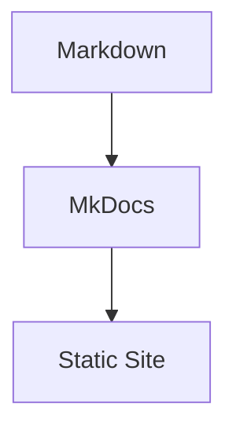

# MkDocs 문서 사이트 구축 가이드

> 이 문서는 Windows 및 macOS 환경에서 공통으로 사용할 수 있는 **MkDocs 문서 사이트 구축 가이드**이다.  
> Git, Python, Python 가상환경, MkDocs 및 Material for MkDocs 설치가 완료된 상태를 기준으로 한다.  
> 운영체제별 설치 방법은 `프로젝트 환경 구성`의 Windows/macOS 가이드를 참고한다.

---

## 1. 문서 작성 목적

AI-Data-Platform 프로젝트에서는 Markdown 기반의 학습 문서와 기술 가이드를 MkDocs로 관리한다.

MkDocs는 다음 구조를 기반으로 문서 사이트를 생성한다.

```text
Markdown 문서
    ↓
docs/
    ↓
mkdocs.yml
    ↓
MkDocs
    ↓
정적 웹 문서 사이트
```

본 가이드에서는 다음 내용을 다룬다.

- MkDocs 프로젝트 기본 구조 이해
- 기존 프로젝트에서 MkDocs 구성 확인
- 신규 MkDocs 문서 사이트 생성 방법
- `docs/` 디렉터리 구성
- `mkdocs.yml` 기본 설정
- Material for MkDocs 테마 적용
- 메뉴(`nav`) 구성
- Markdown 문서 추가
- 이미지 및 정적 파일 관리
- 로컬 문서 사이트 실행
- `mkdocs build`를 통한 빌드 확인
- 자주 발생하는 기본 오류 확인

GitHub Pages 배포는 별도의 `GitHub Pages 배포 및 운영` 가이드에서 다룬다.

---

## 2. 사전 준비사항

본 가이드는 다음 환경이 이미 구성되어 있다고 가정한다.

```text
Git 설치 완료
Python 설치 완료
Python 가상환경(.venv) 구성 완료
MkDocs 설치 완료
Material for MkDocs 설치 완료
```

운영체제별 상세 설치는 다음 메뉴를 참고한다.

```text
프로젝트 환경 구성
 ├─ 로컬 환경(Windows) 세팅하기
 │   ├─ Git 설치 및 기본 설정
 │   ├─ Python 설치 및 환경 설정
 │   └─ MkDocs 설치 가이드
 │
 └─ 로컬 환경(macOS) 세팅하기
     ├─ Git 설치 및 GitHub 설정
     ├─ Python 설치 및 환경 설정
     └─ MkDocs 설치 가이드
```

---

## 3. 프로젝트 디렉터리 이동

AI-Data-Platform 프로젝트를 이미 Clone한 경우 프로젝트 루트로 이동한다.

### Windows PowerShell

```powershell
cd C:\projects\AI-Data-Platform
```

### macOS

```bash
cd ~/projects/AI-Data-Platform
```

프로젝트 경로는 각 사용자의 로컬 환경에 따라 다를 수 있다.

---

## 4. Python 가상환경 활성화

MkDocs가 프로젝트 가상환경에 설치되어 있다면 먼저 가상환경을 활성화한다.

### Windows PowerShell

```powershell
.\.venv\Scripts\Activate.ps1
```

### macOS

```bash
source .venv/bin/activate
```

정상적으로 활성화되면 일반적으로 프롬프트 앞에 다음과 같이 표시된다.

```text
(.venv)
```

MkDocs 설치 여부를 확인한다.

```bash
mkdocs --version
```

---

## 5. MkDocs 프로젝트 기본 구조

MkDocs의 기본 문서 구조는 매우 단순하다.

```text
project/
├─ docs/
│  └─ index.md
└─ mkdocs.yml
```

각 항목의 역할은 다음과 같다.

| 항목 | 역할 |
|---|---|
| `docs/` | Markdown 문서와 이미지 등 문서 자산 저장 |
| `docs/index.md` | 기본 첫 화면 문서 |
| `mkdocs.yml` | 사이트 이름, 테마, 메뉴, 확장 기능 등을 설정 |

AI-Data-Platform 프로젝트에서는 이 기본 구조를 확장하여 다음과 같이 사용할 수 있다.

```text
AI-Data-Platform/
├─ docs/
│  ├─ index.md
│  ├─ roadmap/
│  ├─ project_setup/
│  ├─ basic/
│  ├─ mkdocs/
│  └─ study/
│
├─ mkdocs.yml
├─ README.md
└─ .gitignore
```

---

## 6. 신규 MkDocs 프로젝트 생성

기존 AI-Data-Platform 프로젝트처럼 이미 `mkdocs.yml`과 `docs/`가 존재한다면 이 단계는 수행하지 않는다.

새로운 MkDocs 사이트를 처음 만드는 경우 빈 디렉터리에서 다음 명령을 실행한다.

```bash
mkdocs new .
```

정상적으로 실행되면 기본 구조가 생성된다.

```text
.
├─ docs/
│  └─ index.md
└─ mkdocs.yml
```

다른 이름의 디렉터리로 생성할 수도 있다.

```bash
mkdocs new my-docs
```

생성 결과:

```text
my-docs/
├─ docs/
│  └─ index.md
└─ mkdocs.yml
```

---

## 7. `mkdocs.yml` 이해

`mkdocs.yml`은 MkDocs 문서 사이트의 핵심 설정 파일이다.

가장 단순한 예는 다음과 같다.

```yaml
site_name: AI Data Platform Study
```

Material 테마를 적용하려면 다음과 같이 작성한다.

```yaml
site_name: AI Data Platform Study

theme:
  name: material
```

AI-Data-Platform처럼 사이트 설명도 추가할 수 있다.

```yaml
site_name: AI Data Platform Study
site_description: AI Data Platform & Local LLM Study

theme:
  name: material
```

---

## 8. Material for MkDocs 테마 적용

Material for MkDocs가 설치되어 있다면 `mkdocs.yml`에 다음 설정을 사용한다.

```yaml
theme:
  name: material
```

Material 테마는 MkDocs의 기본 기능에 더해 다양한 탐색, 검색, 코드 표시 기능을 제공한다.

예를 들어 다음과 같이 기능을 추가할 수 있다.

```yaml
theme:
  name: material

  features:
    - navigation.tabs
    - navigation.top
    - search.highlight
    - search.share
    - content.code.copy
    - content.code.annotate
```

> Material 기능은 프로젝트 문서 구조와 사용 목적에 맞게 선택적으로 적용한다.

---

## 9. 메뉴(`nav`) 구성

`nav`는 왼쪽 메뉴와 상단 탐색 구조를 정의한다.

예:

```yaml
nav:
  - Home: index.md
  - Roadmap: roadmap/study-roadmap.md
  - 기초 학습:
      - Git 핵심 가이드: basic/git_core_guide.md
      - Python 핵심 가이드: basic/python_core_guide_for_beginner.md
```

문서 경로는 `docs/`를 기준으로 작성한다.

예를 들어 실제 파일이 다음 위치에 있다면:

```text
docs/basic/git_core_guide.md
```

`mkdocs.yml`에는 다음과 같이 작성한다.

```yaml
- Git 핵심 가이드: basic/git_core_guide.md
```

`docs/`는 경로에 포함하지 않는다.

---

## 10. 메뉴 Depth 구성

MkDocs 메뉴는 YAML 들여쓰기로 계층 구조를 정의한다.

예:

```yaml
nav:
  - 프로젝트 환경 구성:
      - 환경 구성:
          - 환경 구성 개요: project_setup/project_environment_setup_overview_guide.md
          - 개발 장비 구성 참고: project_setup/development_device_guide.md

      - 로컬 환경(Windows) 세팅하기:
          - Git 설치 및 기본 설정: project_setup/git_install_basic_setup_windows_guide.md
          - Python 설치 및 환경 설정: project_setup/python_environment_setup_windows_guide.md
```

구조:

```text
프로젝트 환경 구성
 ├─ 환경 구성
 │   ├─ 환경 구성 개요
 │   └─ 개발 장비 구성 참고
 │
 └─ 로컬 환경(Windows) 세팅하기
     ├─ Git 설치 및 기본 설정
     └─ Python 설치 및 환경 설정
```

YAML은 들여쓰기가 매우 중요하므로 Tab보다 Space 사용을 권장한다.

---

## 11. Material Navigation 기능 참고

Material for MkDocs에서는 메뉴 표시 방식을 여러 기능으로 제어할 수 있다.

예:

```yaml
theme:
  name: material

  features:
    - navigation.tabs
    - navigation.top
```

대표적인 기능:

| 기능 | 설명 |
|---|---|
| `navigation.tabs` | 최상위 메뉴를 상단 Tab 형태로 표시 |
| `navigation.sections` | 사이드바의 Section을 그룹 형태로 표시 |
| `navigation.expand` | 접을 수 있는 메뉴를 기본적으로 펼쳐 표시 |
| `navigation.top` | 페이지 상단 이동 버튼 제공 |
| `navigation.prune` | 대규모 사이트에서 탐색 HTML을 줄이는 기능 |

아코디언처럼 하위 메뉴가 접혔다 펴지는 구조를 원한다면 `navigation.sections`, `navigation.expand`, `navigation.prune` 등의 조합에 따라 표시 결과가 달라질 수 있으므로 실제 사이트에서 확인하면서 조정한다.

---

## 12. Markdown 문서 추가

예를 들어 MkDocs 문서 관리 하위에 새로운 문서를 추가한다고 가정한다.

파일 생성:

```text
docs/mkdocs/mkdocs_site_build_guide.md
```

문서 내용:

```markdown
# MkDocs 문서 사이트 구축 가이드

이 문서는 MkDocs 문서 사이트 구축 방법을 설명한다.
```

그리고 `mkdocs.yml`에 메뉴를 등록한다.

```yaml
- MkDocs 문서 관리:
    - MkDocs 문서 사이트 구축:
        mkdocs/mkdocs_site_build_guide.md
```

---

## 13. 문서 파일명 작성 원칙

파일명은 가능하면 다음 원칙을 권장한다.

```text
영문 소문자
snake_case
문서 역할이 드러나는 이름
```

예:

```text
mkdocs_site_build_guide.md
mkdocs_github_pages_deploy_guide.md
git_core_guide.md
development_device_guide.md
```

파일명에 공백이나 한글을 사용할 수도 있지만 Git, URL, 자동화 환경 등을 고려하면 영문 파일명이 관리하기 편하다.

---

## 14. 문서 디렉터리 구성 원칙

기능 또는 역할 단위로 디렉터리를 구분하면 문서 수가 증가해도 관리하기 쉽다.

예:

```text
docs/
├─ project_setup/
├─ basic/
├─ mkdocs/
├─ roadmap/
└─ study/
```

각 디렉터리의 역할 예:

| 디렉터리 | 역할 |
|---|---|
| `project_setup/` | 프로젝트 환경 구성 |
| `basic/` | Git, Python 등 기초 학습 |
| `mkdocs/` | MkDocs 문서 사이트 구축 및 배포 |
| `roadmap/` | 전체 학습 로드맵 |
| `study/` | AI 단계별 학습 가이드 |

---

## 15. 이미지 추가

이미지는 일반적으로 `docs/` 하위에 저장한다.

예:

```text
docs/project_setup/images/windows_python_install.png
```

같은 디렉터리 계층을 기준으로 Markdown에서 상대 경로를 사용한다.

예:

```markdown

```

크기를 지정하려면 `attr_list` 확장 기능을 사용할 수 있다.

```markdown
{ width="90%" }
```

`figure`와 `figcaption`을 사용할 경우 `md_in_html` 설정도 함께 사용할 수 있다.

예:

```html
<figure markdown>
{ width="90%" }
<figcaption>
그림 1. Python 설치
</figcaption>
</figure>
```

---

## 16. Markdown Extension 설정

AI-Data-Platform에서는 코드 블록, Mermaid, 이미지 속성 등을 사용하기 위해 Markdown Extension을 설정할 수 있다.

예:

```yaml
markdown_extensions:
  - attr_list
  - md_in_html
  - admonition
  - pymdownx.highlight
  - pymdownx.superfences:
      custom_fences:
        - name: mermaid
          class: mermaid
          format: !!python/name:pymdownx.superfences.fence_code_format
```

각 기능의 역할은 다음과 같다.

| Extension | 역할 |
|---|---|
| `attr_list` | 이미지 크기 등 속성 지정 |
| `md_in_html` | HTML 블록 안에서 Markdown 사용 |
| `admonition` | Note, Warning 등 안내 박스 |
| `pymdownx.highlight` | 코드 Highlight |
| `pymdownx.superfences` | 확장 코드 블록 및 Mermaid 지원 |

---

## 17. Mermaid 사용

`pymdownx.superfences`에서 Mermaid Custom Fence를 설정했다면 다음과 같이 작성할 수 있다.

````markdown

````

문서 사이트에서는 Diagram으로 렌더링된다.

---

## 18. Custom CSS 적용

프로젝트에 별도 CSS가 필요한 경우 `docs/` 아래에 CSS 파일을 둘 수 있다.

예:

```text
docs/study/css/extra.css
```

`mkdocs.yml`:

```yaml
extra_css:
  - study/css/extra.css
```

예를 들어 이미지 테두리나 사이드바 Depth 등을 프로젝트 스타일에 맞게 조정할 수 있다.

---

## 19. 로컬 문서 사이트 실행

프로젝트 루트에서 다음 명령을 실행한다.

```bash
mkdocs serve
```

정상적으로 실행되면 다음과 비슷한 메시지가 표시된다.

```text
INFO - Building documentation...
INFO - Serving on http://127.0.0.1:8000/
```

브라우저에서 다음 주소로 접속한다.

```text
http://127.0.0.1:8000/
```

MkDocs 개발 서버는 일반적으로 문서나 설정 파일 변경을 감지하여 사이트를 다시 빌드한다.

---

## 20. Windows와 macOS에서 `mkdocs serve`

MkDocs 명령 자체는 운영체제와 관계없이 동일하다.

### Windows PowerShell

```powershell
mkdocs serve
```

### macOS

```bash
mkdocs serve
```

차이는 명령어가 아니라 프로젝트 경로와 Python 가상환경 활성화 방식이다.

따라서 본 문서부터는 대부분의 MkDocs 명령을 공통으로 사용할 수 있다.

---

## 21. 로컬 서버 종료

`mkdocs serve`가 실행 중인 터미널에서 다음 키를 누른다.

```text
Ctrl + C
```

서버가 종료되고 다시 터미널 프롬프트로 돌아온다.

---

## 22. 사이트 빌드 확인

정적 사이트 생성이 정상적으로 되는지 확인하려면 다음 명령을 실행한다.

```bash
mkdocs build
```

기본적으로 프로젝트 루트에 다음 디렉터리가 생성된다.

```text
site/
```

예:

```text
AI-Data-Platform/
├─ docs/
├─ site/
├─ mkdocs.yml
└─ ...
```

`site/`에는 HTML, CSS, JavaScript 등 실제 정적 웹사이트 결과물이 생성된다.

---

## 23. `site/` 디렉터리 관리

`site/`는 `docs/`와 `mkdocs.yml`을 기반으로 다시 생성할 수 있는 결과물이다.

따라서 Source Branch에서는 일반적으로 Git 관리 대상에서 제외한다.

`.gitignore`:

```gitignore
site/
```

상세한 Git 제외 파일 설정은 다음 가이드를 참고한다.

```text
프로젝트 환경 구성
 → Git 제외(.gitignore) 설정
```

---

## 24. 문서 수정 기본 작업 흐름

문서 작성 시 다음 흐름을 권장한다.

```text
Markdown 문서 작성
      ↓
mkdocs.yml 메뉴 확인
      ↓
mkdocs serve
      ↓
브라우저에서 확인
      ↓
오류 수정
      ↓
mkdocs build
      ↓
Git Commit
```

---

## 25. `mkdocs.yml` 경로 오류

다음과 같은 Warning이 발생할 수 있다.

```text
A reference to 'xxx.md' is included in the 'nav' configuration,
which is not found in the documentation files.
```

이는 `nav`에 등록된 파일 경로와 실제 파일 위치가 일치하지 않는다는 의미이다.

확인:

```text
1. 파일이 실제로 존재하는가?
2. 파일명이 정확한가?
3. 대소문자가 일치하는가?
4. docs/ 기준 상대 경로가 정확한가?
5. 파일 이동 후 mkdocs.yml을 수정했는가?
```

---

## 26. `mkdocs.yml`을 찾을 수 없는 경우

오류 예:

```text
Config file 'mkdocs.yml' does not exist.
```

대부분 MkDocs 프로젝트 루트가 아닌 다른 디렉터리에서 명령을 실행한 경우이다.

현재 디렉터리 파일을 확인한다.

### Windows PowerShell

```powershell
dir
```

### macOS

```bash
ls
```

다음 파일이 보이는 위치에서 MkDocs 명령을 실행한다.

```text
mkdocs.yml
docs/
```

---

## 27. `mkdocs` 명령을 찾지 못하는 경우

예:

```text
mkdocs: command not found
```

또는 Windows에서 MkDocs 명령을 인식하지 못하는 오류가 발생할 수 있다.

먼저 프로젝트 Python 가상환경이 활성화되어 있는지 확인한다.

### Windows

```powershell
.\.venv\Scripts\Activate.ps1
```

### macOS

```bash
source .venv/bin/activate
```

그 다음:

```bash
mkdocs --version
```

을 확인한다.

설치 자체에 문제가 있다면 `프로젝트 환경 구성 > MkDocs 설치 가이드`를 참고한다.

---

## 28. YAML 들여쓰기 오류

`mkdocs.yml`은 YAML 문법을 사용하므로 들여쓰기가 잘못되면 설정 오류가 발생한다.

잘못된 예:

```yaml
nav:
- Home: index.md
    - Guide: guide.md
```

정상 예:

```yaml
nav:
  - Home: index.md
  - Guide: guide.md
```

특히 메뉴 Depth를 변경할 때 Space 들여쓰기를 일관되게 유지한다.

---

## 29. 권장 문서 구조 예시

AI-Data-Platform에서는 다음과 같은 구조로 발전시킬 수 있다.

```text
docs/
├─ index.md
├─ roadmap/
│  └─ study-roadmap.md
│
├─ project_setup/
│  ├─ project_environment_setup_overview_guide.md
│  ├─ development_device_guide.md
│  └─ ...
│
├─ basic/
│  ├─ git_core_guide.md
│  └─ python_core_guide_for_beginner.md
│
├─ mkdocs/
│  ├─ mkdocs_site_build_guide.md
│  └─ mkdocs_github_pages_deploy_guide.md
│
└─ study/
   ├─ step1/
   ├─ step2/
   └─ step3/
```

---

## 30. 구축 완료 체크리스트

다음 항목이 모두 확인되면 MkDocs 문서 사이트의 기본 구축이 완료된 것이다.

- [ ] 프로젝트 루트에 `mkdocs.yml`이 있다.
- [ ] `docs/` 디렉터리가 있다.
- [ ] Material 테마가 적용되어 있다.
- [ ] `nav` 메뉴가 정상적으로 구성되어 있다.
- [ ] Markdown 문서가 정상적으로 표시된다.
- [ ] 이미지가 정상적으로 표시된다.
- [ ] 필요한 Markdown Extension이 설정되어 있다.
- [ ] `mkdocs serve`가 정상 실행된다.
- [ ] `http://127.0.0.1:8000/`에서 사이트를 확인할 수 있다.
- [ ] `mkdocs build`가 오류 없이 완료된다.
- [ ] `site/`가 `.gitignore`에 등록되어 있다.

---

## 31. 다음 단계

MkDocs 문서 사이트가 로컬에서 정상적으로 구축되었다면 다음 단계는 GitHub Pages를 통한 웹 배포이다.

```text
MkDocs 문서 사이트 구축
        ↓
로컬 확인
        ↓
mkdocs build 확인
        ↓
Git Repository 반영
        ↓
GitHub Pages 배포
```

다음 문서를 참고한다.

```text
MkDocs 문서 관리
 → GitHub Pages 배포 및 운영
```

---

## 32. 참고 공식 문서

- MkDocs Getting Started  
  https://www.mkdocs.org/getting-started/

- MkDocs Writing Your Docs  
  https://www.mkdocs.org/user-guide/writing-your-docs/

- MkDocs Configuration  
  https://www.mkdocs.org/user-guide/configuration/

- Material for MkDocs - Navigation  
  https://squidfunk.github.io/mkdocs-material/setup/setting-up-navigation/

- Material for MkDocs - Customization  
  https://squidfunk.github.io/mkdocs-material/customization/

---

## 33. 최종 정리

MkDocs 문서 사이트 구축의 핵심 요소는 다음 세 가지이다.

```text
docs/
→ 실제 Markdown 문서

mkdocs.yml
→ 사이트 설정과 메뉴

mkdocs serve
→ 로컬 문서 사이트 확인
```

기본 작업 흐름은 다음과 같다.

```text
문서 작성
   ↓
nav 등록
   ↓
mkdocs serve
   ↓
브라우저 확인
   ↓
mkdocs build
```

운영체제별 차이는 Git, Python, 가상환경, MkDocs 설치 단계에서 주로 발생하며, **MkDocs 문서 작성과 사이트 구성 단계는 Windows와 macOS에서 거의 동일한 방식으로 진행할 수 있다.**
