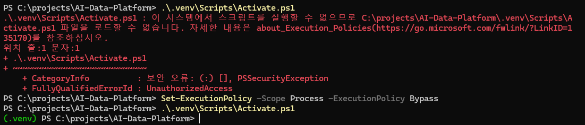
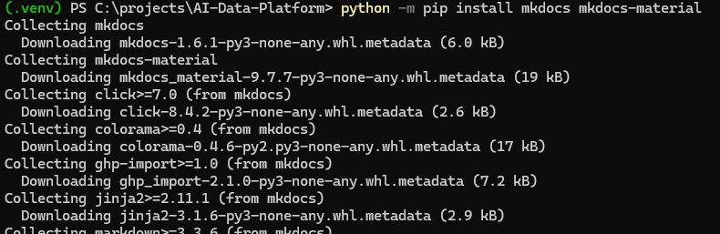
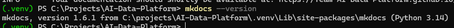

# MkDocs 설치 가이드 - Windows

> 이 문서는 Windows 로컬 개발환경에서 MkDocs와 Material for MkDocs를 설치하는 방법을 설명한다.  
> Python 설치 및 `.venv` 가상환경 구성이 완료된 상태를 기준으로 하며, **MkDocs 설치와 설치 확인까지만** 다룬다.  
> MkDocs 프로젝트 신규 생성, `mkdocs.yml` 구성, GitHub Pages 연동 및 배포는 별도의 **문서 관리 가이드**에서 다룬다.

---

## 1. MkDocs란?

MkDocs는 Markdown 문서를 기반으로 정적 웹 문서 사이트를 생성하는 Python 기반 도구이다.

프로젝트의 개발 가이드, 설치 가이드, 아키텍처 문서, 학습 자료 등을 Markdown으로 작성하고 웹 문서 형태로 관리할 때 사용할 수 있다.

이번 환경에서는 기본 MkDocs와 함께 **Material for MkDocs** 테마를 설치한다.

```text
Python
  ↓
Python 가상환경(.venv)
  ↓
MkDocs
  ↓
Material for MkDocs
```

---

## 2. 사전 준비사항

MkDocs를 설치하기 전에 다음 환경 구성이 완료되어 있어야 한다.

- Python 설치
- pip 사용 가능
- 프로젝트의 `.venv` 가상환경 생성
- PowerShell에서 `.venv` 가상환경 활성화

프로젝트 루트 디렉터리로 이동한다.

```powershell
cd C:\projects\AI-Data-Platform
```

가상환경을 활성화한다.

```powershell
.\.venv\Scripts\Activate.ps1
```

정상적으로 활성화되면 PowerShell 프롬프트 앞에 `(.venv)`가 표시된다.

```text
(.venv) PS C:\projects\AI-Data-Platform>
```
<figure markdown>
{ width="90%" }
<figcaption>
그림 2. Python 가상환경 활성화
</figcaption>
</figure>


> MkDocs는 프로젝트의 Python 가상환경에 설치하여 관리하는 것이 좋다.  
> 이렇게 하면 다른 Python 프로젝트의 패키지와 분리해서 관리할 수 있다.

---

## 3. Python 및 pip 확인

가상환경이 활성화된 상태에서 Python 버전을 확인한다.

```powershell
python --version
```

pip도 정상적으로 사용할 수 있는지 확인한다.

```powershell
python -m pip --version
```

출력 경로에 프로젝트의 `.venv`가 포함되어 있다면 현재 가상환경의 pip를 사용하고 있는 것이다.

---

## 4. pip 업그레이드

필수 단계는 아니지만, 패키지 설치 전에 pip를 최신 상태로 업데이트할 수 있다.

```powershell
python -m pip install --upgrade pip
```

이미 최신 버전이라면 `Requirement already satisfied` 메시지가 표시될 수 있다.

---

## 5. MkDocs 및 Material for MkDocs 설치

가상환경이 활성화된 상태에서 다음 명령을 실행한다.

```powershell
python -m pip install mkdocs mkdocs-material
```

이 명령으로 다음 패키지를 설치한다.

| 패키지 | 설명 |
|---|---|
| `mkdocs` | Markdown 기반 정적 문서 사이트 생성 도구 |
| `mkdocs-material` | MkDocs에서 사용하는 Material 테마 |

`python -m pip` 형식을 사용하면 현재 활성화된 Python 환경의 pip를 명확하게 사용하여 패키지를 설치할 수 있다.

<figure markdown>
{ width="90%" }
<figcaption>
그림 3. MkDocs 버전 확인(설치확인)
</figcaption>
</figure>

---

## 6. MkDocs 설치 확인

설치가 완료되면 다음 명령으로 MkDocs 버전을 확인한다.

```powershell
mkdocs --version
```

정상적으로 설치되었다면 다음과 비슷한 결과가 출력된다.

<figure markdown>
{ width="90%" }
<figcaption>
그림 1. Windows 가상환경에 MkDocs 및 Material for MkDocs 설치
</figcaption>
</figure>

```text
mkdocs, version 1.6.x from C:\projects\AI-Data-Platform\.venv\Lib\site-packages\mkdocs
```

출력 경로에 프로젝트의 `.venv`가 포함되어 있으면 가상환경에 정상적으로 설치된 것이다.

---

## 7. 설치된 패키지 상세 확인

필요한 경우 다음 명령으로 MkDocs 설치 정보를 확인할 수 있다.

```powershell
python -m pip show mkdocs
```

Material for MkDocs도 확인할 수 있다.

```powershell
python -m pip show mkdocs-material
```

설치되어 있다면 패키지 이름, 버전, 설치 위치 등의 정보가 출력된다.

---

## 8. `mkdocs` 명령을 찾지 못하는 경우

설치를 완료했는데 `mkdocs` 명령을 찾을 수 없다는 오류가 발생하면 먼저 PowerShell 프롬프트 앞에 `(.venv)`가 표시되어 있는지 확인한다.

가상환경이 활성화되어 있지 않다면 다음 명령으로 활성화한다.

```powershell
.\.venv\Scripts\Activate.ps1
```

그 다음 MkDocs가 현재 가상환경에 설치되어 있는지 확인한다.

```powershell
python -m pip show mkdocs
```

설치 정보가 나오지 않는다면 다시 설치한다.

```powershell
python -m pip install mkdocs mkdocs-material
```

설치 후 다시 버전을 확인한다.

```powershell
mkdocs --version
```

---

## 9. 설치 완료 확인 체크리스트

다음 항목이 모두 확인되면 MkDocs 설치가 완료된 것이다.

- [ ] 프로젝트 루트에 `.venv` 가상환경이 존재한다.
- [ ] PowerShell 프롬프트 앞에 `(.venv)`가 표시된다.
- [ ] `python --version` 명령이 정상 실행된다.
- [ ] `python -m pip --version` 명령이 정상 실행된다.
- [ ] `python -m pip install mkdocs mkdocs-material` 설치가 완료되었다.
- [ ] `mkdocs --version` 명령이 정상 실행된다.
- [ ] MkDocs 설치 위치가 프로젝트의 `.venv` 하위로 표시된다.

---

## 10. 이번 가이드의 범위

이 가이드에서는 **로컬 개발환경에 MkDocs를 설치하는 단계까지만** 진행한다.

```text
Python 설치
    ↓
가상환경 생성 및 활성화
    ↓
MkDocs 설치
    ↓
Material for MkDocs 설치
    ↓
설치 확인
    ↓
완료
```

다음 내용은 별도의 **MkDocs 문서 관리 가이드**에서 다룬다.

- MkDocs 문서 사이트 신규 생성
- `docs/` 디렉터리 구성
- `mkdocs.yml` 설정
- 메뉴(`nav`) 구성
- Material 테마 상세 설정
- 로컬 문서 사이트 실행 및 확인
- GitHub Repository 연동
- `gh-pages` 브랜치 구성
- GitHub Pages 배포 및 운영

따라서 로컬 환경 구성 단계에서는 `mkdocs --version` 명령이 정상적으로 실행되는 것까지 확인하면 된다.
