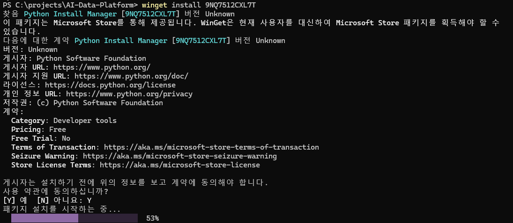
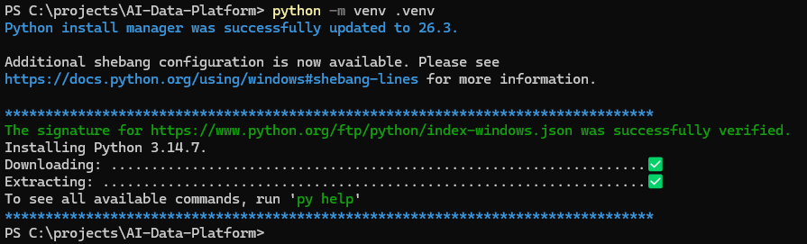

# Python 설치 및 환경 설정 가이드 - Windows

> AI-Data-Platform 프로젝트를 Windows PC에서 사용하기 위해 Python을 설치하고, 버전을 확인한 뒤, 프로젝트 전용 가상환경(.venv)과 pip 환경을 구성하는 가이드

---

## 1. 문서 작성 목적

이 문서는 **Windows 환경에서 AI-Data-Platform 프로젝트를 처음 시작하거나, 새로운 PC에서 개발 환경을 다시 구성하는 사용자**를 대상으로 Python 설치와 기본 환경 설정 방법을 설명한다.

AI-Data-Platform 프로젝트의 RAG, Local LLM 연계, AI Agent 등 여러 실습은 Python을 기반으로 작성되어 있다.

따라서 프로젝트 실습을 진행하려면 다음 환경이 필요하다.

```text
Python 설치
    ↓
Python 실행 확인
    ↓
pip 확인
    ↓
프로젝트 가상환경(.venv) 생성
    ↓
가상환경 활성화
    ↓
pip 업데이트
    ↓
프로젝트별 Python 패키지 설치 준비 완료
```

이 문서에서는 **Windows에서 Python을 설치하고 프로젝트별 Python 실행 환경을 준비하는 단계까지만** 다룬다.

MkDocs, Ollama, LangChain, LangGraph, ChromaDB 등의 개별 패키지나 프로그램 설치는 해당 기능별 가이드에서 별도로 진행한다.

---

## 2. Python 환경을 별도로 구성하는 이유

Windows PC에 Python만 설치하면 Python 코드를 실행할 수는 있다.

하지만 AI-Data-Platform 프로젝트에서는 Python만 설치하고 바로 모든 라이브러리를 시스템 전체에 설치하지 않고, **프로젝트 전용 가상환경을 만들어 사용하는 방식**을 권장한다.

전체 구조를 단순화하면 다음과 같다.

```text
Windows
│
├─ Python
│
└─ AI-Data-Platform
    │
    ├─ .venv
    │   └─ 프로젝트 전용 Python 환경
    │
    ├─ docs
    ├─ labs
    ├─ mkdocs.yml
    └─ ...
```

가상환경을 사용하면 프로젝트별로 Python 패키지와 버전을 분리하여 관리할 수 있다.

---

## 3. Windows Python 환경 구성 전체 흐름

새로운 Windows PC에서 권장하는 구성 순서는 다음과 같다.

```text
1. 기존 Python 설치 여부 확인
        ↓
2. Python 설치
        ↓
3. PowerShell 다시 실행
        ↓
4. Python 버전 확인
        ↓
5. pip 확인
        ↓
6. AI-Data-Platform 프로젝트 폴더 이동
        ↓
7. .venv 가상환경 생성
        ↓
8. PowerShell에서 가상환경 활성화
        ↓
9. 필요 시 PowerShell ExecutionPolicy 오류 해결
        ↓
10. pip 업데이트
        ↓
11. 최종 환경 확인
```

---

## 4. Python이 이미 설치되어 있는지 먼저 확인

Python을 설치하기 전에 기존 설치 여부를 먼저 확인한다.

PowerShell 또는 Windows Terminal을 실행하고 다음 명령을 입력한다.

```powershell
python --version
```

정상적으로 설치되어 있다면 다음과 비슷한 결과가 출력된다.

```text
Python 3.14.x
```

Python Install Manager가 설치된 환경에서는 다음 명령도 사용할 수 있다.

```powershell
py --version
```

환경에 따라 `python` 또는 `py` 명령의 동작이 다를 수 있으므로, 프로젝트에서는 우선 다음 명령을 기준으로 확인한다.

```powershell
python --version
```

### Python이 정상적으로 설치된 경우

Python 버전이 정상적으로 출력되면 다시 설치하지 않아도 된다.

다음 단계인 **pip 확인**으로 이동한다.

### Python을 찾을 수 없는 경우

다음과 비슷한 메시지가 나타나면 Python이 설치되어 있지 않거나 명령 경로가 정상적으로 연결되지 않은 상태일 수 있다.

```text
python : 'python'이라는 용어가 cmdlet, 함수, 스크립트 파일 또는
실행할 수 있는 프로그램 이름으로 인식되지 않습니다.
```

이 경우 Python을 설치한다.

---

## 5. Windows의 Python 설치 방식

현재 Windows용 Python은 **Python Install Manager**를 중심으로 설치 및 버전 관리를 할 수 있다.

Python 공식 문서에서는 Python Install Manager를 Microsoft Store에서 설치하거나 Python 공식 다운로드 페이지에서 설치할 수 있다고 안내한다.

설치 방식은 크게 다음과 같이 생각하면 된다.

```text
방법 1. Microsoft Store에서 Python Install Manager 설치
방법 2. python.org에서 Python Install Manager 설치
방법 3. 기존 방식의 Python Windows Installer 사용
```

AI-Data-Platform 프로젝트에서는 **Python 공식 배포 방식을 사용하는 것을 권장**한다.

---

## 6. 방법 1 - Microsoft Store에서 Python Install Manager 설치

Windows에서 가장 간단한 방법 중 하나는 Microsoft Store에서 Python Install Manager를 설치하는 것이다.

설치 흐름은 다음과 같다.

```text
Microsoft Store 실행
      ↓
Python Install Manager 검색
      ↓
설치
      ↓
PowerShell 다시 실행
      ↓
Python 설치 또는 실행 확인
```

WinGet을 사용할 수 있는 환경에서는 다음 명령으로 Python Install Manager를 설치할 수도 있다.

```powershell
winget install 9NQ7512CXL7T
```

여기서 `9NQ7512CXL7T`는 Microsoft Store의 Python Install Manager를 식별하는 Store ID이다.

<figure markdown>
{ width="90%" }
<figcaption>
그림 1. WinGet을 사용할 수 있는 환경에서 설치
</figcaption>
</figure>

> 설치 명령이나 Store ID는 Python 공식 배포 정책에 따라 변경될 수 있으므로, 실제 설치 시점에는 Python 공식 Windows 문서를 함께 확인하는 것이 좋다.

---

## 7. 방법 2 - python.org에서 설치

Microsoft Store를 사용하지 않는 경우 Python 공식 사이트의 Windows 다운로드 페이지에서 Python Install Manager 또는 Windows용 설치 파일을 내려받을 수 있다.

권장 흐름은 다음과 같다.

```text
Python 공식 Windows 다운로드 페이지 접속
      ↓
Python Install Manager 또는 Windows용 설치 파일 선택
      ↓
설치 프로그램 실행
      ↓
설치 완료
      ↓
PowerShell 다시 실행
      ↓
python --version 확인
```

조직 또는 회사 PC에서 Microsoft Store 사용이 제한된 경우 이 방식을 사용할 수 있다.

---

## 8. Python 버전 선택

AI-Data-Platform 프로젝트에서는 프로젝트에서 사용하는 Python 버전을 가능한 한 맞추는 것이 좋다.

예를 들어 팀에서 Python 3.14 계열을 기준으로 실습하고 있다면 Windows PC에서도 동일한 계열을 사용하는 것이 환경 차이를 줄이는 데 도움이 된다.

다만 다음 사항을 주의한다.

```text
최신 Python 버전이라고 해서
모든 AI / ML 라이브러리가 즉시 호환되는 것은 아니다.
```

특히 다음 라이브러리는 Python 최신 버전 지원 시점이 다를 수 있다.

```text
PyTorch
sentence-transformers
ChromaDB
LangChain 관련 패키지
각종 문서 처리 라이브러리
```

따라서 프로젝트에서 `requirements.txt`, `pyproject.toml` 또는 별도의 Python 버전 정책이 있다면 **프로젝트 기준 버전을 우선**한다.

---

## 9. 설치 후 PowerShell을 다시 실행해야 하는 이유

Python 설치가 완료된 후 기존에 열려 있던 PowerShell에서 바로 다음 명령을 실행했을 때 Python이 인식되지 않는 경우가 있다.

```powershell
python --version
```

설치 과정에서 Windows의 실행 경로나 앱 연결 정보가 변경되었지만, 이미 실행 중인 PowerShell 세션에는 변경사항이 즉시 반영되지 않을 수 있기 때문이다.

따라서 설치가 끝난 후에는 다음 순서를 권장한다.

```text
1. 현재 PowerShell 종료
2. PowerShell 또는 Windows Terminal 다시 실행
3. python --version 실행
4. pip 확인
```

---

## 10. Python 설치 확인

새 PowerShell을 열고 다음 명령을 실행한다.

```powershell
python --version
```

정상 예:

```text
Python 3.14.x
```

Python 실행 파일의 위치를 확인하고 싶다면 다음 명령을 사용할 수 있다.

```powershell
where python
```

여러 Python이 설치되어 있다면 여러 경로가 출력될 수도 있다.

이 경우 실제 프로젝트에서 어떤 Python이 실행되는지 확인하는 것이 중요하다.

---

## 11. Python Install Manager 관련 명령 확인

Python Install Manager를 사용하는 환경에서는 다음과 같은 명령을 사용할 수 있다.

```powershell
py --version
```

또는 설치 관리자 자체를 명확하게 지정해야 하는 경우 다음 명령을 사용할 수 있다.

```powershell
pymanager --version
```

다만 AI-Data-Platform 프로젝트 실습에서는 복잡성을 줄이기 위해 기본적으로 다음 명령을 중심으로 사용한다.

```powershell
python
python -m pip
python -m venv
```

이 방식은 **현재 실행 중인 Python과 연결된 pip 또는 venv를 명확하게 사용한다는 장점**이 있다.

---

## 12. pip란?

`pip`는 Python 패키지를 설치하고 관리하는 도구이다.

예를 들어 다음과 같은 Python 라이브러리를 설치할 때 사용한다.

```text
requests
pypdf
python-docx
openpyxl
chromadb
langchain
langgraph
```

일반적으로 Python 설치 환경에 pip가 함께 제공된다.

---

## 13. pip 설치 여부 확인

다음 명령으로 pip를 확인한다.

```powershell
python -m pip --version
```

정상적으로 설치되어 있다면 다음과 비슷한 결과가 출력된다.

```text
pip 26.x from ...\site-packages\pip (python 3.14)
```

### 왜 `pip --version`보다 `python -m pip --version`을 권장하는가?

단순히 다음 명령을 사용할 수도 있다.

```powershell
pip --version
```

하지만 PC에 여러 Python이 설치되어 있다면 `pip` 명령이 어떤 Python과 연결되어 있는지 혼동할 수 있다.

반면 다음 명령은:

```powershell
python -m pip
```

현재 `python` 명령으로 실행되는 Python 인터프리터의 pip를 사용한다.

따라서 프로젝트 문서에서는 가능하면 다음 형식을 사용하는 것을 권장한다.

```powershell
python -m pip <명령>
```

---

## 14. 프로젝트 디렉터리로 이동

Python 설치를 확인했다면 AI-Data-Platform 프로젝트 루트 디렉터리로 이동한다.

예를 들어 프로젝트가 다음 위치에 있다면:

```text
C:\projects\AI-Data-Platform
```

PowerShell에서 다음 명령을 실행한다.

```powershell
cd C:\projects\AI-Data-Platform
```

현재 위치를 확인할 수 있다.

```powershell
pwd
```

또는 파일 목록을 확인한다.

```powershell
dir
```

프로젝트 루트에는 일반적으로 다음과 같은 파일과 디렉터리가 있다.

```text
AI-Data-Platform
│
├─ docs
├─ labs
├─ mkdocs.yml
├─ README.md
└─ ...
```

---

## 15. Python 가상환경이란?

Python 가상환경(Virtual Environment)은 **특정 프로젝트에서 사용하는 Python 패키지를 별도의 공간에 분리하여 관리하기 위한 환경**이다.

AI-Data-Platform 프로젝트에서는 `.venv`라는 이름으로 가상환경을 생성하는 것을 권장한다.

```text
AI-Data-Platform
│
├─ .venv
│   ├─ Scripts
│   ├─ Lib
│   └─ ...
│
├─ docs
├─ labs
└─ ...
```

가상환경을 사용하면 다음과 같은 장점이 있다.

```text
1. 프로젝트마다 서로 다른 패키지 버전을 사용할 수 있다.
2. 다른 Python 프로젝트와 라이브러리 충돌을 줄일 수 있다.
3. Windows 시스템 Python 환경을 불필요하게 변경하지 않는다.
4. 프로젝트를 새 PC에서 다시 구성하기 쉽다.
5. 문제가 발생했을 때 .venv를 삭제하고 다시 만들 수 있다.
```

---

## 16. `.venv`라는 이름을 사용하는 이유

가상환경 디렉터리 이름은 반드시 `.venv`여야 하는 것은 아니다.

다음과 같은 이름도 사용할 수 있다.

```text
venv
env
myenv
```

하지만 프로젝트에서는 다음과 같이 `.venv`를 사용하는 것을 권장한다.

```text
.venv
```

이유는 다음과 같다.

```text
프로젝트 가상환경임을 쉽게 알 수 있음
IDE에서 자동으로 인식하기 쉬움
Git 저장소에서 제외하기 쉬움
팀원 간 동일한 명명 규칙 사용 가능
```

---

## 17. Windows와 macOS의 `.venv`는 서로 다르다

가상환경은 운영체제와 Python 설치 환경에 의존한다.

따라서 macOS에서 생성한 `.venv`를 Windows PC에서 그대로 복사해서 사용하면 안 된다.

예를 들어 내부 구조부터 다르다.

Windows:

```text
.venv/
└─ Scripts/
```

macOS:

```text
.venv/
└─ bin/
```

따라서 새로운 PC나 다른 운영체제에서 프로젝트를 Clone한 경우에는 **해당 PC에서 `.venv`를 새로 생성**한다.

---

## 18. 가상환경 생성

프로젝트 루트에서 다음 명령을 실행한다.

```powershell
python -m venv .venv
```

<figure markdown>
{ width="90%" }
<figcaption>
그림 2. Python 가상환경 생성
</figcaption>
</figure>

명령을 분해하면 다음과 같다.

```text
python
→ Python 실행

-m
→ Python 모듈을 실행

venv
→ Python 표준 가상환경 모듈

.venv
→ 생성할 가상환경 디렉터리 이름
```

즉 다음 명령은:

```powershell
python -m venv .venv
```

**현재 Python을 이용하여 `.venv`라는 가상환경을 생성한다**는 의미이다.

---

## 19. 가상환경 생성 확인

명령 실행 후 프로젝트 디렉터리를 확인한다.

```powershell
dir
```

다음과 같이 `.venv`가 생성되어 있으면 정상이다.

```text
AI-Data-Platform
│
├─ .venv
├─ docs
├─ labs
├─ mkdocs.yml
└─ ...
```

Windows의 `.venv` 내부에는 일반적으로 다음 구조가 생성된다.

```text
.venv
│
├─ Include
├─ Lib
├─ Scripts
└─ pyvenv.cfg
```

가상환경 실행과 관련된 주요 파일은 `Scripts` 디렉터리에 있다.

---

## 20. PowerShell에서 가상환경 활성화

PowerShell에서는 다음 명령으로 가상환경을 활성화한다.

```powershell
.\.venv\Scripts\Activate.ps1
```

PowerShell의 실행 정책에 따라 `Activate.ps1` 실행 시 `PSSecurityException` 또는 `UnauthorizedAccess` 오류가 발생할 수 있다.

이 경우 다음 명령을 **최초 1회만 실행**하여 현재 사용자에 대한 PowerShell 스크립트 실행 권한을 설정한다.

```powershell
Set-ExecutionPolicy -Scope CurrentUser -ExecutionPolicy RemoteSigned
```

설정 후 다시 가상환경 활성화 명령을 실행한다.

```powershell
.\.venv\Scripts\Activate.ps1
```

> `Set-ExecutionPolicy` 명령은 최초 1회만 설정하면 된다.  
> 이후에는 PowerShell을 새로 실행할 때마다 가상환경 활성화 명령만 실행하면 된다.

<figure markdown>
{ width="90%" }
<figcaption>
그림 3. Python 가상환경 활성화
</figcaption>
</figure>

성공하면 PowerShell 프롬프트 앞에 일반적으로 다음과 같이 가상환경 이름이 표시된다.

```text
(.venv) PS C:\projects\AI-Data-Platform>
```


앞의:

```text
(.venv)
```

는 **현재 PowerShell이 `.venv` 가상환경을 사용하고 있다는 의미**이다.

---

## 21. 가상환경 활성화가 의미하는 것

가상환경을 활성화하면 현재 PowerShell 세션에서 `python`과 `pip` 명령이 프로젝트의 `.venv` 안에 있는 Python 환경을 우선 사용하도록 설정된다.

개념적으로 다음과 같다.

```text
가상환경 활성화 전

python
   ↓
Windows에 설치된 기본 Python


가상환경 활성화 후

python
   ↓
AI-Data-Platform\.venv\Scripts\python.exe
```

이를 통해 프로젝트에서 설치하는 패키지가 시스템 전체가 아닌 `.venv`에 설치된다.

---

## 22. 실제 사용 중인 Python 확인

가상환경 활성화 후 다음 명령을 실행한다.

```powershell
where python
```

가상환경이 정상적으로 활성화되었다면 프로젝트 `.venv`의 Python 경로가 우선적으로 표시되어야 한다.

예:

```text
C:\projects\AI-Data-Platform\.venv\Scripts\python.exe
```

Python 자체에서도 다음 명령으로 실행 파일 위치를 확인할 수 있다.

```powershell
python -c "import sys; print(sys.executable)"
```

예:

```text
C:\projects\AI-Data-Platform\.venv\Scripts\python.exe
```

이 확인 방법은 여러 Python이 설치된 PC에서 특히 유용하다.

---

## 23. PowerShell ExecutionPolicy 오류

Windows PowerShell에서 가상환경을 처음 활성화할 때 다음과 비슷한 오류가 발생할 수 있다.

```text
Activate.ps1 파일을 로드할 수 없습니다.

이 시스템에서 스크립트를 실행할 수 없으므로
...\Activate.ps1 파일을 로드할 수 없습니다.

PSSecurityException
UnauthorizedAccess
```

이 오류는 `.venv`가 잘못 생성된 것이 아니다.

PowerShell의 **스크립트 실행 정책(Execution Policy)** 때문에 `Activate.ps1` 실행이 차단된 것이다.

---

## 24. 현재 PowerShell에서만 임시로 실행 허용하기

프로젝트 실습에서는 시스템 전체 정책을 바로 변경하기보다, 필요한 경우 **현재 PowerShell 프로세스에서만 임시로 허용하는 방법**을 사용할 수 있다.

다음 명령을 실행한다.

```powershell
Set-ExecutionPolicy -Scope Process -ExecutionPolicy Bypass
```

그 다음 다시 가상환경을 활성화한다.

```powershell
.\.venv\Scripts\Activate.ps1
```

정상적으로 활성화되면 다음과 같이 표시된다.

```text
(.venv) PS C:\projects\AI-Data-Platform>
```

### `-Scope Process`를 사용하는 이유

`Process` 범위는 **현재 실행 중인 PowerShell 프로세스에만 적용**된다.

```text
PowerShell 실행
      ↓
ExecutionPolicy 임시 변경
      ↓
가상환경 사용
      ↓
PowerShell 종료
      ↓
임시 설정 종료
```

즉 PowerShell 창을 닫으면 해당 설정은 유지되지 않는다.

초기 실습 환경에서는 시스템 전체 설정을 변경하는 것보다 영향 범위가 작다는 장점이 있다.

---

## 25. Python 공식 문서에서 안내하는 다른 방식

Python의 `venv` 공식 문서에서는 Windows PowerShell에서 `Activate.ps1` 실행이 차단되는 경우 사용자 범위의 실행 정책을 변경하는 방법도 안내한다.

예:

```powershell
Set-ExecutionPolicy -ExecutionPolicy RemoteSigned -Scope CurrentUser
```

이 방식은 현재 Windows 사용자 계정에 설정이 유지된다.

두 방식의 차이는 다음과 같다.

| 방식 | 적용 범위 | 지속 여부 |
|---|---|---|
| `Process + Bypass` | 현재 PowerShell 프로세스 | PowerShell 종료 시 해제 |
| `CurrentUser + RemoteSigned` | 현재 Windows 사용자 | 설정 유지 |

AI-Data-Platform의 초기 환경 구성에서는 **일단 `Process` 범위의 임시 설정으로 문제를 해결하고**, 회사 보안정책이나 개인 개발환경 정책에 따라 지속적인 설정이 필요한 경우 `CurrentUser` 방식을 검토하는 것을 권장한다.

> 회사에서 관리하는 PC는 보안 정책에 의해 ExecutionPolicy 변경 자체가 제한될 수 있다.  
> 이 경우 임의로 정책을 우회하지 말고 조직의 보안 정책 또는 시스템 관리자 지침을 따른다.

---

## 26. CMD에서 가상환경을 활성화하는 방법

PowerShell이 아닌 Windows 명령 프롬프트(CMD)를 사용하는 경우 활성화 명령이 다르다.

```cmd
.venv\Scripts\activate.bat
```

정상적으로 활성화되면 다음과 같이 표시될 수 있다.

```text
(.venv) C:\projects\AI-Data-Platform>
```

프로젝트 가이드에서는 Windows PowerShell을 기준으로 설명하지만, 필요에 따라 CMD를 사용할 수도 있다.

---

## 27. 가상환경은 반드시 활성화해야 하는가?

Python 가상환경은 활성화하지 않아도 해당 가상환경의 Python 실행 파일을 직접 지정하면 사용할 수 있다.

예:

```powershell
.\.venv\Scripts\python.exe --version
```

하지만 매번 전체 경로를 입력해야 하므로 일반적인 개발과 실습에서는 가상환경을 활성화하여 사용하는 것이 편리하다.

```powershell
.\.venv\Scripts\Activate.ps1
```

---

## 28. 가상환경에서 pip 확인

가상환경을 활성화한 상태에서 다음 명령을 실행한다.

```powershell
python -m pip --version
```

결과 경로에 `.venv`가 포함되어 있는지 확인한다.

예:

```text
pip 26.x from C:\projects\AI-Data-Platform\.venv\Lib\site-packages\pip
```

이 결과는 현재 pip가 시스템 전체가 아니라 AI-Data-Platform의 `.venv` 안에서 실행되고 있다는 의미이다.

---

## 29. pip 업데이트

가상환경을 처음 만든 뒤 pip를 최신 상태로 업데이트할 수 있다.

```powershell
python -m pip install --upgrade pip
```

이미 최신 버전인 경우 다음과 비슷한 메시지가 출력될 수 있다.

```text
Requirement already satisfied: pip in .\.venv\Lib\site-packages (...)
```

이 메시지는 오류가 아니다.

현재 `.venv`에 설치된 pip가 이미 요구 조건을 만족한다는 의미이다.

---

## 30. 프로젝트 패키지는 가상환경 활성화 후 설치한다

이후 MkDocs 또는 AI 실습용 Python 패키지를 설치할 때는 가능하면 `.venv`가 활성화된 상태에서 설치한다.

예:

```text
(.venv) PS C:\projects\AI-Data-Platform>
```

이 상태에서:

```powershell
python -m pip install <패키지명>
```

또는 프로젝트에 `requirements.txt`가 있는 경우:

```powershell
python -m pip install -r requirements.txt
```

를 사용한다.

> 이 문서에서는 특정 AI 라이브러리 설치까지 진행하지 않는다.  
> 패키지 설치 내용은 MkDocs, RAG, Agent 등 각 실습 가이드에서 필요한 시점에 다룬다.

---

## 31. `requirements.txt`의 역할

Python 프로젝트에서는 필요한 라이브러리와 버전을 `requirements.txt` 같은 파일로 관리할 수 있다.

예를 들어:

```text
requests
pypdf
openpyxl
```

와 같은 패키지 목록이 있을 수 있다.

다음 명령으로 한 번에 설치할 수 있다.

```powershell
python -m pip install -r requirements.txt
```

하지만 AI-Data-Platform 전체 프로젝트에 하나의 공통 `requirements.txt`가 반드시 존재한다고 가정해서는 안 된다.

실습 영역마다 별도 `requirements.txt`를 사용할 수도 있으므로 **해당 실습 가이드의 안내를 우선**한다.

---

## 32. `.venv`는 Git에 올리지 않는다

`.venv`에는 Python 실행 파일과 설치된 라이브러리가 들어 있기 때문에 용량이 크고 운영체제에 종속적이다.

따라서 GitHub Repository에 `.venv` 자체를 올리지 않는 것이 일반적인 원칙이다.

`.gitignore`에 다음 항목이 포함되어 있는지 확인한다.

```gitignore
.venv/
venv/
```

프로젝트를 다른 PC에서 Clone한 사용자는 `.venv`를 내려받는 것이 아니라 자신의 PC에서 다시 생성한다.

```powershell
python -m venv .venv
```

---

## 33. 새 PC에서 환경을 다시 만드는 원리

프로젝트를 GitHub에 올릴 때는 `.venv` 자체보다 **소스 코드와 패키지 정의 파일**을 관리한다.

개념적으로 다음과 같다.

```text
GitHub Repository

소스 코드
requirements.txt
설정 파일
문서
      ↓
새 PC에서 Clone
      ↓
Python 설치
      ↓
.venv 새로 생성
      ↓
필요 패키지 다시 설치
```

따라서 Windows에서 만든 `.venv`를 macOS로 복사하거나, 다른 Windows PC에 그대로 복제하는 방식은 권장하지 않는다.

---

## 34. 가상환경 비활성화

가상환경 사용을 종료하려면 다음 명령을 실행한다.

```powershell
deactivate
```

프롬프트 앞의 `(.venv)` 표시가 사라진다.

예:

```text
PS C:\projects\AI-Data-Platform>
```

가상환경 디렉터리가 삭제되는 것은 아니다.

단지 현재 PowerShell에서 가상환경 사용을 종료한 것이다.

---

## 35. PowerShell을 다시 열었을 때

PowerShell을 종료하면 가상환경 활성화 상태도 종료된다.

다음에 다시 프로젝트 작업을 시작할 때는 프로젝트 디렉터리로 이동한 후 다시 활성화한다.

```powershell
cd C:\projects\AI-Data-Platform
```

```powershell
.\.venv\Scripts\Activate.ps1
```

만약 다시 ExecutionPolicy 오류가 발생하고 `Process` 범위의 임시 방식을 사용하고 있다면 다음 명령을 먼저 실행한다.

```powershell
Set-ExecutionPolicy -Scope Process -ExecutionPolicy Bypass
```

그 다음 다시 활성화한다.

```powershell
.\.venv\Scripts\Activate.ps1
```

---

## 36. `.venv`를 다시 만들어야 하는 경우

다음과 같은 경우 `.venv`를 삭제하고 새로 구성하는 것이 문제 해결에 도움이 될 수 있다.

```text
Python 버전을 크게 변경한 경우
가상환경 내부 패키지가 심하게 충돌한 경우
macOS에서 사용하던 프로젝트를 Windows에서 새로 구성한 경우
다른 PC에서 프로젝트를 Clone한 경우
가상환경 자체가 손상된 경우
```

가상환경 안에 중요한 소스 코드를 저장하지 않았다면 `.venv`는 다시 생성할 수 있는 환경이다.

삭제 후:

```powershell
python -m venv .venv
```

로 다시 생성한다.

---

## 37. 여러 Python이 설치된 경우

Windows PC에는 여러 Python 버전이 동시에 설치될 수 있다.

이 경우 프로젝트의 `.venv`를 만들기 전에 현재 `python` 명령이 어느 버전을 가리키는지 확인한다.

```powershell
python --version
```

```powershell
where python
```

Python Install Manager를 사용하는 경우 설치된 런타임을 관리하는 기능도 사용할 수 있다.

특정 Python 버전을 프로젝트에서 요구한다면 그 버전을 선택하여 `.venv`를 생성해야 한다.

가상환경 생성 후에는 다음 명령으로 다시 확인한다.

```powershell
python --version
```

```powershell
python -c "import sys; print(sys.executable)"
```

---

## 38. 자주 발생하는 문제

### 38.1 `python` 명령을 찾을 수 없음

확인 순서:

```text
1. Python 설치 여부 확인
2. PowerShell 종료 후 다시 실행
3. python --version 재확인
4. py --version 확인
5. Python 공식 설치 관리자 상태 확인
```

---

### 38.2 Python을 설치했는데 Microsoft Store가 열림

Windows의 App Execution Alias 설정이나 기존 Python 연결 상태 때문에 `python` 명령 실행 시 Microsoft Store가 열리는 경우가 있을 수 있다.

이 경우 다음을 확인한다.

```text
Python Install Manager 또는 Python 설치가 정상 완료되었는가?
PowerShell을 다시 실행했는가?
where python 결과가 어떻게 나오는가?
py 명령은 정상 동작하는가?
```

무작정 여러 Python을 추가 설치하기보다 현재 설치 상태를 먼저 확인한다.

---

### 38.3 `pip` 명령을 찾을 수 없음

다음 명령을 사용한다.

```powershell
python -m pip --version
```

이 방식이 정상 동작하면 별도의 `pip` 명령이 PATH에 없어도 현재 Python의 pip를 사용할 수 있다.

---

### 38.4 `.venv` 생성이 되지 않음

다음을 먼저 확인한다.

```powershell
python --version
```

Python 자체가 정상적으로 실행되는지 확인한 후 다시 생성한다.

```powershell
python -m venv .venv
```

---

### 38.5 `Activate.ps1` 실행이 차단됨

증상:

```text
PSSecurityException
UnauthorizedAccess
스크립트를 실행할 수 없습니다.
```

현재 PowerShell에서만 임시로 허용하려면:

```powershell
Set-ExecutionPolicy -Scope Process -ExecutionPolicy Bypass
```

그 다음:

```powershell
.\.venv\Scripts\Activate.ps1
```

을 실행한다.

---

### 38.6 가상환경을 활성화했는데 시스템 Python이 실행되는 것 같음

다음 명령으로 확인한다.

```powershell
where python
```

또는:

```powershell
python -c "import sys; print(sys.executable)"
```

정상이라면 프로젝트의 `.venv\Scripts\python.exe`가 사용되어야 한다.

---

### 38.7 `pip install` 후 다른 Python에서 패키지를 찾지 못함

여러 Python과 pip가 섞여 있을 가능성이 있다.

가상환경을 활성화하고 다음 방식으로 설치한다.

```powershell
python -m pip install <패키지명>
```

그리고 다음 명령으로 현재 Python을 확인한다.

```powershell
python -c "import sys; print(sys.executable)"
```

---

## 39. 최종 환경 확인

환경 구성이 끝나면 다음 명령을 순서대로 실행한다.

### 39.1 Python 버전

```powershell
python --version
```

---

### 39.2 Python 실행 위치

```powershell
python -c "import sys; print(sys.executable)"
```

가상환경이 활성화된 경우 `.venv\Scripts\python.exe` 경로가 출력되어야 한다.

---

### 39.3 pip 버전

```powershell
python -m pip --version
```

출력 경로에 `.venv`가 포함되어 있는지 확인한다.

---

### 39.4 가상환경 표시

PowerShell 프롬프트 앞에 다음 표시가 있는지 확인한다.

```text
(.venv)
```

예:

```text
(.venv) PS C:\projects\AI-Data-Platform>
```

---

## 40. 완료 체크리스트

Windows Python 개발 환경 구성이 완료되었는지 확인한다.

```text
[완료] Python 설치
[완료] python --version 정상 출력
[완료] python -m pip --version 정상 출력
[완료] AI-Data-Platform 프로젝트 루트 확인
[완료] .venv 가상환경 생성
[완료] PowerShell에서 .venv 활성화
[완료] 필요 시 ExecutionPolicy 오류 해결
[완료] 가상환경 Python 경로 확인
[완료] pip 업데이트
[완료] .venv가 Git 관리 대상에서 제외되어 있는지 확인
```

위 항목이 모두 정상이라면 Windows에서 AI-Data-Platform 프로젝트의 Python 기반 실습을 진행할 기본 환경이 준비된 것이다.

---

## 41. 다음 단계

Windows 로컬 환경 구성의 전체 흐름에서 현재 위치는 다음과 같다.

```text
로컬 환경(Windows) 세팅하기

1. Git 설치 및 기본 설정
        ↓
2. Python 설치 및 환경 설정
        ↓
3. 프로젝트 참여 및 소스 받기
        ↓
4. 필요한 기능별 환경 구성
```

프로젝트 Repository를 이미 Clone한 상태에서 이 문서를 진행했다면 다음 단계는 목적에 따라 달라진다.

```text
MkDocs 문서 관리
→ MkDocs 관련 패키지 설치 및 mkdocs serve

RAG 실습
→ 해당 requirements.txt 설치

Local LLM
→ Ollama / Open WebUI 환경 구성

AI Agent
→ LangChain / LangGraph 등 필요한 패키지 구성
```

기본 Python 환경과 기능별 패키지 설치를 분리하여 관리하면 환경 구성이 복잡해지는 것을 줄일 수 있다.

---

## 42. 핵심 정리

Windows에서 AI-Data-Platform 프로젝트를 위한 Python 환경 구성의 핵심은 다음과 같다.

```text
1. Python 설치 여부를 먼저 확인한다.
2. 필요하면 Python 공식 Install Manager를 이용해 설치한다.
3. python --version으로 정상 설치 여부를 확인한다.
4. python -m pip 방식으로 pip를 확인한다.
5. 프로젝트 루트에 .venv 가상환경을 생성한다.
6. PowerShell에서 Activate.ps1로 가상환경을 활성화한다.
7. ExecutionPolicy 오류가 발생할 수 있다는 점을 알아둔다.
8. 프로젝트 실습 패키지는 활성화된 .venv 안에 설치한다.
9. .venv 자체는 GitHub에 올리지 않는다.
10. 새 PC에서는 .venv를 새로 생성한다.
```

이 문서까지 완료하면 **Windows PC에서 Python을 실행하고 AI-Data-Platform 프로젝트별 Python 패키지를 독립적으로 설치할 수 있는 기본 개발 환경**이 준비된 상태이다.

---

## 43. 참고 기준

이 문서는 다음 Python 공식 문서의 현재 Windows 환경 구성을 기준으로 작성하였다.

```text
Python 공식 문서
- Using Python on Windows
- Python Install Manager
- venv - Creation of virtual environments
- Installing Python Modules

Python 공식 다운로드
- Python Releases for Windows
```

Python 설치 방식과 명령은 Python 버전 및 Windows 환경에 따라 변경될 수 있으므로, 실제 설치 시점에는 최신 Python 공식 문서를 함께 확인하는 것을 권장한다.
