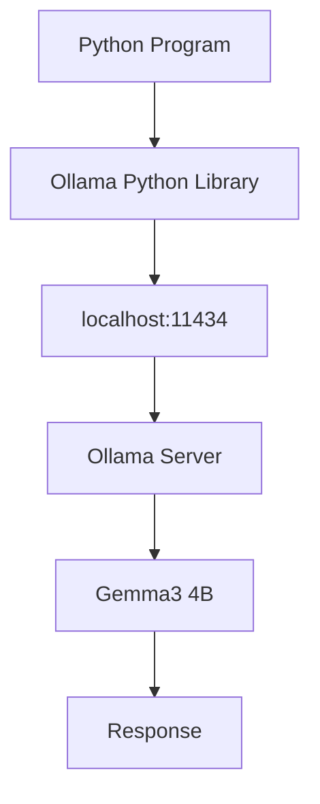

# Step1-3 Python 가상환경과 Ollama 연동 가이드

# 개요

본 문서는 Local LLM 구축 과정에서 Python 가상환경(Virtual Environment)을 이해하고,
Ollama와 연동하는 방법을 설명합니다.

대상 독자:

- Python 초보자
- Local LLM 입문자
- RAG 구축 예정자
- Agent 구축 예정자

---

# 1. 왜 Python 가상환경을 사용하는가?

예를 들어 하나의 PC에서 여러 프로젝트를 수행한다고 가정합니다.

Project-A

- Django 4.2

Project-B

- Django 5.0

Project-C

- Flask

만약 모든 라이브러리를 전역(Global)으로 설치하면

Project-A를 위해 설치한 라이브러리가
Project-B에 영향을 줄 수 있습니다.

즉

Project-A 수정
↓
라이브러리 버전 변경
↓
Project-B 장애 발생

상황이 생길 수 있습니다.

그래서 Python은 프로젝트별 독립 환경을 제공하는
Virtual Environment(가상환경)을 제공합니다.

---

# 2. Virtual Environment란?

Virtual Environment는

프로젝트 전용 Python 실행 환경입니다.

쉽게 말하면

하나의 Mac 안에

- Python-A
- Python-B
- Python-C

를 별도로 만드는 것과 같습니다.

장점

- 프로젝트별 라이브러리 분리
- 버전 충돌 방지
- 운영 환경 재현 가능
- AI 프로젝트 관리 용이

---

# 3. venv란?

venv는 Python이 기본 제공하는
가상환경 생성 모듈입니다.

명령어

```bash
python3 -m venv .venv
```

명령어 분석

python3

- Python3 실행

-m

- Python 모듈 실행

venv

- 가상환경 생성 모듈

.venv

- 생성될 가상환경 폴더명

---

# 4. .venv는 무슨 의미인가?

사실 아래 모두 가능합니다.

```bash
python3 -m venv aaa
```

```bash
python3 -m venv my-python
```

```bash
python3 -m venv python-env
```

하지만 업계에서는

```text
.venv
```

를 표준처럼 사용합니다.

여기서

```text
.
```

은 숨김(Hidden) 폴더 의미입니다.

즉

```text
.venv
```

는

"숨김 처리된 Python 가상환경"

이라는 의미입니다.

---

# 5. 가상환경 생성

명령어

```bash
python3 -m venv .venv
```

실행 후

```text
AI-Data-Platform
 ├── docs
 ├── mkdocs.yml
 └── .venv
```

생성됩니다.

내부 구조

```text
.venv
 ├── bin
 ├── include
 ├── lib
 └── pyvenv.cfg
```

---

# 6. source .venv/bin/activate 의미

명령어

```bash
source .venv/bin/activate
```

이 명령이 가장 중요합니다.

---

## source

현재 터미널 세션에 환경 설정을 반영합니다.

---

## .venv/bin/activate

가상환경 활성화 스크립트입니다.

---

실행 전

```bash
which python
```

예시

```text
/opt/homebrew/bin/python3
```

---

실행 후

```bash
which python
```

결과

```text
AI-Data-Platform/.venv/bin/python
```

즉

Mac 기본 Python

에서

프로젝트 전용 Python

으로 변경됩니다.

---

# 7. 매번 activate 해야 하나?

답:

예

터미널을 새로 열 때마다 실행해야 합니다.

예

```bash
cd AI-Data-Platform

source .venv/bin/activate
```

이유

가상환경 활성화는

현재 터미널 세션에만 적용되기 때문입니다.

---

# 8. deactivate

가상환경 종료

```bash
deactivate
```

실행 전

```text
(.venv)
```

실행 후

```text
➜
```

다시 Mac 기본 Python 사용

---

# 9. pip란?

pip는

Python Package Manager

입니다.

Java의 Maven

Node.js의 npm

과 같은 역할입니다.

예

```bash
python -m pip install ollama
```

의 의미는

ollama 라이브러리를 설치하라는 의미입니다.

---

# 10. 왜 pip 대신 python -m pip 를 사용하는가?

권장

```bash
python -m pip install ollama
```

비권장

```bash
pip install ollama
```

이유

현재 활성화된 Python 환경의 pip를 사용하기 때문입니다.

AI 프로젝트에서는

python -m pip

사용을 권장합니다.

---

# 11. Ollama Python 라이브러리 설치

명령어

```bash
python -m pip install ollama
```

주의

Ollama 서버 설치가 아닙니다.

Python 프로그램에서 Ollama API를 호출하기 위한 라이브러리 설치입니다.

구조

Python Program
↓
Ollama Library
↓
Ollama Server
↓
Gemma / Qwen

---

# 12. 설치 확인

```bash
python -c "import ollama; print('ollama python library ok')"
```

결과

```text
ollama python library ok
```

---

# 13. 첫 번째 Python 예제

파일명

test_ollama.py

```python
from ollama import chat

response = chat(
    model='gemma3:4b',
    messages=[
        {
            'role': 'user',
            'content': 'Local LLM이 무엇인지 설명해줘'
        }
    ]
)

print(response['message']['content'])
```

실행

```bash
python test_ollama.py
```

---

# 14. 내부 동작 구조



---

# 15. 향후 활용

이후 단계에서 모두 사용됩니다.

Step1

- Local LLM

Step2

- Open WebUI

Step3

- RAG

Step4

- Agent

Step5

- AI Data Platform

---

# 정리

필수 명령어

```bash
python3 -m venv .venv
```

```bash
source .venv/bin/activate
```

```bash
python -m pip install --upgrade pip
```

```bash
python -m pip install ollama
```

```bash
python -c "import ollama"
```

Local LLM 학습에서 Python 가상환경은 선택이 아니라 필수입니다.
