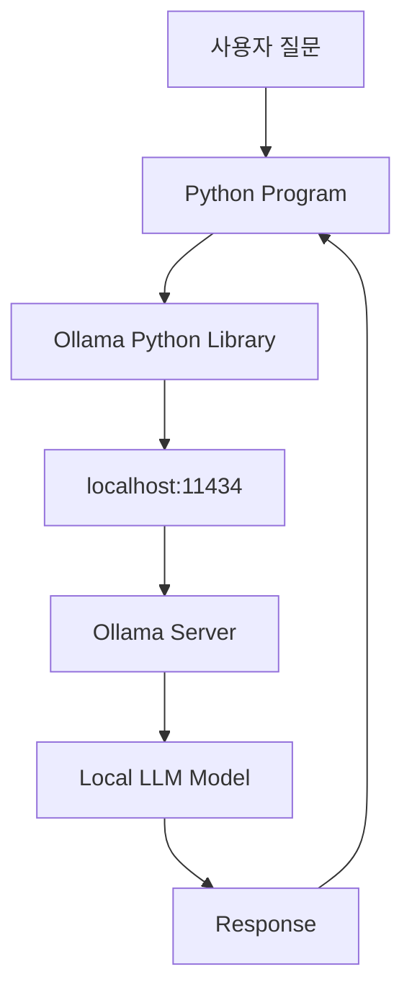

# Step1-3. Python에서 Ollama 연동하기

> 본 문서는 Local LLM 구축 과정에서 **Python 프로그램으로 Ollama를 호출하는 방법**을 설명한다.  
> Python 설치, 가상환경 생성 및 기본 설정은 이미 완료된 상태를 기준으로 하며, 본 문서에서는 **Ollama Python 라이브러리 설치 → 연결 구조 이해 → 첫 번째 호출 실습**에 집중한다.

---

## 1. 학습 목표

이번 단계에서는 다음 내용을 학습한다.

- Python 프로그램에서 Ollama를 호출하는 방법
- Ollama Python 라이브러리의 역할
- Ollama Server와 Python 프로그램의 연결 구조
- Local LLM 모델을 Python 코드에서 호출하는 기본 방법
- 이후 RAG 및 AI Agent 구현을 위한 Python 연동 기반 마련

전체 흐름은 다음과 같다.

```text
Python Program
      ↓
Ollama Python Library
      ↓
Ollama Server
      ↓
Local LLM Model
      ↓
Response
```

---

## 2. 사전 준비사항

본 실습을 진행하기 전에 다음 환경이 준비되어 있어야 한다.

- Python 설치 완료
- 프로젝트 Python 가상환경(`.venv`) 생성 완료
- 가상환경 활성화 가능
- Ollama 설치 완료
- 사용할 Local LLM 모델 다운로드 완료

Python 설치와 가상환경 구성 방법은 다음 메뉴의 별도 가이드를 참고한다.

```text
프로젝트 환경 구성
 ├─ 로컬 환경(Windows) 세팅하기
 │   └─ Python 설치 및 환경 설정
 │
 └─ 로컬 환경(macOS) 세팅하기
     └─ Python 설치 및 환경 설정
```

> 본 문서에서는 Python 가상환경의 개념이나 생성 방법을 다시 상세히 설명하지 않는다.  
> 프로젝트 공통 개발환경 구성과 AI 실습 내용을 분리하여 관리하기 위함이다.

---

## 3. 프로젝트 가상환경 활성화

Python 패키지를 설치하거나 실습 코드를 실행하기 전에 프로젝트의 가상환경을 활성화한다.

### macOS

프로젝트 루트 디렉터리에서 다음 명령을 실행한다.

```bash
source .venv/bin/activate
```

정상적으로 활성화되면 터미널 프롬프트 앞에 일반적으로 다음과 같이 표시된다.

```text
(.venv)
```

현재 사용 중인 Python 경로를 확인하려면 다음 명령을 사용할 수 있다.

```bash
which python
```

예시:

```text
/Users/사용자명/projects/AI-Data-Platform/.venv/bin/python
```

---

### Windows PowerShell

Windows에서는 다음 명령으로 가상환경을 활성화한다.

```powershell
.\.venv\Scripts\Activate.ps1
```

정상적으로 활성화되면 다음과 같이 표시된다.

```text
(.venv) PS C:\projects\AI-Data-Platform>
```

---

## 4. Ollama Python 라이브러리란?

Ollama는 Local LLM 모델을 로컬 환경에서 실행할 수 있게 해주는 도구이다.

하지만 Python 프로그램에서 Ollama를 호출하려면 Ollama Server와 통신할 수 있는 Python 라이브러리가 필요하다.

이번 실습에서는 `ollama` Python 패키지를 사용한다.

```text
Python Program
      ↓
ollama Python Library
      ↓
Ollama Server
      ↓
Gemma / Qwen / Llama
```

여기서 중요한 점은 다음과 같다.

```text
Ollama Application
→ Local LLM 모델을 실행하는 서버

ollama Python Library
→ Python 프로그램에서 Ollama Server를 호출하기 위한 라이브러리
```

즉 다음 명령은 Ollama Server 자체를 설치하는 명령이 아니다.

```bash
python -m pip install ollama
```

---

## 5. Ollama Python 라이브러리 설치

가상환경이 활성화된 상태에서 다음 명령을 실행한다.

```bash
python -m pip install ollama
```

`pip` 명령을 직접 실행하는 대신 다음 형식을 사용하는 것을 권장한다.

```bash
python -m pip
```

이 방식은 현재 활성화된 Python 환경의 pip를 명확하게 사용하기 때문에, 여러 Python 환경이 설치되어 있는 경우 패키지가 잘못된 위치에 설치되는 문제를 줄이는 데 도움이 된다.

---

## 6. 설치 확인

설치가 완료되면 다음 명령으로 `ollama` 라이브러리를 정상적으로 import할 수 있는지 확인한다.

```bash
python -c "import ollama; print('ollama python library ok')"
```

정상적인 경우 다음과 같이 출력된다.

```text
ollama python library ok
```

오류가 발생한다면 먼저 다음 명령으로 현재 가상환경에 패키지가 설치되어 있는지 확인한다.

```bash
python -m pip show ollama
```

---

## 7. Ollama Server 실행 상태 확인

Python 라이브러리가 설치되어 있어도 Ollama Server가 실행되고 있지 않으면 Local LLM을 호출할 수 없다.

Ollama가 정상적으로 실행 중인지 확인한다.

```bash
ollama list
```

설치된 모델 목록이 정상적으로 출력되면 Ollama가 동작 중인 상태이다.

예시:

```text
NAME          ID              SIZE
gemma3:4b     ........        ...
qwen3:8b      ........        ...
```

사용하려는 모델이 목록에 없다면 먼저 모델을 다운로드해야 한다.

예:

```bash
ollama pull gemma3:4b
```

또는

```bash
ollama pull qwen3:8b
```

---

## 8. Python과 Ollama의 내부 연결 구조

Ollama는 기본적으로 로컬 환경에서 API Server 역할을 한다.

Python 프로그램에서 `ollama` 라이브러리를 호출하면 내부적으로 Ollama Server와 통신하고, Ollama Server가 Local LLM 모델을 실행한다.

```text
Python Program
      ↓
Ollama Python Library
      ↓
localhost:11434
      ↓
Ollama Server
      ↓
Local LLM Model
      ↓
Response
```

구조를 조금 더 풀어보면 다음과 같다.

```text
사용자 질문
    ↓
Python 코드
    ↓
ollama.chat()
    ↓
Ollama API
    ↓
Local LLM
    ↓
응답 생성
    ↓
Python 프로그램
```

---

## 9. 첫 번째 Python 호출 예제

프로젝트의 실습 디렉터리에 다음 파일을 생성한다.

```text
test_ollama.py
```

예제 코드는 다음과 같다.

```python
from ollama import chat

response = chat(
    model="gemma3:4b",
    messages=[
        {
            "role": "user",
            "content": "Local LLM이 무엇인지 설명해줘",
        }
    ],
)

print(response["message"]["content"])
```

실행한다.

```bash
python test_ollama.py
```

정상적으로 동작하면 Local LLM이 생성한 답변이 터미널에 출력된다.

---

## 10. 코드 이해하기

예제 코드를 단계별로 살펴본다.

### 10.1 `chat` 함수 import

```python
from ollama import chat
```

`ollama` 라이브러리에서 채팅 형태로 모델을 호출하기 위한 `chat` 함수를 가져온다.

---

### 10.2 모델 지정

```python
model="gemma3:4b"
```

호출할 Local LLM 모델을 지정한다.

Ollama에 설치되어 있는 다른 모델을 사용할 수도 있다.

예:

```python
model="qwen3:8b"
```

단, 해당 모델이 Ollama에 미리 설치되어 있어야 한다.

---

### 10.3 메시지 전달

```python
messages=[
    {
        "role": "user",
        "content": "Local LLM이 무엇인지 설명해줘",
    }
]
```

모델에게 전달할 대화 메시지를 정의한다.

주요 항목은 다음과 같다.

| 항목 | 설명 |
|---|---|
| `role` | 메시지를 작성한 역할 |
| `content` | 실제 전달할 메시지 내용 |

이번 예제에서는 사용자의 질문을 전달하므로 `role`에 `user`를 사용한다.

---

### 10.4 응답 출력

```python
print(response["message"]["content"])
```

Ollama에서 반환된 응답 중 실제 모델 답변 내용을 출력한다.

기본적인 응답 구조는 다음과 같이 이해할 수 있다.

```text
response
  └─ message
       └─ content
            └─ 실제 LLM 응답
```

---

## 11. Mermaid로 보는 처리 흐름


```mermaid
flowchart TD
    A[사용자 질문] --> B[Python Program]
    B --> C[Ollama Python Library]
    C --> D[localhost:11434]
    D --> E[Ollama Server]
    E --> F[Local LLM Model]
    F --> G[Response]
    G --> B
```

---

## 12. 자주 발생하는 오류

### 12.1 `ModuleNotFoundError: No module named 'ollama'`

원인:

```text
현재 Python 환경에 ollama 패키지가 설치되지 않음
```

확인:

```bash
python -m pip show ollama
```

설치:

```bash
python -m pip install ollama
```

가상환경이 활성화되어 있는지도 함께 확인한다.

---

### 12.2 Ollama Server 연결 오류

Python 라이브러리는 설치되어 있지만 Ollama Server가 실행되지 않은 경우 발생할 수 있다.

확인:

```bash
ollama list
```

Ollama Server가 정상적으로 실행 중인지 확인한다.

---

### 12.3 모델을 찾을 수 없는 경우

예:

```text
model 'gemma3:4b' not found
```

현재 설치된 모델을 확인한다.

```bash
ollama list
```

필요한 모델을 다운로드한다.

```bash
ollama pull gemma3:4b
```

---

### 12.4 다른 Python 환경에 패키지가 설치된 경우

다음 명령으로 현재 Python 경로를 확인한다.

macOS:

```bash
which python
```

Windows:

```powershell
where.exe python
```

현재 프로젝트의 `.venv` 경로를 사용하고 있는지 확인한다.

---

## 13. 이번 실습에서 중요한 개념

이번 단계에서 기억해야 할 핵심은 다음과 같다.

```text
Ollama Server
≠
Ollama Python Library
```

Ollama Server는 Local LLM을 실제로 실행한다.

```text
Ollama Server
      ↓
Gemma / Qwen / Llama
```

Ollama Python Library는 Python 프로그램과 Ollama Server 사이를 연결한다.

```text
Python
   ↓
Ollama Library
   ↓
Ollama Server
   ↓
Local LLM
```

따라서 Python 기반 AI 애플리케이션을 구현하려면 이 연결 구조를 이해하는 것이 중요하다.

---

## 14. 이후 학습과의 연결

이번에 구성한 Python ↔ Ollama 연동 방식은 이후 학습 과정의 기본 기반이 된다.

### Step 1. Local LLM

```text
Python
  ↓
Ollama
  ↓
Local LLM
```

### Step 2. RAG

```text
사용자 질문
    ↓
Python
    ↓
Vector DB 검색
    ↓
검색 문서
    ↓
Ollama
    ↓
답변 생성
```

### Step 3. AI Agent

```text
사용자 요청
    ↓
Agent
    ↓
Tool / RAG / API
    ↓
Ollama
    ↓
최종 응답
```

즉 이번 실습은 단순한 Python 예제가 아니라, 이후 RAG와 AI Agent를 구현하기 위한 가장 기본적인 연결 구조를 확인하는 단계이다.

---

## 15. 정리

이번 단계에서는 Python 개발환경을 새로 구성하는 것이 아니라, 이미 준비된 프로젝트 가상환경 위에서 Ollama Python 라이브러리를 설치하고 Local LLM을 호출하는 방법을 학습했다.

핵심 흐름은 다음과 같다.

```text
프로젝트 가상환경 활성화
        ↓
ollama Python 라이브러리 설치
        ↓
Ollama Server 실행 확인
        ↓
Local LLM 모델 확인
        ↓
Python 코드에서 ollama.chat() 호출
        ↓
Local LLM 응답 확인
```

핵심 명령어는 다음과 같다.

```bash
python -m pip install ollama
```

```bash
python -c "import ollama; print('ollama python library ok')"
```

```bash
ollama list
```

```bash
python test_ollama.py
```

이번 단계가 완료되면 Python 프로그램에서 Local LLM을 직접 호출할 수 있으며, 이후 RAG와 AI Agent 구현으로 확장할 수 있다.
