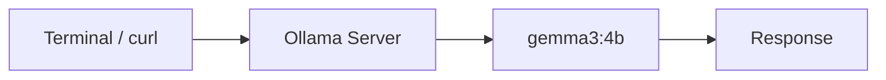
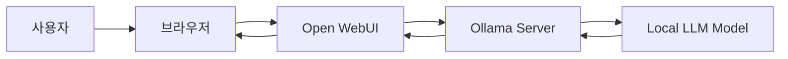
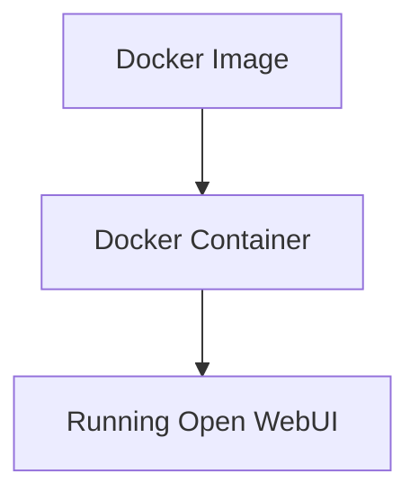
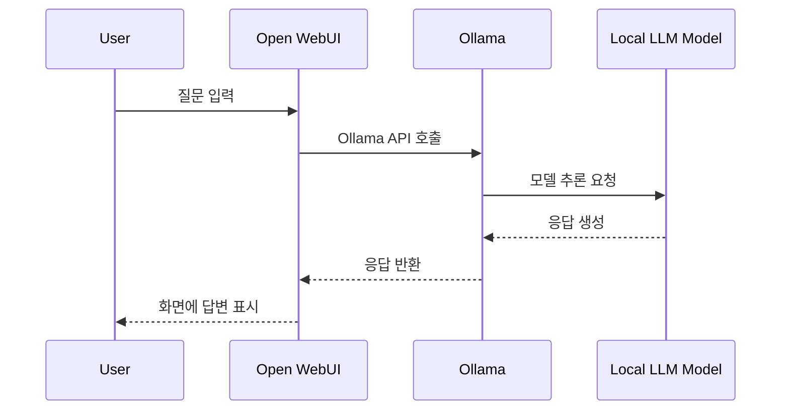
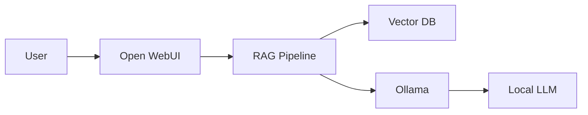

# Step1-4 Open WebUI 구축 및 Docker 이해 가이드

## 문서 목적

본 문서는 Local LLM 구축 Step1 과정 중 **Open WebUI를 설치하고 Ollama와 연결하는 방법**을 설명합니다.

단순히 명령어만 따라 하는 문서가 아니라, 처음 접하는 사람이 이해할 수 있도록 다음 내용을 함께 설명합니다.

- Open WebUI가 무엇인지
- 왜 Open WebUI가 필요한지
- Docker가 무엇인지
- 이미지와 컨테이너의 차이
- `docker run` 명령어의 의미
- Open WebUI와 Ollama가 어떻게 연결되는지
- 설치, 접속, 중지, 재시작, 삭제 방법
- 문제 발생 시 확인 방법

---

## 1. 현재까지 진행한 상태

이전 단계에서 우리는 Ollama를 설치하고 Local LLM 모델을 실행했습니다.

예:

```bash
ollama run gemma3:4b
```

또는 API 방식으로 호출했습니다.

```bash
curl http://localhost:11434/api/generate
```

여기까지 성공했다면 현재 구조는 다음과 같습니다.



즉, 터미널이나 API를 통해 Local LLM을 호출할 수 있는 상태입니다.

하지만 이 방식은 학습에는 좋지만, 실제 사용성은 불편합니다.

---

## 2. Open WebUI란?

Open WebUI는 Ollama와 연결하여 Local LLM을 **웹 브라우저에서 ChatGPT처럼 사용할 수 있게 해주는 오픈소스 웹 UI**입니다.

쉽게 비유하면 다음과 같습니다.

| 구성요소 | 역할 |
|---|---|
| Ollama | Local LLM을 실행하는 엔진 |
| Gemma / Qwen / Llama | 실제 답변을 생성하는 모델 |
| Open WebUI | 브라우저에서 대화할 수 있게 해주는 화면 |
| Docker | Open WebUI를 쉽게 실행하기 위한 실행 환경 |

즉, Open WebUI는 모델 자체가 아닙니다.

Open WebUI는 사용자의 질문을 받아서 Ollama에게 전달하고, Ollama가 모델을 실행한 결과를 다시 화면에 보여주는 역할을 합니다.

---

## 3. 왜 Open WebUI가 필요한가?

터미널 방식은 다음과 같은 한계가 있습니다.

```bash
ollama run gemma3:4b
```

또는

```bash
curl http://localhost:11434/api/generate
```

이 방식은 다음 작업이 불편합니다.

- 이전 대화 이력 확인
- 모델 변경
- 긴 프롬프트 작성
- 파일 기반 질의
- RAG 실습
- 여러 사용자 사용
- ChatGPT와 유사한 사용 경험

Open WebUI를 사용하면 다음이 가능해집니다.

- 브라우저에서 대화
- 대화 이력 저장
- 모델 선택
- 프롬프트 관리
- 파일 업로드
- RAG 기능 확장
- 사용자 계정 관리
- 관리자 화면 제공

AI 플랫폼 학습 관점에서는 Open WebUI를 통해 Local LLM을 **서비스 형태로 사용하는 경험**을 할 수 있습니다.

---

## 4. Open WebUI 전체 구조

Open WebUI를 설치하면 구조는 다음과 같이 바뀝니다.



사용자는 브라우저에서 질문하지만 실제 답변 생성은 Ollama와 Local LLM 모델이 수행합니다.

---

## 5. Docker를 사용하는 이유

Open WebUI는 직접 설치할 수도 있지만, 본 가이드에서는 Docker를 사용합니다.

Docker를 사용하는 이유는 다음과 같습니다.

| 이유 | 설명 |
|---|---|
| 설치 단순화 | 복잡한 Python/Node 환경을 직접 구성하지 않아도 됨 |
| 버전 충돌 방지 | Mac의 Python, pip, node 환경과 충돌하지 않음 |
| 삭제 쉬움 | 컨테이너만 삭제하면 됨 |
| 재설치 쉬움 | 동일 명령어로 다시 실행 가능 |
| 운영 환경과 유사 | 실제 서버 운영에서도 컨테이너 방식을 많이 사용 |

처음에는 Docker가 낯설 수 있지만, AI 플랫폼과 MSA 환경에서는 Docker를 이해하는 것이 매우 중요합니다.

---

## 6. Docker란?

Docker는 애플리케이션을 실행하기 위한 **격리된 실행 환경**을 제공합니다.

쉽게 말하면, 내 컴퓨터 안에 애플리케이션별로 독립된 작은 실행 공간을 만드는 기술입니다.

예를 들어 Open WebUI를 직접 설치하면 다음 요소를 직접 맞춰야 할 수 있습니다.

- Python 버전
- Node 버전
- 의존 라이브러리
- 실행 스크립트
- 데이터 저장 경로
- 포트 설정

Docker를 사용하면 이런 실행 환경이 이미지 안에 이미 준비되어 있습니다.

사용자는 이미지를 내려받고 컨테이너로 실행하기만 하면 됩니다.

---

## 7. 이미지(Image)와 컨테이너(Container)

Docker에서 가장 중요한 개념은 이미지와 컨테이너입니다.

### 7.1 이미지(Image)

이미지는 애플리케이션 실행에 필요한 파일과 설정을 묶어둔 템플릿입니다.

비유하면:

```text
이미지 = 설치 CD / 실행 패키지 / 설계도
```

Open WebUI 이미지는 다음입니다.

```text
ghcr.io/open-webui/open-webui:main
```

이 이미지 안에는 Open WebUI 실행에 필요한 구성요소가 들어 있습니다.

---

### 7.2 컨테이너(Container)

컨테이너는 이미지를 실제로 실행한 인스턴스입니다.

비유하면:

```text
컨테이너 = 이미지로 실행한 실제 프로그램
```

즉:

```text
이미지: Open WebUI 실행 파일 묶음
컨테이너: 실제 실행 중인 Open WebUI
```

관계는 다음과 같습니다.



---

## 8. 사전 준비사항

Open WebUI 설치 전에 다음을 확인합니다.

### 8.1 Ollama 설치 확인

```bash
ollama list
```

예상 결과:

```text
NAME          ID              SIZE
gemma3:4b     xxxxxxxxxxxx    3.3 GB
```

모델이 없다면 먼저 모델을 설치합니다.

```bash
ollama run gemma3:4b
```

---

### 8.2 Ollama API 동작 확인

```bash
curl http://localhost:11434/api/tags
```

정상이라면 설치된 모델 목록이 JSON으로 출력됩니다.

---

### 8.3 Docker Desktop 실행 확인

```bash
docker --version
```

정상 예시:

```text
Docker version 28.x.x
```

Docker Desktop 앱이 실행 중이어야 합니다.

---

## 9. Open WebUI 설치 명령어

아래 명령어를 실행합니다.

```bash
docker run -d \
  -p 3000:8080 \
  --add-host=host.docker.internal:host-gateway \
  -v open-webui:/app/backend/data \
  --name open-webui \
  --restart always \
  ghcr.io/open-webui/open-webui:main
```

처음 실행하면 Open WebUI 이미지를 다운로드한 뒤 컨테이너를 실행합니다.

---

## 10. docker run 명령어 상세 설명

### 10.1 docker run

```bash
docker run
```

이미지를 기반으로 새 컨테이너를 생성하고 실행하는 명령입니다.

---

### 10.2 -d

```bash
-d
```

detached mode의 약자입니다.

컨테이너를 백그라운드에서 실행합니다.

이 옵션이 없으면 터미널이 컨테이너 로그에 붙잡히게 됩니다.

---

### 10.3 -p 3000:8080

```bash
-p 3000:8080
```

포트 매핑입니다.

형식:

```text
내 PC 포트:컨테이너 내부 포트
```

즉:

```text
localhost:3000 → Open WebUI 컨테이너 내부 8080
```

브라우저에서는 다음 주소로 접속합니다.

```text
http://localhost:3000
```

---

### 10.4 --add-host=host.docker.internal:host-gateway

```bash
--add-host=host.docker.internal:host-gateway
```

Docker 컨테이너 안에서 호스트 PC를 찾기 위한 설정입니다.

Open WebUI는 컨테이너 안에서 실행됩니다.

Ollama는 보통 내 Mac 또는 Windows 호스트에서 실행됩니다.

따라서 컨테이너 안의 Open WebUI가 호스트의 Ollama에 접근해야 합니다.

이때 사용하는 주소가 다음입니다.

```text
host.docker.internal
```

즉 Open WebUI 입장에서는 Ollama가 다음 위치에 있다고 볼 수 있습니다.

```text
http://host.docker.internal:11434
```

---

### 10.5 -v open-webui:/app/backend/data

```bash
-v open-webui:/app/backend/data
```

볼륨 마운트입니다.

Open WebUI의 데이터가 컨테이너 내부에만 있으면 컨테이너 삭제 시 데이터가 사라질 수 있습니다.

그래서 Docker Volume에 저장합니다.

저장되는 데이터 예:

- 사용자 계정
- 관리자 설정
- 대화 이력
- 업로드 파일 메타데이터
- Open WebUI 설정

`open-webui`는 Docker Volume 이름입니다.

`/app/backend/data`는 컨테이너 내부의 데이터 저장 경로입니다.

---

### 10.6 --name open-webui

```bash
--name open-webui
```

컨테이너 이름을 지정합니다.

이름을 지정하면 이후 관리 명령이 쉬워집니다.

예:

```bash
docker stop open-webui
docker start open-webui
docker logs open-webui
```

---

### 10.7 --restart always

```bash
--restart always
```

Docker가 다시 시작될 때 컨테이너도 자동으로 시작되도록 설정합니다.

예를 들어 Mac을 재부팅하고 Docker Desktop이 다시 실행되면 Open WebUI도 자동으로 올라올 수 있습니다.

---

### 10.8 ghcr.io/open-webui/open-webui:main

```bash
ghcr.io/open-webui/open-webui:main
```

실행할 Docker 이미지입니다.

- `ghcr.io`: GitHub Container Registry
- `open-webui/open-webui`: 이미지 이름
- `main`: 태그

즉 GitHub Container Registry에서 Open WebUI 이미지를 받아 실행하는 것입니다.

---

## 11. 설치 확인

컨테이너가 정상 실행 중인지 확인합니다.

```bash
docker ps
```

정상 예시:

```text
CONTAINER ID   IMAGE                                PORTS                    NAMES
xxxxxxxxxxxx   ghcr.io/open-webui/open-webui:main   0.0.0.0:3000->8080/tcp   open-webui
```

`open-webui`가 보이면 실행 중입니다.

---

## 12. 브라우저 접속

브라우저에서 접속합니다.

```text
http://localhost:3000
```

최초 접속 시 관리자 계정을 생성합니다.

입력 항목:

- 이름
- 이메일
- 비밀번호

첫 번째로 가입한 사용자가 관리자 계정이 됩니다.

---

## 13. Open WebUI에서 모델 확인

로그인 후 모델 선택 메뉴를 확인합니다.

정상이라면 Ollama에 설치된 모델이 표시됩니다.

예:

```text
gemma3:4b
qwen3:8b
```

모델이 보이면 Open WebUI와 Ollama 연결이 성공한 것입니다.

---

## 14. 첫 번째 질문 테스트

아래 질문을 입력합니다.

```text
너는 지금 내 PC에서 실행되는 Local LLM이다.
Open WebUI, Ollama, Local LLM 모델의 관계를 초보자에게 설명해줘.
```

정상적으로 답변이 나오면 성공입니다.

---

## 15. Open WebUI 내부 호출 흐름

질문을 입력하면 내부적으로 다음 흐름이 발생합니다.



---

## 16. 자주 사용하는 Docker 명령어

### 16.1 실행 중인 컨테이너 확인

```bash
docker ps
```

---

### 16.2 전체 컨테이너 확인

중지된 컨테이너까지 확인합니다.

```bash
docker ps -a
```

---

### 16.3 Open WebUI 중지

```bash
docker stop open-webui
```

---

### 16.4 Open WebUI 시작

```bash
docker start open-webui
```

---

### 16.5 Open WebUI 재시작

```bash
docker restart open-webui
```

---

### 16.6 로그 확인

```bash
docker logs open-webui
```

최근 로그만 보고 싶으면:

```bash
docker logs --tail 100 open-webui
```

실시간 로그를 보고 싶으면:

```bash
docker logs -f open-webui
```

---

### 16.7 컨테이너 삭제

```bash
docker rm -f open-webui
```

주의:

이 명령은 컨테이너를 삭제합니다.

하지만 위 설치 방식에서는 데이터가 Docker Volume에 저장되므로 볼륨을 삭제하지 않는 한 데이터는 남아 있을 수 있습니다.

---

## 17. Open WebUI 업그레이드

Open WebUI 이미지를 최신으로 받고 컨테이너를 재생성합니다.

```bash
docker pull ghcr.io/open-webui/open-webui:main
```

기존 컨테이너 삭제:

```bash
docker rm -f open-webui
```

다시 실행:

```bash
docker run -d \
  -p 3000:8080 \
  --add-host=host.docker.internal:host-gateway \
  -v open-webui:/app/backend/data \
  --name open-webui \
  --restart always \
  ghcr.io/open-webui/open-webui:main
```

동일한 볼륨을 사용하므로 기존 계정과 대화 이력은 유지됩니다.

---

## 18. Open WebUI 완전 삭제

컨테이너 삭제:

```bash
docker rm -f open-webui
```

볼륨 삭제:

```bash
docker volume rm open-webui
```

주의:

볼륨을 삭제하면 계정, 설정, 대화 이력이 삭제됩니다.

---

## 19. 문제 해결

### 19.1 http://localhost:3000 접속이 안 됨

확인:

```bash
docker ps
```

`open-webui`가 없으면 시작합니다.

```bash
docker start open-webui
```

---

### 19.2 3000 포트가 이미 사용 중임

확인:

```bash
lsof -i :3000
```

다른 포트를 사용하려면 설치 명령에서 다음처럼 변경합니다.

```bash
-p 3001:8080
```

접속 주소:

```text
http://localhost:3001
```

---

### 19.3 모델 목록이 안 보임

먼저 Ollama 모델 목록을 확인합니다.

```bash
ollama list
```

Ollama API 확인:

```bash
curl http://localhost:11434/api/tags
```

Open WebUI 컨테이너 로그 확인:

```bash
docker logs --tail 100 open-webui
```

---

### 19.4 Ollama가 실행 중인지 확인

```bash
ollama ps
```

또는:

```bash
curl http://localhost:11434/api/tags
```

---

## 20. 학습 관점에서 정리

Open WebUI를 설치하면 Local LLM 구조가 다음처럼 확장됩니다.

```text
1단계: 터미널에서 모델 실행
2단계: curl로 Ollama API 호출
3단계: Python으로 Ollama 호출
4단계: Open WebUI로 브라우저에서 사용
```

이후 RAG 단계에서는 다음 구조로 발전합니다.



---

## 21. 최종 정리

Open WebUI는 Local LLM을 실무적으로 사용하기 위한 기본 UI입니다.

Ollama만 있으면 모델을 실행할 수 있지만, Open WebUI를 사용하면 다음이 가능해집니다.

- ChatGPT와 유사한 화면
- 모델 선택
- 대화 이력 관리
- 향후 RAG 연결
- 향후 Agent 실습
- 팀원과 공유 가능한 학습 환경

따라서 Step1 Local LLM 구축 단계에서 Open WebUI까지 설치하면 Local LLM의 기본 사용 환경이 완성됩니다.
