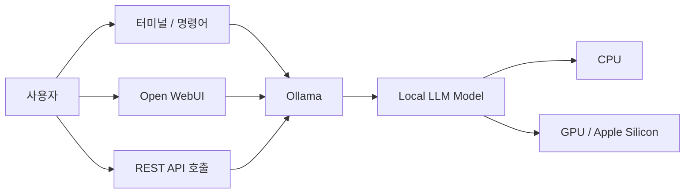

# Step 1. Local LLM 구축 가이드

> 대상: Local LLM 구축을 처음 진행하는 개발자  
> 목표: 개인 PC 또는 사내 개발 장비에서 LLM을 직접 실행하고, 터미널/웹 UI/API 방식으로 기본 테스트까지 완료한다.  
> 권장 구성: Ollama + 모델 다운로드 + Open WebUI 선택 설치

---

## 1. 이 단계에서 만들 결과물

Step 1을 완료하면 다음을 할 수 있습니다.

1. 내 PC에 Local LLM 실행 도구를 설치한다.
2. 작은 모델을 먼저 실행해서 정상 동작을 확인한다.
3. 성능이 허용되면 중간 크기 모델을 추가로 실행한다.
4. 터미널에서 프롬프트를 입력해 답변을 받는다.
5. REST API로 모델을 호출한다.
6. 선택 사항으로 웹 브라우저 기반 UI인 Open WebUI를 연결한다.

이번 단계는 RAG, Agent, Fine-tuning 단계로 넘어가기 전의 가장 기본 환경 구축 단계입니다.

---

## 2. 전체 구성 개념

Local LLM은 간단히 말하면 ChatGPT처럼 동작하는 언어 모델을 클라우드가 아니라 내 컴퓨터에서 직접 실행하는 구조입니다.



### 구성 요소 설명

| 구성 요소 | 설명 |
|---|---|
| Ollama | 로컬에서 LLM 모델을 쉽게 다운로드하고 실행하게 해주는 도구 |
| Local Model | 실제 답변을 생성하는 AI 모델. 예: Gemma, Qwen, Llama 계열 |
| CLI | 터미널에서 `ollama run` 명령으로 모델을 실행하는 방식 |
| REST API | 애플리케이션에서 HTTP 방식으로 모델을 호출하는 방식 |
| Open WebUI | ChatGPT처럼 브라우저 화면에서 로컬 모델을 사용할 수 있게 해주는 웹 UI |

---

## 3. 사전 준비 사항

## 3.1 장비 기준

처음에는 고성능 모델보다 작은 모델로 시작하는 것이 좋습니다.

| 장비 | 권장 시작 모델 | 비고 |
|---|---|---|
| Mac mini M2 Pro / MacBook Pro M2 Pro | `gemma3:4b`, `qwen3.5:4b`, 가능하면 `gemma3:12b` | Apple Silicon에서는 비교적 쾌적하게 테스트 가능 |
| Windows 노트북 Intel Core Ultra 7 / RAM 32GB | `gemma3:4b`, `qwen3.5:4b` | CPU 기반이면 속도는 다소 느릴 수 있음 |
| RAM 16GB 이하 PC | `gemma3:1b`, `qwen3.5:2b` | 처음 테스트용으로 적합 |

> 처음부터 20B, 27B, 35B 같은 큰 모델을 받으면 다운로드 시간, 메모리 사용량, 응답 속도 때문에 실습이 막힐 수 있습니다.  
> Step 1에서는 작은 모델로 성공 경험을 먼저 만드는 것이 중요합니다.

---

## 3.2 디스크 용량 확인

모델 파일은 생각보다 큽니다.

| 모델 크기 | 대략적인 디스크 사용량 |
|---|---:|
| 1B ~ 2B | 약 1GB ~ 3GB |
| 4B | 약 3GB ~ 5GB |
| 8B ~ 12B | 약 5GB ~ 10GB 이상 |
| 27B 이상 | 수십 GB 가능 |

최소 20GB 이상 여유 공간을 확보하는 것을 권장합니다.

### macOS / Linux

```bash
df -h
```

### Windows PowerShell

```powershell
Get-PSDrive C
```

---

## 4. Ollama 설치

Ollama는 로컬에서 모델을 실행하기 위한 핵심 도구입니다.

공식 사이트: <https://ollama.com>

---

## 4.1 macOS 설치

### 방법 1. 공식 설치 파일 사용

1. 브라우저에서 <https://ollama.com> 접속
2. Download 클릭
3. macOS용 설치 파일 다운로드
4. 설치 후 Ollama 앱 실행
5. 터미널을 열고 설치 확인

```bash
ollama --version
```

정상 설치되었다면 Ollama 버전이 출력됩니다.

---

## 4.2 Windows 설치

1. 브라우저에서 <https://ollama.com> 접속
2. Download 클릭
3. Windows용 설치 파일 다운로드
4. 설치 후 Ollama 실행
5. PowerShell 또는 Windows Terminal 실행
6. 설치 확인

```powershell
ollama --version
```

정상 설치되었다면 Ollama 버전이 출력됩니다.

---

## 4.3 Linux 설치

Linux에서는 다음 명령으로 설치할 수 있습니다.

```bash
curl -fsSL https://ollama.com/install.sh | sh
```

설치 확인:

```bash
ollama --version
```

---

## 5. Ollama 기본 동작 확인

설치가 완료되면 Ollama 서버가 백그라운드에서 실행됩니다.

다음 명령으로 상태를 확인합니다.

```bash
ollama list
```

처음 설치 직후에는 아직 받은 모델이 없기 때문에 빈 목록이 나올 수 있습니다.

예시:

```bash
NAME    ID    SIZE    MODIFIED
```

빈 목록이어도 정상입니다. 아직 모델을 다운로드하지 않았기 때문입니다.

---

## 6. 첫 번째 모델 실행

처음에는 가벼운 모델부터 실행합니다.

권장 시작 모델:

```bash
ollama run gemma3:4b
```

처음 실행하면 모델을 자동으로 다운로드한 뒤 실행합니다.

다운로드가 끝나면 프롬프트 입력 화면이 나타납니다.

예시 질문:

```text
너는 지금 로컬에서 실행 중인 LLM이야. 간단히 자기소개해줘.
```

정상적으로 답변이 나오면 Local LLM 실행 성공입니다.

---

## 7. 대화 종료 방법

Ollama 대화 모드에서 빠져나오려면 다음 중 하나를 입력합니다.

```text
/bye
```

또는 키보드에서 다음을 누릅니다.

```text
Ctrl + D
```

---

## 8. 모델 목록 확인

현재 PC에 다운로드된 모델 목록을 확인합니다.

```bash
ollama list
```

예시:

```text
NAME          ID              SIZE      MODIFIED
gemma3:4b     xxxxxxxxxxxx    3.3 GB    5 minutes ago
```

---

## 9. 추가 모델 설치

기본 테스트가 끝났다면 다른 모델도 테스트해볼 수 있습니다.

### 9.1 가벼운 테스트용

```bash
ollama run gemma3:1b
```

장점:

- 빠르게 실행됨
- 저사양 PC에서도 부담이 적음
- Local LLM 구조 이해용으로 적합

단점:

- 답변 품질은 큰 모델보다 낮을 수 있음

---

### 9.2 일반 실습용

```bash
ollama run gemma3:4b
```

장점:

- 처음 실습하기 좋은 균형형 모델
- 문서 요약, 질의응답, 간단한 코드 설명 테스트에 적합

---

### 9.3 성능 비교용

```bash
ollama run qwen3.5:4b
```

또는 사용 가능한 최신 Qwen 모델을 Ollama Library에서 확인한 후 실행합니다.

```bash
ollama run qwen3.6
```

> 단, 큰 모델은 장비 성능에 따라 매우 느릴 수 있습니다. 처음에는 4B 이하 모델부터 시작하세요.

---

## 10. 모델 삭제

사용하지 않는 모델은 삭제할 수 있습니다.

```bash
ollama rm gemma3:4b
```

삭제 후 확인:

```bash
ollama list
```

---

## 11. REST API 호출 테스트

Ollama는 기본적으로 로컬 REST API를 제공합니다.

기본 주소:

```text
http://localhost:11434
```

### 11.1 모델 생성 API 호출

macOS / Linux:

```bash
curl http://localhost:11434/api/generate \
  -d '{
    "model": "gemma3:4b",
    "prompt": "Local LLM이 무엇인지 초보자에게 설명해줘.",
    "stream": false
  }'
```

Windows PowerShell:

```powershell
$body = @{
  model = "gemma3:4b"
  prompt = "Local LLM이 무엇인지 초보자에게 설명해줘."
  stream = $false
} | ConvertTo-Json

Invoke-RestMethod -Uri "http://localhost:11434/api/generate" -Method Post -Body $body -ContentType "application/json"
```

정상 동작하면 JSON 형태로 응답이 반환됩니다.

---

## 12. Python에서 호출하기

Python 개발에서 Ollama를 호출하려면 `ollama` Python 라이브러리를 사용할 수 있습니다.

### 12.1 Python 가상환경 생성

macOS / Linux:

```bash
mkdir local-llm-test
cd local-llm-test
python3 -m venv .venv
source .venv/bin/activate
```

Windows PowerShell:

```powershell
mkdir local-llm-test
cd local-llm-test
python -m venv .venv
.\.venv\Scripts\Activate.ps1
```

---

### 12.2 라이브러리 설치

```bash
pip install ollama
```

---

### 12.3 Python 예제 작성

`ollama_test.py` 파일을 생성합니다.

```python
import ollama

response = ollama.generate(
    model="gemma3:4b",
    prompt="Local LLM을 사내 개발환경에서 활용하는 방법을 5줄로 설명해줘."
)

print(response["response"])
```

실행:

```bash
python ollama_test.py
```

정상적으로 답변이 출력되면 Python 연동까지 성공입니다.

---

## 13. Open WebUI 설치 선택 사항

터미널보다 ChatGPT 같은 웹 화면에서 사용하고 싶다면 Open WebUI를 설치합니다.

Open WebUI는 Ollama와 연결해서 로컬 모델을 브라우저에서 사용할 수 있게 해주는 웹 UI입니다.

공식 문서: <https://docs.openwebui.com>

---

## 13.1 Docker로 Open WebUI 실행

Docker Desktop이 설치되어 있어야 합니다.

### macOS / Windows 공통

```bash
docker run -d \
  -p 3000:8080 \
  --add-host=host.docker.internal:host-gateway \
  -v open-webui:/app/backend/data \
  --name open-webui \
  --restart always \
  ghcr.io/open-webui/open-webui:main
```

실행 후 브라우저에서 접속합니다.

```text
http://localhost:3000
```

최초 접속 시 관리자 계정을 생성합니다.

---

## 13.2 Open WebUI에서 모델 선택

1. 브라우저에서 `http://localhost:3000` 접속
2. 로그인
3. 상단 또는 좌측의 모델 선택 메뉴 클릭
4. `gemma3:4b` 같은 Ollama 모델 선택
5. 질문 입력

예시 질문:

```text
너는 지금 내 PC에서 실행되는 로컬 LLM이야. 현재 구조를 설명해줘.
```

답변이 나오면 Open WebUI 연결 성공입니다.

---

## 14. 자주 발생하는 문제와 해결 방법

## 14.1 `ollama` 명령어를 찾을 수 없음

증상:

```text
command not found: ollama
```

해결:

1. Ollama가 설치되어 있는지 확인합니다.
2. 터미널을 완전히 종료 후 다시 엽니다.
3. 그래도 안 되면 재부팅합니다.
4. Windows에서는 설치 후 PowerShell을 새로 열어야 합니다.

---

## 14.2 모델 다운로드가 너무 느림

원인:

- 모델 파일 크기가 큼
- 네트워크 속도가 느림
- 회사망에서 다운로드가 제한됨

해결:

1. 작은 모델부터 받습니다.

```bash
ollama run gemma3:1b
```

2. 회사망에서 막히면 개인망 또는 허용된 네트워크에서 테스트합니다.
3. 모델 다운로드 중 터미널을 종료하지 않습니다.

---

## 14.3 답변 속도가 너무 느림

원인:

- 모델이 장비에 비해 큼
- GPU 가속을 제대로 사용하지 못함
- 메모리가 부족함

해결:

1. 더 작은 모델을 사용합니다.

```bash
ollama run gemma3:1b
```

2. 동시에 실행 중인 무거운 프로그램을 종료합니다.
3. 4B 모델에서 먼저 안정화한 후 8B 이상으로 확장합니다.

---

## 14.4 Open WebUI에서 모델이 보이지 않음

확인 순서:

1. Ollama 모델이 설치되어 있는지 확인합니다.

```bash
ollama list
```

2. Ollama가 실행 중인지 확인합니다.

```bash
ollama ps
```

3. Open WebUI 컨테이너를 재시작합니다.

```bash
docker restart open-webui
```

4. 브라우저를 새로고침합니다.

---

## 15. 실습 체크리스트

아래 항목을 모두 체크하면 Step 1 완료입니다.

| 체크 | 항목 |
|---|---|
| [ ] | Ollama 설치 완료 |
| [ ] | `ollama --version` 확인 완료 |
| [ ] | `ollama run gemma3:4b` 실행 완료 |
| [ ] | 터미널에서 질문/답변 테스트 완료 |
| [ ] | `ollama list`로 모델 목록 확인 완료 |
| [ ] | REST API 호출 테스트 완료 |
| [ ] | Python 호출 테스트 완료 |
| [ ] | Open WebUI 선택 설치 완료 |
| [ ] | 브라우저에서 로컬 모델 대화 테스트 완료 |

---

## 16. Step 1 완료 기준

Step 1은 다음 상태가 되면 완료입니다.

```text
내 PC에서 LLM 모델이 실행되고,
터미널 또는 웹 UI에서 질문을 입력하면,
인터넷 기반 ChatGPT가 아니라 로컬 모델이 직접 답변하는 상태
```

즉, 다음 명령이 정상 동작해야 합니다.

```bash
ollama run gemma3:4b
```

그리고 다음 API 호출이 정상 응답해야 합니다.

```bash
curl http://localhost:11434/api/generate \
  -d '{
    "model": "gemma3:4b",
    "prompt": "테스트입니다.",
    "stream": false
  }'
```

---

## 17. 다음 단계 예고

Step 1이 완료되면 다음 단계로 넘어갈 수 있습니다.

| 단계 | 내용 |
|---|---|
| Step 2 | 모델별 성능 비교 및 프롬프트 테스트 |
| Step 3 | 문서 기반 질의응답 RAG 구축 |
| Step 4 | 사내 문서 검색용 Vector DB 연동 |
| Step 5 | Agent 구조 실습 |
| Step 6 | AI Data Platform 아키텍처 설계 |

---

## 18. 참고 링크

- Ollama 공식 사이트: <https://ollama.com>
- Ollama Model Library: <https://ollama.com/library>
- Gemma 3 모델: <https://ollama.com/library/gemma3>
- Qwen 모델: <https://ollama.com/library/qwen3.5>
- Open WebUI 공식 문서: <https://docs.openwebui.com>
- Open WebUI GitHub: <https://github.com/open-webui/open-webui>

---

## 19. 장관님 실습 추천 순서

장관님 장비 기준으로는 다음 순서가 좋습니다.

### 1차: Mac mini M2 Pro에서 실습

```bash
ollama run gemma3:4b
```

성공 후:

```bash
ollama run qwen3.5:4b
```

### 2차: Windows 노트북에서 동일 실습

```powershell
ollama run gemma3:4b
```

성능이 느리면:

```powershell
ollama run gemma3:1b
```

### 3차: Open WebUI 연결

```bash
docker run -d \
  -p 3000:8080 \
  --add-host=host.docker.internal:host-gateway \
  -v open-webui:/app/backend/data \
  --name open-webui \
  --restart always \
  ghcr.io/open-webui/open-webui:main
```

브라우저 접속:

```text
http://localhost:3000
```

---

# 끝

이 문서는 GitHub 저장소의 `docs/` 폴더에 업로드한 뒤 MkDocs 메뉴에 연결해서 팀원들과 공유할 수 있습니다.

예시 경로:

```text
docs/ai-data-platform/step1-local-llm-setup.md
```

MkDocs `mkdocs.yml` 예시:

```yaml
nav:
  - AI Data Platform:
      - Step 1. Local LLM 구축: ai-data-platform/step1-local-llm-setup.md
```
