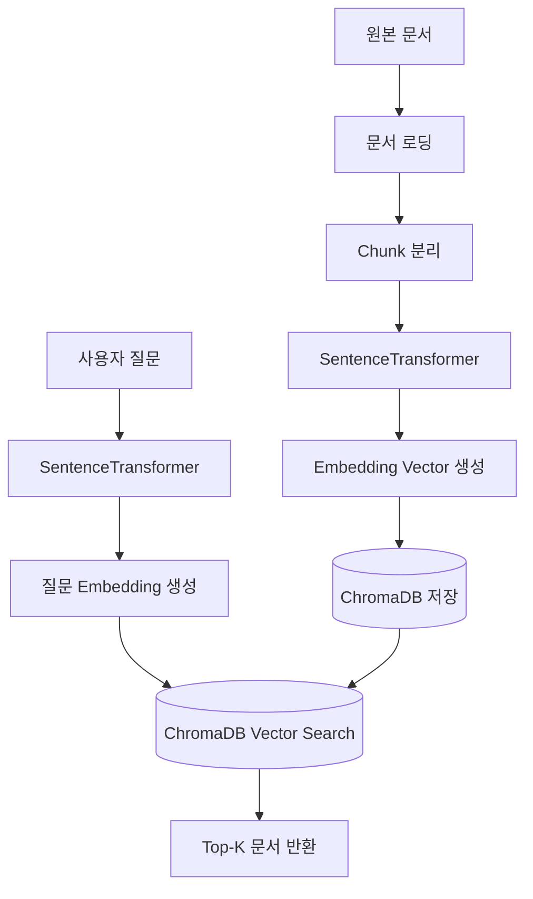

# Step2-2 보충. SentenceTransformer와 Embedding 이해 가이드

> 문서를 Vector DB에 저장하기 전에 왜 Embedding이 필요한지, SentenceTransformer가 어떤 역할을 하는지 이해하기 위한 Step2-2 보충 학습 문서

---

## 1. 문서 작성 목적

이 문서는 AI-Data-Platform 스터디의 Step2 RAG 과정 중 **Step2-2. Vector DB 구축 및 문서 적재**를 보완하기 위한 가이드 문서이다.

Step2-2에서는 Markdown 문서를 읽고, 문서를 Chunk 단위로 나눈 뒤, 각 Chunk를 Embedding으로 변환하여 ChromaDB에 저장하였다. 이 과정에서 `SentenceTransformer`를 사용했는데, 처음 RAG를 학습하는 입장에서는 다음과 같은 질문이 생길 수 있다.

```text
SentenceTransformer가 무엇인가?
왜 문서를 숫자로 변환해야 하는가?
Embedding은 무엇인가?
왜 ChromaDB에 텍스트를 그대로 저장하지 않고 Embedding을 저장하는가?
Step2-2 실습에서 왜 SentenceTransformer를 선택했는가?
```

본 문서는 위 질문에 답하기 위해 작성되었다.

---

## 2. Step2-2에서 SentenceTransformer가 등장하는 위치

Step2-2의 전체 처리 흐름은 다음과 같다.

```text
문서 준비
 ↓
문서 로딩
 ↓
Chunk 분리
 ↓
Embedding 생성
 ↓
ChromaDB 저장
 ↓
Vector Search 테스트
```

이 중 `SentenceTransformer`는 아래 단계에서 사용된다.

```text
Chunk 분리
 ↓
SentenceTransformer
 ↓
Embedding Vector 생성
 ↓
ChromaDB 저장
```

즉, SentenceTransformer는 문서 Chunk를 Vector DB에 저장할 수 있는 숫자 벡터로 변환하는 역할을 한다.

---

## 3. Embedding이란 무엇인가?

### 3.1 문장을 숫자로 표현하는 기술

컴퓨터는 사람이 이해하는 자연어 문장을 그대로 의미적으로 비교하지 못한다. 예를 들어 다음 세 문장을 보자.

```text
문장 1: 마이크로서비스의 장점은 독립 배포이다.
문장 2: MSA는 서비스별로 개별 배포가 가능하다.
문장 3: 오늘 점심은 김치찌개를 먹었다.
```

사람이 보면 문장 1과 문장 2는 비슷한 의미라는 것을 쉽게 알 수 있다.

```text
문장 1 ≒ 문장 2
```

그러나 컴퓨터가 이 의미적 유사성을 계산하려면 문장을 숫자로 변환해야 한다.

예를 들어 다음과 같이 표현할 수 있다.

```text
문장 1 → [0.123, 0.567, 0.891, ...]
문장 2 → [0.121, 0.564, 0.887, ...]
문장 3 → [0.912, 0.123, 0.456, ...]
```

이처럼 문장, 문단, 문서 Chunk를 숫자 배열로 변환한 것을 **Embedding Vector**라고 한다.

---

### 3.2 Embedding이 필요한 이유

Embedding을 사용하면 문장 간 의미적 거리를 계산할 수 있다.

```text
문장 1과 문장 2는 의미가 비슷하므로 벡터 거리가 가깝다.
문장 1과 문장 3은 의미가 다르므로 벡터 거리가 멀다.
```

이 원리를 이용하면 사용자의 질문과 가장 의미적으로 가까운 문서 Chunk를 찾을 수 있다.

```text
사용자 질문
 ↓
질문 Embedding 생성
 ↓
문서 Chunk Embedding과 비교
 ↓
가장 유사한 문서 Top-K 검색
```

RAG에서 Vector DB 검색이 가능한 이유가 바로 이 Embedding 때문이다.

---

## 4. SentenceTransformer란 무엇인가?

`SentenceTransformer`는 문장 또는 문단을 Embedding Vector로 변환하는 Python 라이브러리이자 모델 사용 방식이다.

정확히는 `sentence-transformers` 패키지를 통해 제공되며, Transformer 기반 언어 모델을 사용하여 자연어 문장의 의미를 벡터로 변환한다.

```text
문장
 ↓
SentenceTransformer 모델
 ↓
Embedding Vector
```

예를 들어 다음 문장을 입력하면,

```text
마이크로서비스의 장점은 무엇인가?
```

SentenceTransformer는 이 문장을 다음과 같은 숫자 배열로 변환한다.

```text
[0.021, -0.145, 0.338, 0.902, ...]
```

이 숫자 배열은 문장의 의미를 표현한다.

---

## 5. 간단한 SentenceTransformer 예제

### 5.1 패키지 설치

Step2-2 실습에서 SentenceTransformer를 사용하려면 다음 패키지가 필요하다.

```bash
pip install sentence-transformers
```

ChromaDB까지 함께 사용하는 경우 다음과 같이 설치할 수 있다.

```bash
pip install chromadb sentence-transformers
```

---

### 5.2 문장 Embedding 생성 예제

```python
from sentence_transformers import SentenceTransformer

model = SentenceTransformer("paraphrase-multilingual-MiniLM-L12-v2")

sentence = "마이크로서비스의 장점은 무엇인가?"
embedding = model.encode(sentence)

print(type(embedding))
print(len(embedding))
print(embedding[:5])
```

실행 결과는 환경에 따라 다르지만 대략 다음과 같은 형태이다.

```text
<class 'numpy.ndarray'>
384
[ 0.0123 -0.0456  0.0789  0.1023 -0.0345]
```

여기서 `384`는 Embedding Vector의 차원 수를 의미한다. 즉, 하나의 문장이 384개의 숫자로 표현된 것이다.

---

## 6. Step2-2에서 사용한 모델

Step2-2 실습에서는 다음 모델을 사용했다.

```python
MODEL_NAME = "paraphrase-multilingual-MiniLM-L12-v2"
```

이 모델은 SentenceTransformer 계열의 다국어 지원 모델이다.

### 6.1 이 모델을 선택한 이유

AI-Data-Platform 실습에서는 한국어 문서를 다룰 가능성이 높다. 따라서 영어만 지원하는 모델보다는 한국어를 포함한 다국어 모델을 사용하는 것이 적합하다.

`paraphrase-multilingual-MiniLM-L12-v2`를 선택한 이유는 다음과 같다.

```text
한국어를 포함한 다국어 문장 처리 가능
모델 크기가 비교적 작아 로컬 PC에서 실행 가능
Mac 환경에서도 실습 가능
속도가 비교적 빠름
RAG 입문 실습에 적합
```

즉, 이 모델은 최고의 성능을 목표로 선택한 것이 아니라, 학습용 RAG 실습에서 원리를 이해하기 좋고 로컬 환경에서 부담 없이 실행하기 위해 선택한 모델이다.

---

## 7. 왜 ChromaDB 자동 Embedding 대신 직접 Embedding을 만들었는가?

ChromaDB는 Embedding을 처리하는 방식이 크게 두 가지가 있다.

---

### 7.1 방식 1. Embedding을 직접 생성해서 저장

Step2-2 실습에서 사용한 방식이다.

```python
model = SentenceTransformer("paraphrase-multilingual-MiniLM-L12-v2")

embedding = model.encode(chunk_text).tolist()

collection.add(
    ids=[chunk_id],
    documents=[chunk_text],
    embeddings=[embedding],
    metadatas=[metadata]
)
```

이 방식에서는 다음 과정이 코드에 명확히 드러난다.

```text
문서 Chunk
 ↓
SentenceTransformer
 ↓
Embedding Vector
 ↓
ChromaDB 저장
```

장점은 다음과 같다.

```text
Embedding이 언제 생성되는지 명확히 알 수 있다.
문서 적재 과정의 원리를 이해하기 좋다.
검색 시에도 동일한 모델을 사용해야 한다는 점을 학습할 수 있다.
향후 다른 Embedding 모델로 교체하는 구조를 이해하기 쉽다.
```

---

### 7.2 방식 2. ChromaDB가 자동으로 Embedding 생성

ChromaDB의 Embedding Function을 설정해두면 문서를 저장할 때 ChromaDB가 자동으로 Embedding을 생성할 수도 있다.

```python
collection.add(
    ids=[chunk_id],
    documents=[chunk_text],
    metadatas=[metadata]
)
```

이 방식은 코드가 간단하다. 그러나 학습 관점에서는 Embedding 생성 과정이 내부에 숨겨진다.

단점은 다음과 같다.

```text
Embedding 개념을 직접 이해하기 어렵다.
문서 적재와 검색 모델의 일치 여부를 놓치기 쉽다.
Vector DB가 모든 것을 자동으로 처리한다고 오해할 수 있다.
```

---

### 7.3 AI-Data-Platform 실습에서 직접 Embedding 방식을 선택한 이유

AI-Data-Platform 스터디의 목표는 단순히 도구를 사용하는 것이 아니라, AI 플랫폼을 설계하고 구축할 수 있는 역량을 확보하는 것이다.

따라서 Step2-2에서는 편리함보다 구조 이해를 우선했다.

```text
문서를 직접 Chunk로 나눈다.
Chunk를 직접 Embedding으로 변환한다.
Embedding Vector를 직접 ChromaDB에 저장한다.
질문도 같은 모델로 Embedding하여 검색한다.
```

이 과정을 직접 경험해야 RAG의 핵심 구조를 정확히 이해할 수 있다.

---

## 8. 문서 적재와 검색에서 같은 모델을 사용해야 하는 이유

Step2-2에서 문서를 Embedding할 때 사용한 모델과 Step2-3에서 질문을 Embedding할 때 사용하는 모델은 동일해야 한다.

예를 들어 문서를 다음 모델로 저장했다고 가정한다.

```python
SentenceTransformer("paraphrase-multilingual-MiniLM-L12-v2")
```

그런데 검색할 때 다른 모델로 질문을 Embedding하면 문제가 생길 수 있다.

```text
문서 Embedding 공간과 질문 Embedding 공간이 달라진다.
벡터 거리 계산의 의미가 흐려진다.
검색 품질이 떨어진다.
경우에 따라 차원 수가 달라 오류가 발생할 수 있다.
```

따라서 RAG에서는 다음 원칙이 중요하다.

```text
문서를 적재할 때 사용한 Embedding 모델과
질문을 검색할 때 사용한 Embedding 모델은 동일하게 맞춘다.
```

이 원칙 때문에 Step2-3의 `05_search_documents.py`에서도 Step2-2의 `03_insert_to_chroma.py`와 동일한 SentenceTransformer 모델을 사용해야 한다.

---

## 9. ChromaDB에는 무엇이 저장되는가?

ChromaDB에는 보통 다음 정보가 함께 저장된다.

```text
id: Chunk를 구분하는 고유 ID
embedding: Chunk의 의미를 표현하는 벡터
metadata: 파일명, Chunk 번호, 문서 유형 등 부가 정보
document: 원문 텍스트 Chunk
```

예시는 다음과 같다.

```json
{
  "id": "microserver_guide_chunk_001",
  "document": "MicroServer Framework는 Spring Boot 기반의 MSA 플랫폼이다.",
  "embedding": [0.123, 0.456, 0.789],
  "metadata": {
    "source": "microserver_guide.md",
    "chunk_index": 1
  }
}
```

검색 시에는 사용자의 질문도 Embedding으로 변환한 뒤, 저장된 문서 Embedding과 거리를 비교한다.

---

## 10. Vector Search는 어떻게 동작하는가?

Vector Search는 질문 벡터와 문서 벡터 사이의 거리를 계산하여 가장 가까운 문서를 찾는 방식이다.

```text
질문: MicroServer의 주요 구성요소는 무엇인가?
 ↓
질문 Embedding 생성
 ↓
ChromaDB에 저장된 문서 Embedding들과 비교
 ↓
가장 가까운 문서 Top-K 반환
```

예를 들어 ChromaDB에 100개의 Chunk가 저장되어 있다면, 질문과 의미적으로 가장 가까운 순서대로 정렬한 뒤 상위 몇 개를 가져온다.

```text
1위: API Gateway 관련 Chunk
2위: Eureka 관련 Chunk
3위: Monitoring 관련 Chunk
4위: Config Server 관련 Chunk
...
```

이때 상위 몇 개를 가져올지 정하는 값이 Top-K이다.

```python
search_documents(question, top_k=3)
```

위 코드는 질문과 가장 유사한 문서 3개를 가져오라는 의미이다.

---

## 11. Step2-2 실습 코드와의 연결

Step2-2의 `03_insert_to_chroma.py`는 다음과 같은 역할을 한다.

```text
Chunk 파일 또는 Chunk 목록을 읽는다.
SentenceTransformer 모델을 로딩한다.
각 Chunk를 Embedding Vector로 변환한다.
ChromaDB 컬렉션에 document, embedding, metadata를 저장한다.
```

핵심 구조는 다음과 같다.

```python
from sentence_transformers import SentenceTransformer

model = SentenceTransformer("paraphrase-multilingual-MiniLM-L12-v2")

embedding = model.encode(chunk_text).tolist()

collection.add(
    ids=[chunk_id],
    documents=[chunk_text],
    embeddings=[embedding],
    metadatas=[metadata]
)
```

이 구조를 이해하면 Step2-3의 검색 코드도 자연스럽게 이해할 수 있다.

```python
query_embedding = model.encode(question).tolist()

results = collection.query(
    query_embeddings=[query_embedding],
    n_results=top_k
)
```

즉, Step2-2에서는 문서를 Embedding하고, Step2-3에서는 질문을 Embedding한다.

```text
Step2-2: 문서 Chunk → Embedding → 저장
Step2-3: 사용자 질문 → Embedding → 검색
```

---

## 12. 실습 관점에서 기억해야 할 핵심 원칙

Step2-2와 Step2-3을 진행할 때 다음 원칙을 기억해야 한다.

```text
1. LLM은 문서를 그대로 검색하지 않는다.
2. 문서는 먼저 Embedding Vector로 변환되어야 한다.
3. 질문도 Embedding Vector로 변환되어야 한다.
4. Vector DB는 질문 벡터와 문서 벡터의 거리를 비교한다.
5. 문서 적재와 질문 검색에는 동일한 Embedding 모델을 사용하는 것이 좋다.
6. SentenceTransformer는 문장과 문서를 Embedding Vector로 변환하는 도구이다.
```

---

## 13. 실무에서는 어떤 Embedding 모델을 사용하는가?

Step2-2에서는 학습 편의성을 위해 `paraphrase-multilingual-MiniLM-L12-v2`를 사용했다. 그러나 실무 RAG에서는 데이터 특성, 언어, 성능 요구사항에 따라 다양한 Embedding 모델을 사용할 수 있다.

예시는 다음과 같다.

```text
BGE-M3
E5-Multilingual
Nomic Embed
OpenAI Embedding
Voyage Embedding
Cohere Embed
```

기업형 RAG에서는 다음 기준으로 모델을 선택한다.

```text
한국어 검색 성능
도메인 문서 검색 품질
로컬 실행 가능 여부
GPU 필요 여부
응답 속도
비용
보안 정책
라이선스
```

AI-Data-Platform 프로젝트에서는 Step2 단계에서 SentenceTransformer로 원리를 학습하고, 이후 Step2-5 실전 사내 문서 RAG나 Step5 LLM Serving 단계에서 더 고성능 Embedding 모델로 확장할 수 있다.

---

## 14. Mermaid로 보는 Embedding 처리 흐름



---

## 15. MkDocs 반영 위치 제안

이 문서는 Step2-2의 보충 문서이므로 다음 위치에 두는 것을 추천한다.

```text
docs/study/step2/step2_2_sentence_transformer_embedding_guide.md
```

`mkdocs.yml`에는 다음과 같이 반영할 수 있다.

```yaml
- Study:
    - Step2 RAG:
        - Step2-1. RAG 개요 및 아키텍처 이해: study/step2/step2_rag_overview_guide.md
        - Step2-2. Vector DB 구축 및 문서 적재: study/step2/step2_2_vector_db_build_and_document_ingestion_guide.md
        - Step2-2 보충. SentenceTransformer와 Embedding 이해: study/step2/step2_2_sentence_transformer_embedding_guide.md
        - Step2-3. RAG 질의응답 구현: study/step2/step2_3_rag_qa_implementation_guide.md
```

---

# 최종 정리

SentenceTransformer는 문장 또는 문서 Chunk를 Embedding Vector로 변환하는 도구이다.

Step2-2에서 SentenceTransformer를 사용한 이유는 문서를 의미 기반으로 검색할 수 있도록 벡터로 변환하기 위해서이다.

```text
문서 Chunk
 ↓
SentenceTransformer
 ↓
Embedding Vector
 ↓
ChromaDB 저장
```

그리고 Step2-3에서는 사용자의 질문도 동일한 SentenceTransformer 모델로 Embedding한 뒤, ChromaDB에 저장된 문서 벡터와 비교하여 관련 문서를 검색한다.

```text
사용자 질문
 ↓
SentenceTransformer
 ↓
질문 Embedding Vector
 ↓
ChromaDB 검색
 ↓
Top-K 문서 반환
```

따라서 RAG를 이해하기 위해서는 단순히 ChromaDB를 사용하는 것뿐 아니라, 문장과 문서를 벡터로 변환하는 Embedding 개념을 반드시 이해해야 한다.

AI-Data-Platform 프로젝트에서 Step2-2는 바로 이 Embedding 기반 검색 구조를 직접 구축해보는 단계이다.
