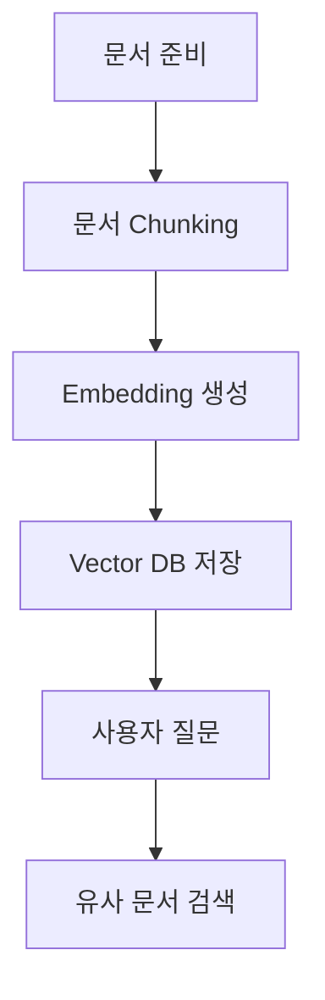
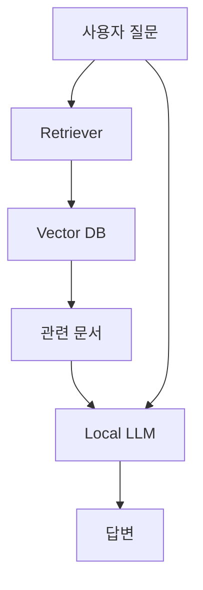
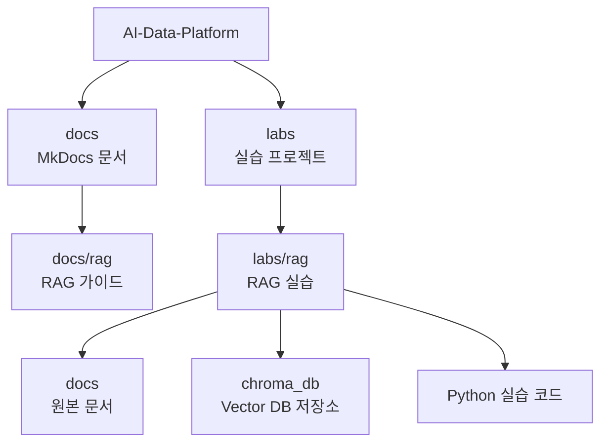
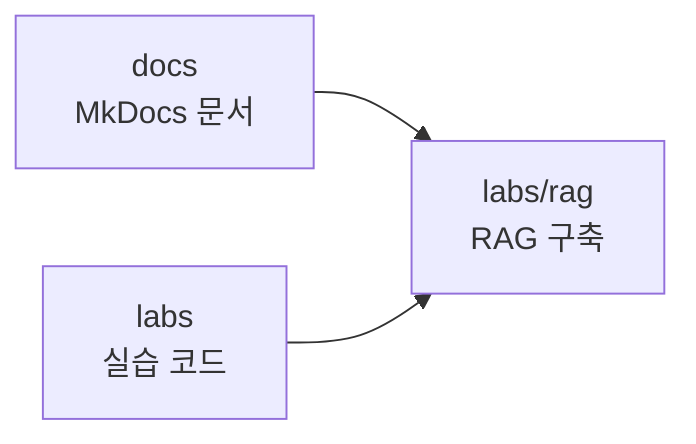
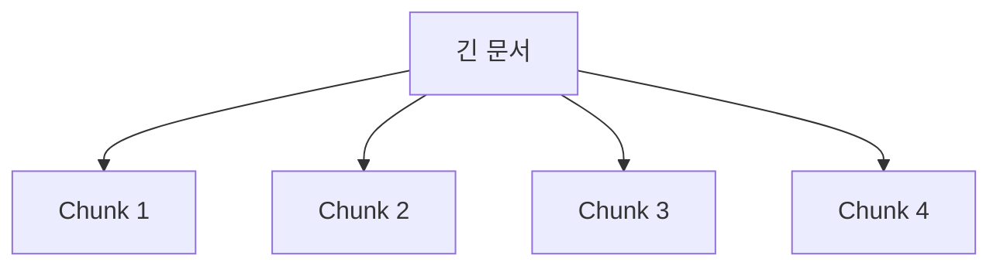
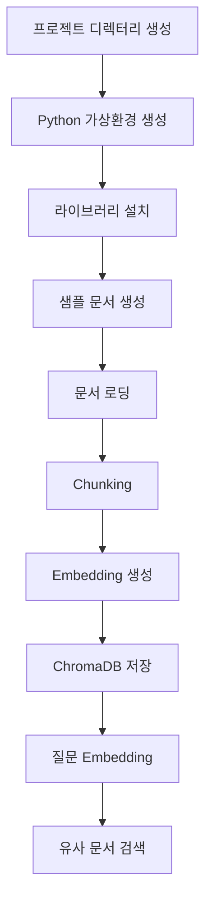
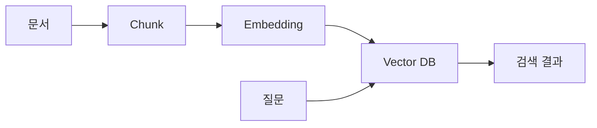

# Step2-2. Vector DB 구축 및 문서 적재 가이드

## 문서 개요

본 문서는 AI Data Platform 스터디의 Step2 RAG 구축 과정 중 두 번째 단계인 **Vector DB 구축 및 문서 적재**를 설명한다.

Step2-1에서 RAG의 개념과 전체 아키텍처를 이해했다면, 이번 단계에서는 RAG의 핵심 저장소 역할을 하는 **Vector Database**를 직접 구축하고, 샘플 문서를 벡터 형태로 저장한 뒤 검색까지 수행한다.

이번 문서의 목표는 단순히 ChromaDB를 설치하는 것이 아니라, 다음 흐름을 직접 실습하면서 이해하는 것이다.



---

# 1. 이번 단계의 목표

이번 단계가 끝나면 다음 내용을 이해하고 실습할 수 있다.

- Vector DB가 무엇인지 이해한다.
- RDB와 Vector DB의 차이를 이해한다.
- RAG에서 Vector DB가 어떤 역할을 하는지 이해한다.
- ChromaDB를 설치한다.
- Python에서 ChromaDB를 사용한다.
- 샘플 문서를 Chunk 단위로 분리한다.
- 문서를 Embedding으로 변환한다.
- Vector DB에 문서를 적재한다.
- 질문을 입력하여 관련 문서를 검색한다.

---

# 2. Vector DB란 무엇인가?

Vector DB는 텍스트, 이미지, 문서 등의 데이터를 **벡터(Vector)** 형태로 저장하고, 사용자의 질문과 의미적으로 가까운 데이터를 검색하는 데이터베이스이다.

일반적인 데이터베이스는 정확히 일치하는 값을 찾는 데 강하다.

예를 들어 RDB에서는 다음과 같은 검색이 일반적이다.

```sql
SELECT *
FROM document
WHERE title = 'MicroServer 설치 가이드';
```

이 방식은 제목이 정확히 일치할 때는 잘 동작한다.

하지만 사용자가 다음처럼 질문하면 어떨까?

```text
MicroServer를 내 PC에 처음 설치하려면 어떻게 해야 해?
```

이 질문에는 "설치 가이드"라는 단어가 직접 포함되어 있지 않을 수도 있다.

그러나 의미적으로는 **MicroServer 설치 가이드**와 관련이 있다.

Vector DB는 이러한 의미 기반 검색을 가능하게 한다.

---

# 3. RDB와 Vector DB의 차이

| 구분 | RDB | Vector DB |
|---|---|---|
| 저장 형태 | 행과 열 | 벡터, 문서, 메타데이터 |
| 검색 방식 | 정확한 값 비교 | 의미적 유사도 검색 |
| 대표 질의 | SQL | Similarity Search |
| 적합한 데이터 | 정형 데이터 | 비정형 데이터, 문서, 텍스트 |
| 활용 예 | 회원 조회, 주문 조회 | 문서 검색, RAG, 추천 검색 |

RDB는 여전히 중요하다.

업무 시스템의 거래 데이터, 사용자 정보, 권한 정보, 상태 정보는 RDB가 적합하다.

반면 RAG에서는 사용자의 질문과 관련된 문서를 의미적으로 찾아야 하므로 Vector DB가 필요하다.


---

# 4. RAG에서 Vector DB의 역할

RAG에서 Vector DB는 LLM이 답변하기 전에 참고할 문서를 찾아주는 역할을 한다.

LLM은 모든 회사 문서를 알고 있지 않다.

따라서 RAG는 먼저 Vector DB에서 질문과 관련된 문서를 검색하고, 검색된 내용을 LLM에게 함께 전달한다.



이 구조에서 Vector DB는 단순 저장소가 아니라 **LLM의 근거 자료 검색 엔진** 역할을 한다.

---

# 5. ChromaDB를 사용하는 이유

이번 실습에서는 Vector DB로 **ChromaDB**를 사용한다.

ChromaDB를 선택하는 이유는 다음과 같다.

- Python에서 사용하기 쉽다.
- 로컬 환경에서 빠르게 실습할 수 있다.
- RAG 학습용으로 적합하다.
- 문서, 메타데이터, 임베딩을 함께 저장할 수 있다.
- 별도 서버 없이 파일 기반으로 영속 저장이 가능하다.
- 향후 Open WebUI, LangChain, LlamaIndex 등과 연계하기 쉽다.

AI Data Platform 스터디의 목적은 처음부터 복잡한 운영형 Vector DB를 구축하는 것이 아니라, RAG의 구조와 동작 원리를 정확히 이해하는 것이다.

따라서 첫 번째 Vector DB 실습에는 ChromaDB가 적합하다.

---

# 6. 실습 환경

본 문서는 macOS 또는 Linux 터미널 기준으로 작성한다.

Windows 환경에서는 PowerShell 또는 WSL2에서 동일하게 실습할 수 있다.

## 6.1 사전 준비

다음 항목이 준비되어 있어야 한다.

- Python 3.10 이상
- pip
- 터미널
- 프로젝트 작업 디렉터리
- 기본적인 Python 실행 환경

Python 버전 확인:

```bash
python3 --version
```

### 명령어 설명

| 명령어 | 설명 |
|---|---|
| `python3` | Python 3 실행 명령어 |
| `--version` | 설치된 Python 버전을 출력하는 옵션 |

정상적으로 설치되어 있다면 다음과 비슷하게 출력된다.

```text
Python 3.11.x
```

---

# 7. 프로젝트 디렉터리 구성

이번 실습은 별도의 독립 프로젝트를 만드는 것이 아니라 현재 운영 중인 **AI-Data-Platform GitHub 저장소 내부에서 진행한다.**

문서와 실습 코드를 함께 관리하면 다음과 같은 장점이 있다.

- 학습 문서와 실습 코드를 함께 관리할 수 있다.
- GitHub를 통해 버전관리가 가능하다.
- 팀원들과 동일한 환경을 공유할 수 있다.
- Step3 Agent, Step4 AI Data Platform 단계까지 동일한 구조를 유지할 수 있다.
- 실습 결과를 프로젝트 자산으로 축적할 수 있다.

---

## 7.1 권장 디렉터리 구조



---

### 실제 디렉터리 예시

```text
AI-Data-Platform
│
├─ docs
│   └─ rag
│       ├─ step2_1_rag_overview.md
│       ├─ step2_2_vector_db_build.md
│       ├─ step2_3_first_rag.md
│       ├─ step2_4_openwebui_rag.md
│       └─ step2_5_enterprise_rag.md
│
├─ labs
│   └─ rag
│       ├─ docs
│       │   └─ microserver_guide.md
│       ├─ chroma_db
│       ├─ 02_load_and_chunk.py
│       ├─ 03_insert_to_chroma.py
│       └─ 04_search_chroma.py
│
├─ mkdocs.yml
├─ README.md
└─ .gitignore
```

---

## 7.2 디렉터리 설명

| 디렉터리 | 설명 |
|----------|------|
| docs | MkDocs 문서 저장소 |
| docs/rag | RAG 학습 문서 |
| labs | 실습 코드 저장소 |
| labs/rag | RAG 실습 프로젝트 |
| labs/rag/docs | 원본 문서 저장 |
| labs/rag/chroma_db | ChromaDB 데이터 저장 |
| mkdocs.yml | MkDocs 설정 파일 |
| .gitignore | Git 제외 설정 파일 |

---

## 7.3 실습 디렉터리 생성

프로젝트 루트(`AI-Data-Platform`)에서 아래 명령을 실행한다.

```bash
mkdir -p labs/rag/docs
mkdir -p labs/rag/chroma_db

cd labs/rag
```

### 명령어 설명

| 명령어 | 설명 |
|----------|------|
| mkdir | 디렉터리 생성 |
| -p | 상위 디렉터리가 없어도 함께 생성 |
| labs/rag/docs | 원본 문서 저장 디렉터리 |
| labs/rag/chroma_db | ChromaDB 저장 디렉터리 |
| cd labs/rag | 실습 디렉터리 이동 |

---

## 7.4 현재 위치 확인

```bash
pwd
```

실행 결과 예시

```text
~/workspace/AI-Data-Platform/labs/rag
```

### 명령어 설명

| 명령어 | 설명 |
|----------|------|
| pwd | 현재 작업 중인 디렉터리 경로를 출력한다. |

---

## 7.5 .gitignore 설정

실습 과정에서 생성되는 가상환경 및 ChromaDB 데이터는 GitHub에 업로드하지 않는다.

프로젝트 루트의 `.gitignore` 파일에 아래 내용을 추가한다.

```gitignore
# Python
.venv/
__pycache__/
*.pyc

# ChromaDB
chroma_db/

# macOS
.DS_Store

# IDE
.idea/
.vscode/
```

### 왜 Git에 올리지 않는가?

#### .venv

Python 가상환경 디렉터리이다.

- 수백 MB ~ 수 GB 크기의 라이브러리가 저장될 수 있다.
- 개발자 PC마다 환경이 다르다.
- Git으로 관리할 대상이 아니다.

#### chroma_db

ChromaDB의 실제 저장 데이터가 위치한다.

저장되는 데이터 예시

- Embedding 데이터
- Vector 데이터
- 실습 데이터

실습을 반복할수록 크기가 계속 증가하므로 Git 저장소에는 포함하지 않는다.

---

## 7.6 최종 목표

Step2 과정이 완료되면 아래와 같은 구조가 완성된다.



문서는 `docs`에서 관리하고,

실습 코드는 `labs`에서 관리하는 구조를 유지한다.

이 구조는 향후 다음 단계까지 그대로 확장할 수 있다.

- Step3 Agent 구축
- Step4 AI Data Platform 구축
- Step5 LLM Serving 구축

---

# 8. Python 가상환경 생성

Python 프로젝트에서는 가상환경을 사용하는 것이 좋다.

가상환경을 사용하면 프로젝트별로 라이브러리를 분리해서 관리할 수 있다.

```bash
python3 -m venv .venv
```

### 명령어 설명

| 명령어 | 설명 |
|---|---|
| `python3` | Python 3 실행 |
| `-m venv` | Python의 venv 모듈을 실행하여 가상환경 생성 |
| `.venv` | 생성할 가상환경 디렉터리 이름 |

가상환경 활성화:

Linux 또는 WSL 환경에서는 다음 명령어로 가상환경을 활성화한다.

```bash
source .venv/bin/activate
```

### 명령어 설명

| 명령어 | 설명 |
|---|---|
| `source` | 현재 셸에서 스크립트를 실행한다. |
| `.venv/bin/activate` | 가상환경을 활성화하는 스크립트이다. |

정상적으로 활성화되면 터미널 앞에 다음과 같이 표시될 수 있다.

```text
(.venv)
```

Windows 환경에서 가상환경 활성화

Windows에서 가상환경을 생성하면 .venv 디렉터리 안에 bin 폴더가 생성되지 않고, 대신 Scripts 폴더가 생성된다.

따라서 Windows PowerShell에서는 다음 명령어를 사용한다.

```powershell
.venv\Scripts\Activate.ps1
```

Git Bash를 사용하는 경우에는 다음 명령어를 사용한다.

```bash
source .venv/Scripts/activate
```

즉, 환경에 따라 가상환경 활성화 경로가 다르다.

| 환경 | 활성화 명령어 |
|---|---|
| Linux / WSL | `source .venv/bin/activate` |
| Windows PowerShell | `.venv\Scripts\Activate.ps1` |
| Windows Git Bash | `source .venv/Scripts/activate` |
| Windows CMD | `.venv\Scripts\activate.bat` |

정리하면, WSL/Linux에서는 `.venv/bin/activate`를 사용하고, Windows 환경에서는 `.venv/Scripts/activate` 또는 `.venv\Scripts\Activate.ps1`을 사용한다.

---

# 9. pip 업그레이드

라이브러리 설치 전에 pip를 최신 버전으로 갱신한다.

```bash
python -m pip install --upgrade pip
```

### 명령어 설명

| 명령어 | 설명 |
|---|---|
| `python -m pip` | 현재 가상환경의 pip를 실행한다. |
| `install` | 패키지를 설치한다. |
| `--upgrade` | 이미 설치된 패키지를 최신 버전으로 갱신한다. |
| `pip` | 업그레이드 대상 패키지이다. |

---

# 10. 필요한 라이브러리 설치

이번 실습에서는 다음 라이브러리를 사용한다.

- `chromadb` : Vector DB
- `sentence-transformers` : 문장을 Embedding으로 변환
- `pypdf` : PDF 문서 읽기용
- `python-dotenv` : 환경변수 관리용

설치 명령:

```bash
pip install chromadb sentence-transformers pypdf python-dotenv
```

### 명령어 설명

| 패키지 | 설명 |
|---|---|
| `chromadb` | 로컬 Vector DB로 사용할 ChromaDB 패키지 |
| `sentence-transformers` | 문장을 벡터로 변환하기 위한 Embedding 모델 패키지 |
| `pypdf` | PDF 문서를 읽기 위한 패키지 |
| `python-dotenv` | `.env` 파일을 통해 환경변수를 관리할 때 사용하는 패키지 |

설치된 패키지 확인:

```bash
pip list
```

### 명령어 설명

| 명령어 | 설명 |
|---|---|
| `pip list` | 현재 가상환경에 설치된 Python 패키지 목록을 출력한다. |

---

# 11. 실습 디렉터리 구조 만들기

이번 실습은 별도의 프로젝트를 생성하는 것이 아니라 현재 운영 중인 **AI-Data-Platform 저장소의 `labs/rag` 디렉터리 내부에서 진행한다.**

실습 코드와 실습 데이터를 함께 관리하여 향후 Step2, Step3, Step4 과정까지 동일한 구조를 유지한다.

---

# 11. 실습 디렉터리 구조 만들기

이번 실습은 별도의 프로젝트를 생성하는 것이 아니라 현재 운영 중인 **AI-Data-Platform 저장소의 `labs/rag` 디렉터리 내부에서 진행한다.**

실습 코드와 실습 데이터를 함께 관리하여 향후 Step2, Step3, Step4 과정까지 동일한 구조를 유지한다.

---

## 11.1 실습 디렉터리 구조

```text
AI-Data-Platform
│
├─ docs
│   └─ rag
│       ├─ step2_1_rag_overview.md
│       ├─ step2_2_vector_db_build.md
│       ├─ step2_3_first_rag.md
│       └─ ...
│
├─ labs
│   └─ rag
│       ├─ docs
│       │   └─ microserver_guide.md
│       │
│       ├─ chroma_db
│       │
│       ├─ 01_create_sample_doc.py
│       ├─ 02_load_and_chunk.py
│       ├─ 03_insert_to_chroma.py
│       └─ 04_search_chroma.py
│
├─ mkdocs.yml
└─ README.md
```

---

## 11.2 디렉터리 생성

프로젝트 루트(`AI-Data-Platform`)에서 아래 명령을 실행한다.

```bash
mkdir -p labs/rag/docs
mkdir -p labs/rag/chroma_db

cd labs/rag
```

### 명령어 설명

| 명령어 | 설명 |
|---------|------|
| `mkdir` | 디렉터리를 생성한다. |
| `-p` | 상위 디렉터리가 존재하지 않아도 함께 생성한다. |
| `labs/rag/docs` | 실습용 원본 문서를 저장하는 디렉터리이다. |
| `labs/rag/chroma_db` | ChromaDB 데이터가 저장되는 디렉터리이다. |
| `cd labs/rag` | RAG 실습 디렉터리로 이동한다. |

---

## 11.3 생성 결과 확인

현재 위치를 확인한다.

```bash
pwd
```

예상 결과:

```text
~/workspace/AI-Data-Platform/labs/rag
```

디렉터리 목록 확인:

```bash
ls -al
```

예상 결과:

```text
docs/
chroma_db/
```

---

## 11.4 디렉터리 역할

| 디렉터리 | 역할 |
|----------|------|
| `labs/rag/docs` | Vector DB에 적재할 원본 문서 저장 |
| `labs/rag/chroma_db` | ChromaDB 데이터 저장 |
| `labs/rag/*.py` | RAG 실습용 Python 코드 |
| `docs/rag` | MkDocs 학습 문서 저장 |

---

## 11.5 왜 labs/rag 구조를 사용하는가?

AI Data Platform 프로젝트에서는 문서와 실습 코드를 분리하여 관리한다.

```text
docs  → 학습 문서(MkDocs)

labs  → 실습 코드 및 실험 환경
```

이 구조를 사용하면 다음과 같은 장점이 있다.

- 학습 문서와 실습 코드를 분리할 수 있다.
- GitHub를 통해 버전 관리를 일관되게 수행할 수 있다.
- 팀원들이 동일한 디렉터리 구조를 사용할 수 있다.
- Step3 Agent 실습 시 `labs/agent`로 자연스럽게 확장할 수 있다.
- Step4 AI Data Platform 실습 시 `labs/platform`으로 확장할 수 있다.
- 실습 결과물을 프로젝트 자산으로 축적할 수 있다.

---

# 12. 샘플 문서 생성

먼저 실습에 사용할 Markdown 문서를 생성한다.

파일 생성:

```bash
touch docs/microserver_guide.md
```

### 명령어 설명

| 명령어 | 설명 |
|---|---|
| `touch` | 빈 파일을 생성하거나 파일의 수정 시간을 갱신한다. |
| `docs/microserver_guide.md` | 생성할 Markdown 파일 경로이다. |

파일을 열고 아래 내용을 입력한다.

```markdown
# MicroServer 개발 가이드

## 1. MicroServer 개요

MicroServer는 Spring Boot 기반의 MSA 개발 프레임워크이다.
공통 모듈, 런타임 모듈, 관리자 모듈로 구성되며 Maven 멀티모듈 구조를 사용한다.

## 2. 로컬 개발환경

로컬 개발환경은 개발자가 자신의 PC에서 MicroServer를 실행하고 테스트할 수 있도록 구성한 환경이다.
Java, Maven, STS 또는 IntelliJ, Git, 데이터베이스가 필요하다.

## 3. Maven 멀티모듈 구조

MicroServer는 여러 개의 Maven 모듈로 구성된다.
공통 기능은 module-common에 위치하며, 실행 관련 기능은 m-runtime에서 관리한다.

## 4. Lombok 적용

MicroServer는 반복적인 Getter, Setter, 생성자 코드를 줄이기 위해 Lombok을 사용한다.
개발자는 IDE에 Lombok 플러그인을 설치해야 한다.

## 5. API Gateway

API Gateway는 외부 요청을 내부 서비스로 라우팅하는 역할을 한다.
Spring Cloud Gateway를 사용할 수 있으며, 인증, 로깅, 라우팅 정책을 적용할 수 있다.
```

---

# 13. 문서 Chunking 이해

문서를 그대로 Vector DB에 저장하지 않고 작은 단위로 나누는 이유는 검색 품질 때문이다.

긴 문서 전체를 하나의 벡터로 만들면 질문과 관련된 특정 부분을 찾기 어렵다.

예를 들어 100페이지 문서를 하나의 벡터로 만들면 다음과 같은 문제가 발생한다.

- 질문과 관련 없는 내용까지 함께 검색된다.
- 검색 결과가 너무 넓어진다.
- LLM에 전달할 Context가 길어진다.
- 답변 정확도가 떨어질 수 있다.

따라서 문서를 적절한 크기로 나누어 저장한다.

이를 Chunking이라고 한다.



---

# 14. 문서 로딩 및 Chunking 코드 작성

파일 생성:

```bash
touch 02_load_and_chunk.py
```

다음 코드를 작성한다.

```python
from pathlib import Path


def load_markdown(file_path: str) -> str:
    path = Path(file_path)

    if not path.exists():
        raise FileNotFoundError(f"파일을 찾을 수 없습니다: {file_path}")

    return path.read_text(encoding="utf-8")


def chunk_text(text: str, chunk_size: int = 300, overlap: int = 50) -> list[str]:
    chunks = []
    start = 0

    while start < len(text):
        end = start + chunk_size
        chunk = text[start:end]

        if chunk.strip():
            chunks.append(chunk.strip())

        start = end - overlap

    return chunks


if __name__ == "__main__":
    document_path = "docs/microserver_guide.md"

    text = load_markdown(document_path)
    chunks = chunk_text(text)

    print(f"원본 문서 길이: {len(text)}")
    print(f"생성된 Chunk 수: {len(chunks)}")

    for idx, chunk in enumerate(chunks, start=1):
        print("=" * 50)
        print(f"Chunk {idx}")
        print(chunk)
```

## 코드 설명

| 코드 | 설명 |
|---|---|
| `Path(file_path)` | 문자열 경로를 Path 객체로 변환한다. |
| `path.exists()` | 파일이 실제로 존재하는지 확인한다. |
| `read_text(encoding="utf-8")` | UTF-8 인코딩으로 문서를 읽는다. |
| `chunk_size` | 하나의 Chunk에 포함할 최대 문자 수이다. |
| `overlap` | Chunk 간 겹치는 문자 수이다. |
| `chunks.append()` | 분리된 Chunk를 리스트에 추가한다. |

## Chunk Overlap이 필요한 이유

Chunk를 나눌 때 문장이나 문단의 경계가 잘릴 수 있다.

예를 들어 다음 문장이 있다고 가정한다.

```text
API Gateway는 외부 요청을 내부 서비스로 라우팅하는 역할을 한다.
```

Chunk 경계가 중간에서 잘리면 의미가 약해질 수 있다.

그래서 이전 Chunk의 일부 내용을 다음 Chunk에도 겹치게 넣는다.

이를 Overlap이라고 한다.

실행:

```bash
python 02_load_and_chunk.py
```

### 명령어 설명

| 명령어 | 설명 |
|---|---|
| `python` | 현재 가상환경의 Python 실행 파일을 사용한다. |
| `02_load_and_chunk.py` | 실행할 Python 파일이다. |

---

# 15. Embedding 이해

Embedding은 문장을 숫자 벡터로 변환하는 과정이다.

예를 들어 다음 문장이 있다고 하자.

```text
MicroServer는 Spring Boot 기반의 MSA 프레임워크이다.
```

Embedding 모델은 이 문장을 다음과 같은 숫자 배열로 변환한다.

```text
[0.023, -0.112, 0.531, ...]
```

이 숫자 배열은 문장의 의미를 표현한다.

비슷한 의미를 가진 문장들은 벡터 공간에서 가까운 위치에 배치된다.


### Embedding 모델 이해

본 실습에서는 SentenceTransformer를 사용하여 문서를 벡터로 변환한다.
SentenceTransformer가 무엇인지, 왜 Embedding이 필요한지,
Vector DB와 어떤 관계가 있는지에 대해서는 별도의 가이드를 참고한다.

- [SentenceTransformer와 Embedding 이해](step2_2_sentence_transformer_embedding_guide.md)

---

# 16. ChromaDB에 문서 적재

이제 Chunk로 나눈 문서를 ChromaDB에 저장한다.

파일 생성:

```bash
touch 03_insert_to_chroma.py
```

다음 코드를 작성한다.

```python
from pathlib import Path
from uuid import uuid4

import chromadb
from sentence_transformers import SentenceTransformer


CHROMA_PATH = "chroma_db"
COLLECTION_NAME = "microserver_docs"
MODEL_NAME = "sentence-transformers/paraphrase-multilingual-MiniLM-L12-v2"


def load_markdown(file_path: str) -> str:
    path = Path(file_path)

    if not path.exists():
        raise FileNotFoundError(f"파일을 찾을 수 없습니다: {file_path}")

    return path.read_text(encoding="utf-8")


def chunk_text(text: str, chunk_size: int = 300, overlap: int = 50) -> list[str]:
    chunks = []
    start = 0

    while start < len(text):
        end = start + chunk_size
        chunk = text[start:end]

        if chunk.strip():
            chunks.append(chunk.strip())

        start = end - overlap

    return chunks


def main():
    document_path = "docs/microserver_guide.md"

    text = load_markdown(document_path)
    chunks = chunk_text(text)

    model = SentenceTransformer(MODEL_NAME)

    embeddings = model.encode(chunks).tolist()

    client = chromadb.PersistentClient(path=CHROMA_PATH)

    collection = client.get_or_create_collection(name=COLLECTION_NAME)

    ids = [str(uuid4()) for _ in chunks]

    metadatas = [
        {
            "source": document_path,
            "chunk_index": index,
            "document_type": "markdown",
            "project": "MicroServer"
        }
        for index, _ in enumerate(chunks)
    ]

    collection.add(
        ids=ids,
        documents=chunks,
        embeddings=embeddings,
        metadatas=metadatas
    )

    print(f"문서 적재 완료")
    print(f"Collection: {COLLECTION_NAME}")
    print(f"적재 Chunk 수: {len(chunks)}")


if __name__ == "__main__":
    main()
```

## 코드 설명

| 코드 | 설명 |
|---|---|
| `chromadb.PersistentClient(path=CHROMA_PATH)` | ChromaDB 데이터를 로컬 디렉터리에 영속 저장하는 Client를 생성한다. |
| `get_or_create_collection()` | Collection이 있으면 가져오고, 없으면 새로 생성한다. |
| `SentenceTransformer(MODEL_NAME)` | 문장을 벡터로 변환할 Embedding 모델을 로딩한다. |
| `model.encode(chunks)` | Chunk 목록을 Embedding 벡터로 변환한다. |
| `uuid4()` | 각 Chunk를 구분하기 위한 고유 ID를 생성한다. |
| `metadatas` | 문서 출처, Chunk 번호, 문서 유형 등 검색 보조 정보를 저장한다. |
| `collection.add()` | ID, 문서, Embedding, Metadata를 ChromaDB에 저장한다. |

## Collection이란?

Collection은 ChromaDB에서 데이터를 묶는 단위이다.

RDB로 비유하면 Table과 비슷하게 이해할 수 있다.

예를 들어 다음과 같이 Collection을 나눌 수 있다.

| Collection | 설명 |
|---|---|
| `microserver_docs` | MicroServer 개발 문서 |
| `ai_data_platform_docs` | AI Data Platform 문서 |
| `proposal_docs` | 제안서 문서 |
| `operation_manuals` | 운영 매뉴얼 |

## Metadata를 저장하는 이유

Metadata는 검색 결과를 해석하고 필터링하기 위한 정보이다.

예를 들어 다음과 같은 질문을 생각해보자.

```text
MicroServer 문서 중에서 Maven 관련 내용을 찾아줘.
```

이때 Metadata에 project, source, document_type 같은 정보가 있으면 특정 문서군만 대상으로 검색할 수 있다.

---

# 17. 문서 적재 실행

다음 명령으로 문서를 ChromaDB에 적재한다.

```bash
python 03_insert_to_chroma.py
```

### 명령어 설명

| 명령어 | 설명 |
|---|---|
| `python` | 현재 가상환경의 Python 실행 파일을 사용한다. |
| `03_insert_to_chroma.py` | ChromaDB에 문서를 적재하는 Python 파일을 실행한다. |

최초 실행 시 Embedding 모델을 다운로드하므로 시간이 걸릴 수 있다.

정상 실행되면 다음과 비슷하게 출력된다.

```text
문서 적재 완료
Collection: microserver_docs
적재 Chunk 수: 5
```

실행 후 디렉터리 구조를 확인한다.

```bash
ls -al
ls -al chroma_db
```

### 명령어 설명

| 명령어 | 설명 |
|---|---|
| `ls -al` | 현재 디렉터리의 파일과 폴더를 자세히 출력한다. |
| `ls -al chroma_db` | ChromaDB 저장 디렉터리 내부를 확인한다. |

`chroma_db` 디렉터리에 파일이 생성되어 있으면 로컬 저장이 정상적으로 이루어진 것이다.

---

# 18. ChromaDB 검색 코드 작성

이제 사용자의 질문과 관련된 문서를 검색한다.

파일 생성:

```bash
touch 04_search_chroma.py
```

다음 코드를 작성한다.

```python
import chromadb
from sentence_transformers import SentenceTransformer


CHROMA_PATH = "chroma_db"
COLLECTION_NAME = "microserver_docs"
MODEL_NAME = "sentence-transformers/paraphrase-multilingual-MiniLM-L12-v2"


def main():
    query = "MicroServer에서 Maven 멀티모듈 구조는 어떻게 되어 있어?"

    model = SentenceTransformer(MODEL_NAME)
    query_embedding = model.encode([query]).tolist()[0]

    client = chromadb.PersistentClient(path=CHROMA_PATH)
    collection = client.get_collection(name=COLLECTION_NAME)

    results = collection.query(
        query_embeddings=[query_embedding],
        n_results=3,
        include=["documents", "metadatas", "distances"]
    )

    print(f"질문: {query}")
    print("=" * 80)

    documents = results["documents"][0]
    metadatas = results["metadatas"][0]
    distances = results["distances"][0]

    for index, document in enumerate(documents):
        print(f"[검색 결과 {index + 1}]")
        print(f"거리: {distances[index]}")
        print(f"메타데이터: {metadatas[index]}")
        print("문서 내용:")
        print(document)
        print("-" * 80)


if __name__ == "__main__":
    main()
```

## 코드 설명

| 코드 | 설명 |
|---|---|
| `query` | 사용자가 입력한 질문이다. |
| `model.encode([query])` | 질문을 Embedding 벡터로 변환한다. |
| `get_collection()` | 기존에 생성된 Collection을 가져온다. |
| `collection.query()` | 질문 벡터와 가까운 문서를 검색한다. |
| `n_results=3` | 상위 3개의 검색 결과를 반환한다. |
| `include` | 검색 결과에 포함할 항목을 지정한다. |
| `documents` | 검색된 원문 Chunk이다. |
| `metadatas` | 검색된 Chunk의 부가 정보이다. |
| `distances` | 질문과 문서 간 거리 값이다. |

## Distance 값 이해

Distance는 질문과 문서 간의 거리이다.

일반적으로 거리가 작을수록 더 유사한 문서로 해석할 수 있다.

단, 거리 값의 절대 기준은 사용하는 Embedding 모델, 거리 계산 방식, Vector DB 설정에 따라 달라질 수 있다.

따라서 처음에는 다음 기준으로 이해하면 된다.

```text
Distance가 작다  → 질문과 더 관련성이 높다
Distance가 크다  → 질문과 관련성이 낮다
```

---

# 19. 검색 실행

검색 코드를 실행한다.

```bash
python 04_search_chroma.py
```

### 명령어 설명

| 명령어 | 설명 |
|---|---|
| `python` | 현재 가상환경의 Python 실행 파일을 사용한다. |
| `04_search_chroma.py` | ChromaDB에서 유사 문서를 검색하는 Python 파일을 실행한다. |

정상적으로 실행되면 Maven 멀티모듈과 관련된 Chunk가 검색된다.

예상 결과:

```text
질문: MicroServer에서 Maven 멀티모듈 구조는 어떻게 되어 있어?
================================================================================
[검색 결과 1]
거리: 0.2xxx
메타데이터: {'source': 'docs/microserver_guide.md', 'chunk_index': 2, ...}
문서 내용:
## 3. Maven 멀티모듈 구조

MicroServer는 여러 개의 Maven 모듈로 구성된다.
...
```

---

# 20. 다른 질문으로 검색 테스트

검색 코드를 열고 query 값을 바꾸어 테스트한다.

예시 1:

```python
query = "API Gateway는 어떤 역할을 해?"
```

예시 2:

```python
query = "로컬 개발환경에 필요한 도구는 뭐야?"
```

예시 3:

```python
query = "Lombok을 왜 사용하는 거야?"
```

각 질문을 실행하면서 어떤 Chunk가 검색되는지 확인한다.

---

# 21. 전체 실습 흐름 정리

이번 실습에서 수행한 작업은 다음과 같다.



---

# 22. 실습 결과 확인 체크리스트

| 항목 | 확인 여부 |
|---|---|
| Python 가상환경을 생성했는가? |  |
| ChromaDB를 설치했는가? |  |
| SentenceTransformer를 설치했는가? |  |
| 샘플 Markdown 문서를 생성했는가? |  |
| 문서를 Chunk로 나누었는가? |  |
| Chunk를 Embedding으로 변환했는가? |  |
| ChromaDB에 문서를 적재했는가? |  |
| 질문으로 유사 문서를 검색했는가? |  |

---

# 23. 자주 발생하는 오류

## 23.1 ModuleNotFoundError

오류 예:

```text
ModuleNotFoundError: No module named 'chromadb'
```

원인:

- 가상환경이 활성화되지 않았거나
- 패키지가 설치되지 않았다.

해결:

```bash
source .venv/bin/activate
pip install chromadb
```

---

## 23.2 Python 명령어가 동작하지 않는 경우

오류 예:

```text
command not found: python
```

해결:

```bash
python3 03_insert_to_chroma.py
```

일부 환경에서는 `python` 대신 `python3`를 사용해야 한다.

---

## 23.3 Embedding 모델 다운로드가 느린 경우

최초 실행 시 SentenceTransformer 모델을 다운로드한다.

네트워크 상태에 따라 시간이 걸릴 수 있다.

한 번 다운로드된 모델은 로컬 캐시에 저장되므로 이후 실행은 더 빠르다.

---

## 23.4 Collection already exists 오류

이미 생성된 Collection을 다시 생성하려고 할 때 발생할 수 있다.

본 문서에서는 다음 코드를 사용하므로 일반적으로 문제가 발생하지 않는다.

```python
collection = client.get_or_create_collection(name=COLLECTION_NAME)
```

---

## 23.5 같은 문서가 중복 적재되는 경우

`03_insert_to_chroma.py`를 여러 번 실행하면 동일한 문서가 중복 저장될 수 있다.

실습 중에는 문제가 되지 않지만, 실제 프로젝트에서는 중복 적재를 방지해야 한다.

방법 예:

- 문서 ID를 파일 경로와 Chunk 번호 기준으로 고정한다.
- 기존 Collection을 삭제하고 다시 생성한다.
- 문서 해시 값을 관리한다.

실습용으로 Collection을 초기화하려면 `chroma_db` 디렉터리를 삭제하고 다시 실행할 수 있다.

```bash
rm -rf chroma_db
mkdir chroma_db
python 03_insert_to_chroma.py
```

### 명령어 설명

| 명령어 | 설명 |
|---|---|
| `rm -rf chroma_db` | ChromaDB 저장 디렉터리를 강제로 삭제한다. |
| `mkdir chroma_db` | ChromaDB 저장 디렉터리를 다시 생성한다. |
| `python 03_insert_to_chroma.py` | 문서를 다시 적재한다. |

주의:

`rm -rf`는 매우 강력한 삭제 명령이므로 경로를 반드시 확인하고 실행해야 한다.

---

# 24. 실제 프로젝트 적용 시 고려사항

실제 AI Data Platform 프로젝트에서는 샘플 문서 하나만 저장하지 않는다.

다음과 같은 다양한 문서를 다룰 수 있다.

- Markdown 기반 개발 가이드
- PDF 제안서
- Word 산출물
- Excel 목록
- 회의록
- 운영 매뉴얼
- GitHub Wiki

실제 적용 시에는 다음 사항을 고려해야 한다.

## 24.1 문서 유형별 Loader

문서 유형에 따라 읽는 방식이 달라진다.

| 문서 유형 | 처리 방식 |
|---|---|
| Markdown | 텍스트 파일로 직접 읽기 |
| PDF | pypdf 또는 pymupdf 사용 |
| Word | python-docx 사용 |
| Excel | openpyxl 또는 pandas 사용 |
| HTML | BeautifulSoup 사용 |

## 24.2 Chunking 전략

문서를 무조건 일정 글자 수로 자르는 것은 좋은 방법이 아닐 수 있다.

실제 프로젝트에서는 다음 기준을 고려한다.

- 제목 단위
- 문단 단위
- 페이지 단위
- 섹션 단위
- 표 단위
- 업무 기능 단위

## 24.3 Metadata 설계

Metadata는 RAG 품질을 높이는 핵심 요소이다.

예시:

| Metadata | 설명 |
|---|---|
| `source` | 원본 파일 경로 |
| `project` | 프로젝트명 |
| `document_type` | 문서 유형 |
| `chapter` | 장 또는 절 정보 |
| `created_at` | 생성일 |
| `version` | 문서 버전 |
| `owner` | 문서 담당자 |

## 24.4 보안 고려사항

기업 내부 문서를 Vector DB에 저장할 때는 보안도 고려해야 한다.

- 민감정보 포함 여부 확인
- 권한별 문서 검색 제어
- 원본 문서 접근 권한 연계
- Vector DB 저장 위치 관리
- 로그에 개인정보가 남지 않도록 관리

---

# 25. 이번 단계의 결과물

이번 단계를 완료하면 다음 결과물이 생성된다.

```text
rag-vector-db-lab/
 ├─ docs/
 │   └─ microserver_guide.md
 ├─ chroma_db/
 ├─ 02_load_and_chunk.py
 ├─ 03_insert_to_chroma.py
 └─ 04_search_chroma.py
```

그리고 다음 흐름을 직접 확인할 수 있다.



---

# 26. 다음 단계

다음 문서에서는 **Step2-3. 첫 번째 RAG 구축**을 진행한다.

Step2-2에서는 문서를 Vector DB에 저장하고 검색하는 것까지 수행했다.

Step2-3에서는 검색된 문서를 Local LLM에 전달하여 실제 답변을 생성하는 구조를 만든다.

다음 단계의 핵심 흐름은 다음과 같다.


즉, 다음 단계부터는 단순 검색이 아니라 실제 RAG 답변 생성 구조로 확장된다.
