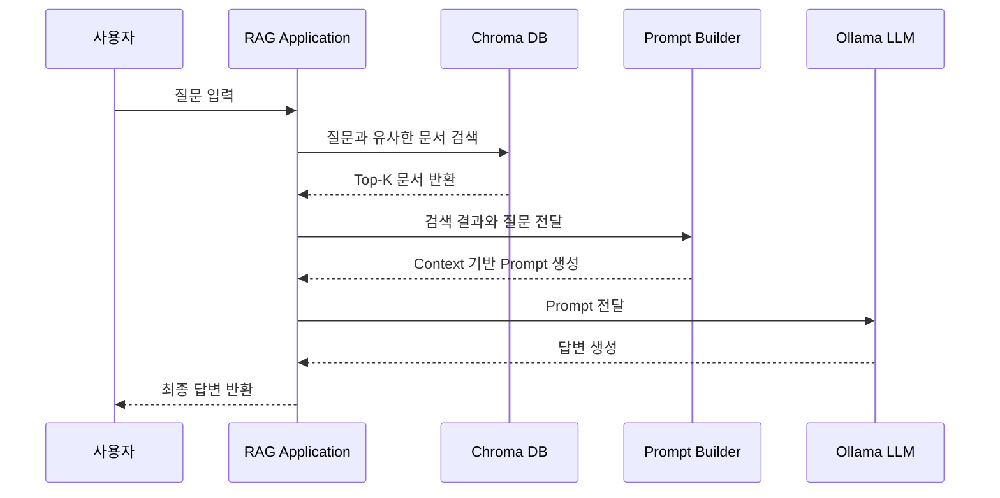

# Step2-3. RAG 질의응답 구현 가이드

> ChromaDB 검색 결과를 Ollama Local LLM의 Prompt Context로 연결하여, 근거 기반 답변을 생성하는 첫 번째 RAG 질의응답 실습 문서

---

## 1. 문서 작성 목적

이 문서는 AI-Data-Platform 스터디의 Step2 RAG 과정 중 **Step2-3. RAG 질의응답 구현**을 설명하기 위한 실습 가이드이다.

Step2-2에서는 문서를 Chunk 단위로 분리하고 Embedding을 생성한 뒤, ChromaDB에 저장하여 검색 가능한 상태를 만들었다. Step2-3에서는 여기서 한 단계 더 나아가, ChromaDB에서 검색된 문서를 Local LLM에 전달하여 실제 자연어 답변을 생성한다.

즉, Step2-3의 핵심은 다음 한 문장으로 정리할 수 있다.

```text
검색된 문서를 LLM의 참고 문서(Context)로 전달하여 근거 기반 답변을 생성한다.
```

본 문서에서는 Step2-2와 Step2-3의 차이를 정리하고, Step2-3에서 추가되는 실습 파일의 전체 소스 코드와 실행 방법을 함께 설명한다.

---

## 2. Step2 RAG 전체 흐름

AI-Data-Platform 프로젝트의 Step2 RAG 과정은 다음 흐름으로 진행된다.

```yaml
Step2 RAG:
  - Step2-1. RAG 개요 및 아키텍처 이해
  - Step2-2. Vector DB 구축 및 문서 적재
  - Step2-3. RAG 질의응답 구현
  - Step2-4. Open WebUI 연동
  - Step2-5. 실전 사내 문서 RAG 구축
```

각 단계의 역할은 다음과 같다.

```text
Step2-1: RAG가 무엇인지 이해한다.
Step2-2: 검색 가능한 문서 저장소를 만든다.
Step2-3: 저장된 문서를 검색하고 LLM 답변 생성에 활용한다.
Step2-4: Web UI에서 RAG를 사용할 수 있도록 확장한다.
Step2-5: 실제 사내 문서 기반 RAG로 확장한다.
```

Step2-2와 Step2-3은 연결되어 있지만 목적이 다르다. Step2-2는 검색 가능한 Vector DB를 구축하는 단계이고, Step2-3은 검색 결과를 LLM 답변 생성에 연결하는 단계이다.

---

## 3. Step2-2와 Step2-3의 차이

### 3.1 Step2-2의 목적

Step2-2의 목적은 **문서를 Vector DB에 저장하고 검색 가능한 상태로 만드는 것**이다. 중심 기술은 ChromaDB와 Embedding이다.

```text
문서
 ↓
문서 로딩
 ↓
Chunk 분리
 ↓
Embedding 생성
 ↓
ChromaDB 저장
 ↓
검색 테스트
```

Step2-2의 결과는 다음과 같다.

```text
문서가 ChromaDB에 저장되어 있다.
질문과 유사한 문서를 검색할 수 있다.
검색 결과로 관련 Chunk를 확인할 수 있다.
```

그러나 이 단계에서는 아직 LLM이 검색 결과를 읽고 답변을 생성하지 않는다. 검색 결과를 사람이 직접 확인하는 수준이다.

### 3.2 Step2-3의 목적

Step2-3의 목적은 **ChromaDB에서 검색한 문서를 LLM에게 전달하여 최종 답변을 생성하는 것**이다.

Step2-3부터는 다음 세 요소가 하나의 흐름으로 연결된다.

```text
사용자 질문
+
Vector DB 검색 결과
+
LLM 답변 생성
```

즉, Step2-3은 Retrieval과 Generation을 연결하는 단계이며, 우리가 일반적으로 말하는 RAG가 실제로 동작하기 시작하는 단계이다.

### 3.3 핵심 차이 비교

| 구분 | Step2-2. Vector DB 구축 및 문서 적재 | Step2-3. RAG 질의응답 구현 |
|---|---|---|
| 중심 기술 | ChromaDB, Embedding | ChromaDB, Prompt, Ollama LLM |
| 핵심 목적 | 문서를 검색 가능한 상태로 저장 | 검색 결과를 이용해 LLM 답변 생성 |
| 입력 | 문서 파일 | 사용자 질문 |
| 주요 처리 | 문서 로딩, Chunking, Embedding, 저장, 검색 테스트 | 질문 검색, Context 구성, Prompt 생성, LLM 호출 |
| 출력 | 관련 문서 Chunk | 자연어 답변 |
| LLM 사용 여부 | 직접 답변 생성에는 사용하지 않음 | 사용함 |
| RAG 관점 | Retrieval 준비 단계 | Retrieval + Generation 연결 단계 |
| 비유 | 도서관 구축 | 사서가 책을 찾아 설명 |

---

## 4. Step2-3 처리 흐름

Step2-3의 전체 처리 흐름은 다음과 같다.



Step2-3에서 새롭게 추가되는 핵심은 다음이다.

```text
검색 결과를 Context로 구성한다.
Context와 질문을 결합하여 Prompt를 만든다.
Prompt를 Ollama Local LLM에 전달한다.
LLM이 검색 문서를 근거로 답변을 생성한다.
```

---

## 5. 실습 전제 조건

Step2-3 실습은 Step2-2가 완료되어 있다는 전제를 가진다. 즉, ChromaDB에 문서가 이미 적재되어 있어야 한다.

### 5.1 Step2-2 완료 후 디렉터리 상태

```text
labs/rag/
├─ docs/
│  └─ microserver_guide.md
├─ chroma_db/
├─ 01_create_sample_doc.py
├─ 02_load_and_chunk.py
├─ 03_insert_to_chroma.py
└─ 04_search_chroma.py
```

### 5.2 Step2-3에서 추가할 파일

Step2-3에서는 다음 4개 파일을 추가한다.

```text
labs/rag/
├─ 05_search_documents.py
├─ 06_build_prompt.py
├─ 07_ask_llm.py
└─ 08_first_rag.py
```

각 파일의 역할은 다음과 같다.

| 파일명 | 역할 |
|---|---|
| `05_search_documents.py` | 사용자 질문을 기준으로 ChromaDB에서 관련 문서를 검색한다. |
| `06_build_prompt.py` | 검색된 문서와 사용자 질문을 결합하여 LLM Prompt를 생성한다. |
| `07_ask_llm.py` | Ollama Local LLM API를 호출하여 답변을 받아온다. |
| `08_first_rag.py` | 검색, Prompt 생성, LLM 호출을 하나의 End-to-End RAG 흐름으로 연결한다. |

---

## 6. 실습 파일 1: 05_search_documents.py

### 6.1 파일 역할

`05_search_documents.py`는 Step2-3의 검색 기능을 담당한다. 사용자의 질문을 입력받아 ChromaDB에 질의하고, 질문과 의미적으로 유사한 문서 Chunk를 Top-K 방식으로 반환한다.

이번 파일은 Step2-2의 `03_insert_to_chroma.py`와 반드시 연관해서 이해해야 한다. `03_insert_to_chroma.py`는 ChromaDB에 문서를 저장할 때 Chroma의 기본 Embedding Function을 사용하는 방식이 아니라, `SentenceTransformer` 모델로 문서 Chunk의 Embedding을 직접 생성한 뒤 `collection.add(..., embeddings=...)` 방식으로 저장한다.

따라서 `05_search_documents.py`에서도 동일한 방식으로 사용자 질문을 직접 Embedding한 뒤 `query_embeddings`를 사용하여 검색해야 한다. 만약 `query_texts` 방식으로 검색하면 ChromaDB 컬렉션에 Embedding Function이 연결되어 있지 않은 경우 오류가 발생할 수 있다.

### 6.2 03번 실습파일과의 관계

Step2-2의 `03_insert_to_chroma.py` 처리 방식은 다음과 같다.

```text
문서 Chunk 목록
 ↓
SentenceTransformer 모델 로딩
 ↓
각 Chunk를 Embedding Vector로 변환
 ↓
collection.add() 호출 시 embeddings 직접 저장
 ↓
ChromaDB 컬렉션에 문서, 메타데이터, Embedding 저장
```

Step2-3의 `05_search_documents.py`는 이 구조에 맞춰 다음 방식으로 검색한다.

```text
사용자 질문
 ↓
03번과 동일한 SentenceTransformer 모델 로딩
 ↓
질문을 Embedding Vector로 변환
 ↓
collection.query(query_embeddings=...) 호출
 ↓
유사 문서 Top-K 반환
```

즉, 03번과 05번은 같은 Embedding 모델을 사용해야 한다. 문서를 저장할 때 사용한 벡터 공간과 질문을 검색할 때 사용하는 벡터 공간이 같아야 의미 기반 검색이 정상적으로 동작한다.

### 6.3 주요 처리 내용

```text
1. ChromaDB 저장 경로를 찾는다.
2. microserver_docs 컬렉션을 가져온다.
3. 컬렉션이 없으면 새로 만들지 않고 오류를 발생시킨다.
4. 03_insert_to_chroma.py와 동일한 SentenceTransformer 모델을 로딩한다.
5. 사용자 질문을 Embedding Vector로 변환한다.
6. query_embeddings 방식으로 ChromaDB에 검색 요청을 보낸다.
7. 검색 결과를 rank, document, metadata, distance 형태로 정리한다.
8. 정리된 검색 결과 목록을 반환한다.
```

### 6.4 소스 코드

```python
"""
Step2-3. RAG 질의응답 구현 - 05_search_documents.py

역할:
- Step2-2의 03_insert_to_chroma.py에서 저장한 ChromaDB 컬렉션을 조회한다.
- 사용자의 질문을 03번 파일과 동일한 SentenceTransformer 모델로 임베딩한다.
- 질문 임베딩과 유사한 문서 Chunk를 ChromaDB에서 검색한다.

중요:
- 03_insert_to_chroma.py는 collection.add() 호출 시 embeddings를 직접 저장한다.
- 따라서 05_search_documents.py도 query_texts 방식보다 query_embeddings 방식으로 검색하는 것이 안전하다.
- ChromaDB 경로도 실행 위치에 따라 달라질 수 있으므로 여러 후보 경로를 확인한다.

실행 위치 권장:
    cd labs/rag
    python 05_search_documents.py

또는 프로젝트 루트에서:
    python labs/rag/05_search_documents.py
"""

from __future__ import annotations

from pathlib import Path
from typing import Any

import chromadb
from sentence_transformers import SentenceTransformer


# 03_insert_to_chroma.py와 반드시 동일해야 하는 설정값
COLLECTION_NAME = "microserver_docs"
MODEL_NAME = "sentence-transformers/paraphrase-multilingual-MiniLM-L12-v2"


def find_chroma_path() -> Path:
    """
    ChromaDB 저장 경로를 찾는다.

    03_insert_to_chroma.py에는 CHROMA_PATH = "chroma_db"로 되어 있다.
    이 값은 '명령을 실행한 현재 위치'를 기준으로 해석된다.

    예를 들어,
    1) cd labs/rag 후 python 03_insert_to_chroma.py 실행
       -> labs/rag/chroma_db 생성

    2) 프로젝트 루트에서 python labs/rag/03_insert_to_chroma.py 실행
       -> 프로젝트 루트/chroma_db 생성

    따라서 05번 파일에서는 자주 사용되는 후보 경로를 순서대로 확인한다.
    """
    script_dir = Path(__file__).resolve().parent
    current_dir = Path.cwd()

    candidate_paths = [
        script_dir / "chroma_db",      # labs/rag/chroma_db
        current_dir / "chroma_db",    # 현재 실행 위치/chroma_db
        script_dir.parent / "chroma_db",
        script_dir.parent.parent / "chroma_db",
    ]

    for path in candidate_paths:
        if path.exists() and path.is_dir():
            return path

    checked_paths = "\n".join(f"- {path}" for path in candidate_paths)

    raise FileNotFoundError(
        "ChromaDB 디렉터리를 찾을 수 없습니다.\n\n"
        "먼저 03_insert_to_chroma.py를 실행해서 문서를 ChromaDB에 적재해야 합니다.\n\n"
        "확인한 경로:\n"
        f"{checked_paths}"
    )


def get_collection(chroma_path: Path):
    """
    ChromaDB 컬렉션을 가져온다.

    여기서는 get_or_create_collection()이 아니라 get_collection()을 사용한다.
    이유는 Step2-3 검색 실습에서는 이미 03번에서 생성된 컬렉션이 있어야 하기 때문이다.

    만약 컬렉션이 없다면 새로 만들지 않고 오류를 발생시켜
    '03번 실습이 먼저 실행되지 않았다'는 사실을 명확하게 알 수 있게 한다.
    """
    client = chromadb.PersistentClient(path=str(chroma_path))

    try:
        collection = client.get_collection(name=COLLECTION_NAME)
    except Exception as exc:
        raise RuntimeError(
            f"ChromaDB에서 컬렉션을 찾을 수 없습니다: {COLLECTION_NAME}\n\n"
            "먼저 아래 순서로 Step2-2 실습을 실행했는지 확인하세요.\n"
            "1. python 01_create_sample_doc.py\n"
            "2. python 02_load_and_chunk.py\n"
            "3. python 03_insert_to_chroma.py\n\n"
            f"현재 ChromaDB 경로: {chroma_path}"
        ) from exc

    return collection


def search_documents(query: str, top_k: int = 3) -> list[dict[str, Any]]:
    """
    질문과 유사한 문서 Chunk를 검색한다.

    처리 순서:
    1. ChromaDB 경로 확인
    2. microserver_docs 컬렉션 조회
    3. 03번과 동일한 임베딩 모델 로딩
    4. 사용자 질문을 벡터로 변환
    5. ChromaDB에서 유사 문서 Top-K 검색
    """
    if not query or not query.strip():
        raise ValueError("검색 질문이 비어 있습니다.")

    chroma_path = find_chroma_path()
    collection = get_collection(chroma_path)

    total_count = collection.count()
    if total_count == 0:
        raise RuntimeError(
            f"컬렉션은 존재하지만 저장된 문서가 없습니다: {COLLECTION_NAME}\n"
            "03_insert_to_chroma.py 실행 결과를 다시 확인하세요."
        )

    model = SentenceTransformer(MODEL_NAME)
    query_embedding = model.encode([query]).tolist()

    n_results = min(top_k, total_count)

    results = collection.query(
        query_embeddings=query_embedding,
        n_results=n_results,
        include=["documents", "metadatas", "distances"],
    )

    documents = results.get("documents", [[]])[0]
    metadatas = results.get("metadatas", [[]])[0]
    distances = results.get("distances", [[]])[0]

    searched_docs: list[dict[str, Any]] = []

    for index, document in enumerate(documents):
        searched_docs.append(
            {
                "rank": index + 1,
                "document": document,
                "metadata": metadatas[index] if index < len(metadatas) else {},
                "distance": distances[index] if index < len(distances) else None,
            }
        )

    return searched_docs


def print_search_results(query: str, docs: list[dict[str, Any]]) -> None:
    """검색 결과를 실습자가 보기 쉬운 형태로 출력한다."""
    print("[사용자 질문]")
    print(query)

    print("\n[검색 결과]")
    if not docs:
        print("검색 결과가 없습니다.")
        return

    for doc in docs:
        print("=" * 80)
        print(f"순위: {doc['rank']}")
        print(f"거리: {doc['distance']}")
        print(f"메타데이터: {doc['metadata']}")
        print("-" * 80)
        print(doc["document"])


if __name__ == "__main__":
    user_query = "MicroServer 프레임워크의 주요 구성요소는 무엇인가?"

    results = search_documents(user_query, top_k=3)
    print_search_results(user_query, results)
```

### 6.5 코드 설명

!!! note "Embedding 모델 이해"

    본 실습에서는 SentenceTransformer를 사용하여 문서를 벡터(Embedding)로 변환한다.   
    Embedding은 RAG의 핵심 개념이며,Vector DB 검색 품질을 결정하는 중요한 요소이다.   
    SentenceTransformer와 Embedding에 대한 상세 설명은 아래 문서를 참고한다.   

    - [SentenceTransformer와 Embedding 이해](step2_2_sentence_transformer_embedding_guide.md)


`COLLECTION_NAME`은 Step2-2에서 문서를 저장할 때 사용한 컬렉션명과 동일해야 한다. 예제에서는 `microserver_docs`를 사용한다. 이 값이 03번 파일과 다르면 검색 대상 컬렉션을 찾지 못한다.

`MODEL_NAME`은 03번에서 문서 Chunk를 Embedding할 때 사용한 모델명과 동일해야 한다. 예제에서는 다국어 처리가 가능한 `sentence-transformers/paraphrase-multilingual-MiniLM-L12-v2` 모델을 사용한다.

`find_chroma_path()` 함수는 ChromaDB 저장 경로를 찾기 위한 보완 함수이다. 03번 파일에서 `CHROMA_PATH = "chroma_db"`처럼 상대 경로를 사용하면, 명령을 어디에서 실행했는지에 따라 실제 DB 생성 위치가 달라질 수 있다. 예를 들어 `cd labs/rag` 후 실행하면 `labs/rag/chroma_db`가 생성되고, 프로젝트 루트에서 실행하면 루트 아래 `chroma_db`가 생성될 수 있다. 따라서 05번 파일은 자주 사용되는 후보 경로를 순서대로 확인하도록 구성했다.

`get_collection()` 함수는 `get_or_create_collection()`이 아니라 `get_collection()`을 사용한다. Step2-3은 이미 Step2-2에서 저장한 문서를 검색하는 단계이므로, 컬렉션이 없을 때 새 컬렉션을 자동 생성하면 안 된다. 새 빈 컬렉션이 만들어지면 오류는 없어 보이지만 실제 검색 결과가 나오지 않아 원인을 파악하기 어려워진다.

`search_documents()` 함수는 사용자 질문을 받아 실제 검색을 수행하는 핵심 함수이다. 먼저 ChromaDB 경로와 컬렉션을 확인하고, 저장된 문서 수를 확인한다. 이후 03번과 동일한 `SentenceTransformer` 모델로 질문을 벡터로 변환하고, `collection.query(query_embeddings=...)` 방식으로 검색한다.

`print_search_results()` 함수는 실습자가 검색 결과를 쉽게 확인할 수 있도록 출력 형식을 정리한 함수이다. 순위, 거리값, 메타데이터, 문서 내용을 함께 출력하므로 검색이 정상적으로 수행되었는지 확인하기 좋다.

### 6.6 실행 방법

`labs/rag` 디렉터리에서 실행하는 것을 권장한다.

```bash
cd labs/rag
python 05_search_documents.py
```

프로젝트 루트에서도 실행할 수 있다.

```bash
python labs/rag/05_search_documents.py
```

정상 실행되면 사용자 질문과 함께 ChromaDB에서 검색된 문서 Chunk가 출력된다.

### 6.7 주의사항

이 파일은 Step2-2의 `03_insert_to_chroma.py` 실행이 완료되어 있어야 정상 동작한다. 만약 ChromaDB 디렉터리나 컬렉션을 찾을 수 없다는 오류가 발생하면 먼저 아래 순서로 Step2-2 실습을 다시 실행한다.

```bash
cd labs/rag
python 01_create_sample_doc.py
python 02_load_and_chunk.py
python 03_insert_to_chroma.py
```

또한 `sentence-transformers` 패키지가 설치되어 있어야 한다.

```bash
pip install sentence-transformers chromadb
```

## 7. 실습 파일 2: 06_build_prompt.py

### 7.1 파일 역할

`06_build_prompt.py`는 검색 결과를 LLM에게 전달할 수 있는 Prompt 형태로 변환한다. RAG에서는 검색 결과를 단순히 LLM에게 던지는 것이 아니라, LLM이 참고해야 할 문서와 사용자의 질문을 명확히 구분해서 전달해야 한다.

이 파일은 검색 결과를 `Context`로 정리하고, 답변 규칙을 포함한 Prompt를 생성한다.

### 7.2 주요 처리 내용

```text
1. 05_search_documents.py의 search_documents() 함수를 가져온다.
2. 검색 결과를 문서 번호가 포함된 Context 문자열로 변환한다.
3. Context와 사용자 질문을 결합한다.
4. LLM이 참고 문서 기반으로 답변하도록 Prompt 규칙을 포함한다.
```

### 7.3 소스 코드

```python
"""
Step2-3. RAG 질의응답 구현 - 06_build_prompt.py

역할:
- Vector DB에서 검색된 문서를 Context로 구성한다.
- 사용자 질문과 Context를 결합하여 LLM에 전달할 Prompt를 만든다.

실행 예시:
    python labs/rag/06_build_prompt.py
"""

from typing import List, Dict

from pathlib import Path
import sys

# 같은 디렉터리의 05_search_documents.py를 import하기 위한 설정
BASE_DIR = Path(__file__).resolve().parent
sys.path.append(str(BASE_DIR))

from importlib import import_module

search_module = import_module("05_search_documents")
search_documents = search_module.search_documents


def build_context(search_results: List[Dict]) -> str:
    """검색 결과를 LLM이 참고할 Context 문자열로 변환한다."""
    context_parts = []

    for result in search_results:
        context_parts.append(
            f"[문서 {result['rank']}]\n{result['document']}"
        )

    return "\n\n".join(context_parts)


def build_prompt(question: str, search_results: List[Dict]) -> str:
    """질문과 검색 문서를 결합하여 RAG Prompt를 생성한다."""
    context = build_context(search_results)

    prompt = f"""
당신은 사내 AI Data Platform 연구 프로젝트를 지원하는 AI Assistant입니다.
아래의 참고 문서를 기반으로 사용자의 질문에 답변하세요.

답변 규칙:
1. 참고 문서에 근거하여 답변합니다.
2. 참고 문서에 없는 내용은 추측하지 않습니다.
3. 답변은 이해하기 쉽게 정리합니다.
4. 필요한 경우 항목으로 구분하여 설명합니다.

[참고 문서]
{context}

[사용자 질문]
{question}

[답변]
""".strip()

    return prompt


if __name__ == "__main__":
    user_query = "MicroServer 프레임워크의 주요 구성요소는 무엇인가?"

    search_results = search_documents(user_query, top_k=3)
    prompt = build_prompt(user_query, search_results)

    print(prompt)
```

### 7.4 코드 설명

`build_context()` 함수는 검색 결과 목록을 하나의 문자열로 합친다. 각 검색 결과에는 `[문서 1]`, `[문서 2]`와 같은 구분자를 붙여 LLM이 참고 문서의 경계를 이해하기 쉽게 만든다.

`build_prompt()` 함수는 RAG 답변 품질을 좌우하는 중요한 부분이다. 이 함수는 LLM에게 다음 규칙을 명확히 전달한다.

```text
참고 문서에 근거하여 답변한다.
참고 문서에 없는 내용은 추측하지 않는다.
답변은 이해하기 쉽게 정리한다.
필요한 경우 항목으로 구분하여 설명한다.
```

이러한 규칙을 Prompt에 포함하는 이유는 LLM이 사내 문서에 없는 내용을 임의로 만들어내는 것을 줄이기 위해서이다. RAG에서 Prompt는 검색 결과와 LLM 답변을 연결하는 핵심 접점이다.

---

## 8. 실습 파일 3: 07_ask_llm.py

### 8.1 파일 역할

`07_ask_llm.py`는 생성된 Prompt를 Ollama Local LLM에 전달하고, LLM이 생성한 답변을 받아오는 역할을 한다.

이 파일은 외부 클라우드 LLM API가 아니라 로컬에서 실행 중인 Ollama API를 사용한다. 따라서 실습 전에 Ollama가 실행 중이어야 하며, 사용할 모델이 로컬에 설치되어 있어야 한다.

### 8.2 사전 확인

Ollama 모델 목록은 다음 명령으로 확인할 수 있다.

```bash
ollama list
```

Ollama 서버가 실행되어 있지 않다면 다음 명령 또는 Ollama 앱 실행을 통해 서버를 먼저 실행한다.

```bash
ollama serve
```

기본 호출 URL은 다음과 같다.

```text
http://localhost:11434/api/generate
```

### 8.3 소스 코드

```python
"""
Step2-3. RAG 질의응답 구현 - 07_ask_llm.py

역할:
- 생성된 Prompt를 로컬 LLM(Ollama)에 전달한다.
- LLM으로부터 답변을 받아 출력한다.

사전 조건:
- Ollama가 실행 중이어야 한다.
- 사용할 모델이 로컬에 설치되어 있어야 한다.

모델 확인:
    ollama list

실행 예시:
    python labs/rag/07_ask_llm.py
"""

import json
import urllib.request
import urllib.error


OLLAMA_URL = "http://localhost:11434/api/generate"
OLLAMA_MODEL = "qwen3:8b"


def ask_llm(prompt: str, model: str = OLLAMA_MODEL) -> str:
    """Ollama 로컬 LLM에 Prompt를 전달하고 답변을 반환한다."""
    payload = {
        "model": model,
        "prompt": prompt,
        "stream": False,
    }

    data = json.dumps(payload).encode("utf-8")

    request = urllib.request.Request(
        OLLAMA_URL,
        data=data,
        headers={"Content-Type": "application/json"},
        method="POST",
    )

    try:
        with urllib.request.urlopen(request, timeout=120) as response:
            response_body = response.read().decode("utf-8")
            result = json.loads(response_body)
            return result.get("response", "")

    except urllib.error.URLError as error:
        raise RuntimeError(
            "Ollama 서버에 연결할 수 없습니다. "
            "'ollama serve' 또는 Ollama 앱 실행 상태를 확인하세요."
        ) from error


def ask_llm_with_simple_prompt():
    """LLM 연결 상태를 확인하기 위한 단순 테스트 함수."""
    prompt = "RAG가 무엇인지 한 문단으로 설명해줘."
    answer = ask_llm(prompt)
    return answer


if __name__ == "__main__":
    print("Ollama LLM 호출 테스트")
    print("=" * 80)

    answer = ask_llm_with_simple_prompt()
    print(answer)
```

### 8.4 코드 설명

`OLLAMA_URL`은 Ollama의 generate API 주소이다. 기본적으로 Ollama는 로컬 PC의 11434 포트에서 동작한다.

`OLLAMA_MODEL`은 사용할 LLM 모델명이다. 예제에서는 `qwen3:8b`를 사용하고 있다. 로컬에 설치된 모델이 다르면 해당 모델명으로 변경해야 한다.

예시는 다음과 같다.

```text
qwen3:8b
gemma3:12b
gemma3:4b
```

`ask_llm()` 함수는 Prompt를 JSON 형식으로 구성하여 Ollama API에 POST 요청을 보낸다. `stream` 값을 `False`로 설정했기 때문에 응답이 한 번에 반환된다.

`urllib.error.URLError` 예외 처리는 Ollama 서버가 실행되지 않았을 때 사용자가 원인을 쉽게 파악할 수 있도록 하기 위한 것이다.

---

## 9. 실습 파일 4: 08_first_rag.py

### 9.1 파일 역할

`08_first_rag.py`는 Step2-3의 최종 실행 파일이다. 앞에서 만든 세 가지 기능을 하나로 연결한다.

```text
검색 → Context 구성 → Prompt 생성 → LLM 호출 → 최종 답변 출력
```

이 파일이 실행되면 사용자는 터미널에서 질문을 입력하고, ChromaDB 검색 결과를 기반으로 한 LLM 답변을 받을 수 있다.

### 9.2 주요 처리 내용

```text
1. 사용자 질문을 입력받는다.
2. 05_search_documents.py를 이용해 관련 문서를 검색한다.
3. 06_build_prompt.py를 이용해 Prompt를 생성한다.
4. 07_ask_llm.py를 이용해 Ollama LLM을 호출한다.
5. 최종 답변을 출력한다.
```

### 9.3 소스 코드

```python
"""
Step2-3. RAG 질의응답 구현 - 08_first_rag.py

역할:
- 사용자 질문을 입력받는다.
- Chroma Vector DB에서 관련 문서를 검색한다.
- 검색 결과를 Context로 구성한다.
- Prompt를 생성한다.
- Prompt를 Ollama LLM에 전달한다.
- 최종 RAG 답변을 출력한다.

실행 예시:
    python labs/rag/08_first_rag.py
"""

from pathlib import Path
import sys
from importlib import import_module


BASE_DIR = Path(__file__).resolve().parent
sys.path.append(str(BASE_DIR))

search_module = import_module("05_search_documents")
prompt_module = import_module("06_build_prompt")
llm_module = import_module("07_ask_llm")

search_documents = search_module.search_documents
build_prompt = prompt_module.build_prompt
ask_llm = llm_module.ask_llm


def run_rag(question: str, top_k: int = 3) -> str:
    """검색부터 답변 생성까지 End-to-End RAG 흐름을 실행한다."""
    search_results = search_documents(question, top_k=top_k)
    prompt = build_prompt(question, search_results)
    answer = ask_llm(prompt)
    return answer


if __name__ == "__main__":
    print("Step2-3. RAG 질의응답 구현")
    print("=" * 80)

    question = input("질문을 입력하세요: ").strip()

    if not question:
        question = "MicroServer 프레임워크의 주요 구성요소는 무엇인가?"
        print(f"기본 질문을 사용합니다: {question}")

    print("\n1. Vector DB에서 관련 문서 검색")
    print("2. 검색 결과를 Context로 구성")
    print("3. Prompt 생성")
    print("4. LLM 답변 생성")
    print("\n처리 중...\n")

    rag_answer = run_rag(question, top_k=3)

    print("=" * 80)
    print("RAG 최종 답변")
    print("=" * 80)
    print(rag_answer)
```

### 9.4 코드 설명

`run_rag()` 함수는 Step2-3의 핵심 흐름을 하나로 묶은 함수이다.

```text
search_documents(question)
build_prompt(question, search_results)
ask_llm(prompt)
```

이 세 함수가 연결되면서 검색 결과가 LLM 답변 생성에 사용된다. 이 구조가 RAG의 기본 구조이다.

`if __name__ == "__main__":` 영역에서는 터미널에서 질문을 입력받고, 질문이 비어 있을 경우 기본 질문을 사용한다. 기본 질문은 실습 문서인 `microserver_guide.md`와 관련된 내용으로 구성되어 있어, 초기 테스트에 적합하다.

---

## 10. 실행 순서

### 10.1 Step2-2 선행 실행

Step2-3을 실행하기 전에 Step2-2에서 ChromaDB 적재가 완료되어 있어야 한다.

```bash
cd labs/rag

python 01_create_sample_doc.py
python 02_load_and_chunk.py
python 03_insert_to_chroma.py
python 04_search_chroma.py
```

`04_search_chroma.py`에서 검색 결과가 정상적으로 출력되면 Step2-3으로 진행할 수 있다.

### 10.2 Step2-3 개별 파일 실행

검색 기능만 테스트한다.

```bash
python 05_search_documents.py
```

Prompt 생성 결과를 확인한다.

```bash
python 06_build_prompt.py
```

Ollama LLM 호출이 정상인지 확인한다.

```bash
python 07_ask_llm.py
```

전체 RAG 흐름을 실행한다.

```bash
python 08_first_rag.py
```

---

## 11. 실행 예시

### 11.1 전체 RAG 실행

```bash
python 08_first_rag.py
```

질문 입력 예시는 다음과 같다.

```text
MicroServer 프레임워크의 주요 구성요소는 무엇인가?
```

예상 처리 흐름은 다음과 같다.

```text
1. Vector DB에서 관련 문서 검색
2. 검색 결과를 Context로 구성
3. Prompt 생성
4. LLM 답변 생성
```

예상 출력 예시는 다음과 같다.

```text
RAG 최종 답변
================================================================================
MicroServer 프레임워크의 주요 구성요소는 API Gateway, Eureka Service Discovery,
Config Server, Business Service, Monitoring 등으로 구성됩니다.

API Gateway는 외부 요청의 진입점 역할을 하며, 라우팅과 인증 처리 등을 담당합니다.
Eureka는 서비스 등록 및 탐색 기능을 제공하고, Monitoring은 Prometheus와 Grafana를 통해
서비스 상태를 확인하는 역할을 합니다.
```

실제 답변 내용은 설치된 Ollama 모델과 검색된 문서 내용에 따라 조금 달라질 수 있다.

---

## 12. 완료 기준

Step2-3은 아래 조건을 만족하면 완료로 판단한다.

```text
1. 사용자가 질문을 입력할 수 있다.
2. 질문과 관련된 문서가 ChromaDB에서 검색된다.
3. 검색된 문서가 Prompt의 Context로 포함된다.
4. Ollama Local LLM이 호출된다.
5. LLM이 검색된 문서를 바탕으로 답변을 생성한다.
6. 검색 결과가 단순 출력에 머무르지 않고 자연어 답변으로 연결된다.
```

가장 중요한 완료 기준은 다음이다.

```text
검색 결과만 출력되는 것이 아니라, 검색 결과를 근거로 LLM 답변이 생성되어야 한다.
```

---

## 13. 실습 시 자주 발생하는 오류

### 13.1 ChromaDB에 문서가 없는 경우

증상은 검색 결과가 비어 있거나 관련 없는 결과가 출력되는 것이다.

확인 사항은 다음과 같다.

```text
01_create_sample_doc.py 실행 여부
02_load_and_chunk.py 실행 여부
03_insert_to_chroma.py 실행 여부
chroma_db 디렉터리 생성 여부
COLLECTION_NAME 일치 여부
```

### 13.2 Embedding 모델 오류

증상은 `SentenceTransformer` 모델 로딩 또는 질문 Embedding 생성 과정에서 오류가 발생하는 것이다.

확인 사항은 다음과 같다.

```text
sentence-transformers 설치 여부
인터넷 연결 또는 모델 캐시 여부
Step2-2의 03_insert_to_chroma.py와 Step2-3의 05_search_documents.py 모델명 일치 여부
```

필요 시 다음 명령으로 패키지를 설치한다.

```bash
pip install sentence-transformers chromadb
```

### 13.3 query_texts 관련 오류

03번 실습파일에서 Embedding을 직접 생성하여 저장한 경우, 05번 검색 파일에서도 질문 Embedding을 직접 생성한 뒤 `query_embeddings`로 검색하는 것이 안전하다.

다음과 같은 방식은 컬렉션에 Embedding Function이 연결되어 있지 않은 경우 오류가 발생할 수 있다.

```python
collection.query(
    query_texts=[query],
    n_results=top_k,
)
```

이번 가이드의 05번 파일은 아래 방식으로 수정되어 있다.

```python
query_embedding = model.encode([query]).tolist()

results = collection.query(
    query_embeddings=query_embedding,
    n_results=n_results,
    include=["documents", "metadatas", "distances"],
)
```

### 13.4 Ollama 연결 오류

증상은 `Ollama 서버에 연결할 수 없습니다.` 메시지가 출력되는 것이다.

확인 사항은 다음과 같다.

```text
Ollama 앱 실행 여부
ollama serve 실행 여부
localhost:11434 포트 사용 가능 여부
사용 모델 설치 여부
```

모델 설치 예시는 다음과 같다.

```bash
ollama pull qwen3:8b
```

---

## 14. 팀원 교육 시 강조할 내용

### 14.1 LLM은 사내 문서를 원래 알지 못한다

Local LLM은 학습된 일반 지식은 가지고 있지만, 우리 회사 문서나 프로젝트 문서를 기본적으로 알지 못한다. 따라서 사내 문서를 답변에 활용하려면 관련 문서를 검색해서 LLM에게 제공해야 한다.

### 14.2 Vector DB는 답변 생성기가 아니다

ChromaDB는 질문과 의미적으로 가까운 문서 조각을 찾아주는 검색 저장소이다. ChromaDB 자체가 자연어 답변을 생성하지는 않는다. 답변 생성은 LLM이 담당한다.

### 14.3 Prompt가 RAG 품질을 좌우한다

검색 결과를 어떻게 Prompt로 구성하느냐에 따라 답변 품질이 달라진다. 좋은 Prompt는 참고 문서와 질문을 명확히 구분하고, 문서에 없는 내용은 추측하지 말라는 규칙을 포함해야 한다.

### 14.4 Step2-3은 작은 RAG 시스템이다

Step2-3에서 만드는 프로그램은 단순 실습처럼 보이지만 구조적으로는 실제 RAG 시스템의 축소판이다.

```text
질문 입력
문서 검색
Context 구성
Prompt 생성
LLM 호출
답변 생성
```

이 구조는 이후 Open WebUI 연동, 사내 문서 RAG, Agent 기반 검색 시스템에서도 계속 사용된다.

---

## 15. MkDocs 반영 예시

문서 파일명은 다음을 추천한다.

```text
docs/study/step2/step2_3_rag_qa_implementation_guide.md
```

`mkdocs.yml`의 nav에는 다음과 같이 반영할 수 있다.

```yaml
- Study:
    - Step2 RAG:
        - Step2-1. RAG 개요 및 아키텍처 이해: study/step2/step2_rag_overview_guide.md
        - Step2-2. Vector DB 구축 및 문서 적재: study/step2/step2_2_vector_db_build_and_document_ingestion_guide.md
        - Step2-3. RAG 질의응답 구현: study/step2/step2_3_rag_qa_implementation_guide.md
```

---

## 16. 다음 단계 예고

Step2-3을 완료하면 Local Python 프로그램 수준에서 RAG가 동작하게 된다.

다음 Step2-4에서는 이 구조를 Open WebUI와 연결한다. Step2-4의 목표는 터미널 기반 RAG를 Web UI 기반 RAG로 확장하여, 팀원들이 브라우저에서 쉽게 질문하고 답변을 받을 수 있는 환경을 구성하는 것이다.

---

# 최종 정리

Step2-2와 Step2-3의 차이는 단순하지만 매우 중요하다.

```text
Step2-2는 문서를 저장하고 검색하는 단계이다.
Step2-3은 검색된 문서를 LLM에게 전달하여 답변을 생성하는 단계이다.
```

RAG는 검색만으로 완성되지 않는다. 검색된 문서를 LLM의 Prompt에 넣고, LLM이 그 내용을 근거로 답변할 때 비로소 RAG가 완성된다.

따라서 Step2-3의 핵심 목표는 다음 한 문장으로 정리할 수 있다.

```text
ChromaDB에 저장된 문서를 검색하고, 그 결과를 Ollama Local LLM에 전달하여 첫 번째 RAG 답변을 생성한다.
```
