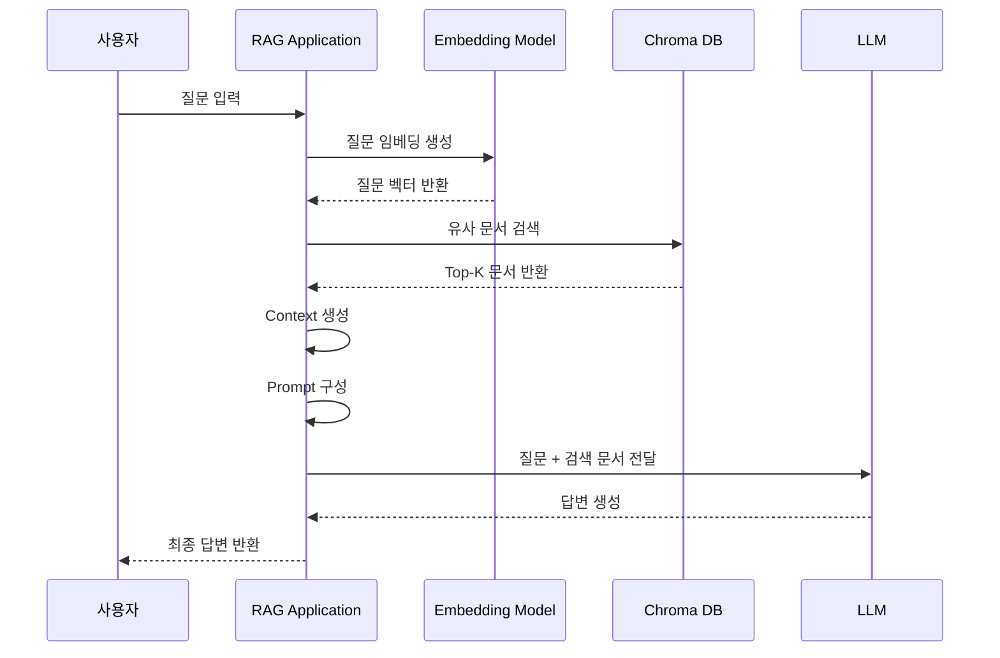

# Step2-3. RAG 질의응답 구현  
## Step2-2와 Step2-3의 차이점 이해

---

## 1. 문서 작성 목적

이 문서는 AI-Data-Platform 스터디의 Step2 RAG 과정 중 **Step2-2와 Step2-3의 차이점**을 명확히 이해하기 위한 가이드 문서이다.

현재 우리는 Step1 Local LLM 구축을 완료했고, Step2 RAG 과정에 진입하였다. Step2-1에서는 RAG의 개념과 전체 아키텍처를 이해했고, Step2-2에서는 Vector DB를 구축하고 문서를 적재하는 실습을 진행하였다.

이제 진행할 Step2-3은 단순히 문서를 저장하거나 검색하는 단계가 아니라, **검색된 문서를 Local LLM에 전달하여 실제 답변을 생성하는 첫 번째 RAG 구현 단계**이다.

따라서 이번 문서에서는 다음 내용을 정리한다.

- Step2-2에서 무엇을 했는가
- Step2-3에서 무엇을 해야 하는가
- 두 단계의 핵심 차이는 무엇인가
- Step2-3 실습은 어떤 순서로 진행하면 좋은가
- 팀원들이 어떤 관점으로 이해해야 하는가

---

## 2. 전체 Step2 RAG 진행 흐름

AI-Data-Platform 프로젝트의 Step2 RAG 과정은 다음과 같이 구성되어 있다.

```yaml
Step2 RAG:
  - Step2-1. RAG 개요 및 아키텍처 이해
  - Step2-2. Vector DB 구축 및 문서 적재
  - Step2-3. 첫 번째 RAG 구축
  - Step2-4. Open WebUI 연동
  - Step2-5. 실전 사내 문서 RAG 구축
```

각 단계는 단절된 실습이 아니라 하나의 흐름으로 연결된다.

```text
Step2-1: RAG가 무엇인지 이해한다.
Step2-2: 검색 가능한 문서 저장소를 만든다.
Step2-3: 저장된 문서를 검색해서 LLM 답변에 활용한다.
Step2-4: Web UI에서 RAG를 사용할 수 있게 연결한다.
Step2-5: 실제 사내 문서 기반 RAG로 확장한다.
```

이 흐름에서 Step2-2와 Step2-3은 특히 헷갈리기 쉽다. 왜냐하면 Step2-2에서도 이미 ChromaDB 검색 테스트를 수행했기 때문이다. 하지만 Step2-2의 검색은 RAG의 일부 기능을 확인하는 단계이고, Step2-3은 검색 결과를 LLM 답변 생성에 연결하는 단계이다.

---

## 3. Step2-2는 무엇을 한 단계인가?

## 3.1 Step2-2의 핵심 목적

Step2-2의 목적은 **문서를 Vector DB에 저장하고 검색 가능한 상태로 만드는 것**이다.

즉, Step2-2의 중심은 LLM이 아니라 Vector DB이다.

```text
문서
 ↓
문서 로딩
 ↓
Chunk 분리
 ↓
Embedding 생성
 ↓
ChromaDB 저장
 ↓
검색 테스트
```

이 단계에서는 문서를 AI가 바로 읽는 것이 아니다. 먼저 문서를 작은 단위로 나누고, 각 문서 조각을 벡터로 변환하여 ChromaDB에 저장한다.

---

## 3.2 Step2-2에서 수행한 주요 작업

Step2-2에서 수행한 작업은 다음과 같다.

```text
1. 실습용 문서 생성
2. 문서 로딩
3. 문서를 Chunk 단위로 분리
4. Chunk별 Embedding 생성
5. Embedding 결과를 ChromaDB에 저장
6. ChromaDB에서 유사도 검색 테스트
```

예상 실습 파일은 다음과 같다.

```text
labs/rag/
├─ docs/
│  └─ microserver_guide.md
├─ chroma_db/
├─ 01_create_sample_doc.py
├─ 02_load_and_chunk.py
├─ 03_insert_to_chroma.py
└─ 04_search_chroma.py
```

---

## 3.3 Step2-2의 결과물

Step2-2가 완료되면 다음 상태가 된다.

```text
문서가 ChromaDB에 저장되어 있다.
질문과 유사한 문서를 검색할 수 있다.
검색 결과로 관련 Chunk를 확인할 수 있다.
```

예를 들어 사용자가 다음과 같이 질문한다고 가정한다.

```text
마이크로서비스의 장점은 뭐야?
```

Step2-2에서는 ChromaDB가 질문과 유사한 문서 조각을 찾아준다.

```text
검색 결과:
1. 마이크로서비스는 기능을 독립적인 서비스 단위로 분리하여 개발한다.
2. 각 서비스는 독립적으로 배포할 수 있다.
3. 장애가 전체 시스템으로 확산되는 것을 줄일 수 있다.
```

여기까지는 검색 결과를 보여주는 수준이다. 아직 LLM이 이 문서를 바탕으로 자연어 답변을 생성하는 단계는 아니다.

---

## 3.4 Step2-2를 비유로 이해하기

Step2-2는 도서관을 만드는 과정과 비슷하다.

```text
책을 준비한다.
책 내용을 주제별로 나눈다.
책장에 분류해서 꽂는다.
검색하면 관련 책을 찾을 수 있게 만든다.
```

즉, Step2-2는 **도서관을 구축하고 책을 검색할 수 있게 만드는 단계**이다.

하지만 아직 사서가 책 내용을 읽고 사람에게 설명해주는 단계는 아니다.

---

## 4. Step2-3은 무엇을 하는 단계인가?

## 4.1 Step2-3의 핵심 목적

Step2-3의 목적은 **ChromaDB에서 검색한 문서를 LLM에게 전달하여 최종 답변을 생성하는 것**이다.

즉, Step2-3의 중심은 Vector DB 단독이 아니라 다음 세 가지의 연결이다.

```text
사용자 질문
+
Vector DB 검색 결과
+
LLM 답변 생성
```

이 단계부터 우리가 일반적으로 말하는 RAG가 실제로 동작하기 시작한다.

---

## 4.2 Step2-3의 처리 흐름

Step2-3의 전체 흐름은 다음과 같다.



Step2-2와 비교했을 때 Step2-3에서 새롭게 추가되는 핵심은 다음이다.

```text
검색 결과를 Prompt에 넣는다.
Prompt를 LLM에게 전달한다.
LLM이 검색된 문서를 근거로 답변을 생성한다.
```

---

## 4.3 Step2-3의 결과물

Step2-3이 완료되면 사용자는 다음과 같은 형태의 결과를 얻을 수 있다.

```text
질문:
마이크로서비스의 장점은 뭐야?

검색된 문서:
1. 마이크로서비스는 기능을 독립적인 서비스 단위로 분리하여 개발한다.
2. 각 서비스는 독립적으로 배포할 수 있다.
3. 장애가 전체 시스템으로 확산되는 것을 줄일 수 있다.

LLM 답변:
마이크로서비스의 장점은 서비스를 기능 단위로 분리하여 독립적으로 개발하고 배포할 수 있다는 점입니다. 또한 특정 서비스에 장애가 발생하더라도 전체 시스템으로 장애가 확산되는 것을 줄일 수 있어 운영 안정성을 높일 수 있습니다.
```

이 차이가 중요하다. Step2-2에서는 관련 문서를 찾는 것까지가 목적이었다. Step2-3에서는 그 문서를 바탕으로 LLM이 사람이 이해하기 쉬운 답변을 생성한다.

---

## 4.4 Step2-3을 비유로 이해하기

Step2-3은 도서관에 사서가 생기는 단계와 비슷하다.

```text
사용자가 질문한다.
사서가 관련 책을 찾는다.
사서가 책 내용을 읽고 정리한다.
사용자에게 이해하기 쉬운 말로 답변한다.
```

즉, Step2-3은 **검색된 문서를 바탕으로 LLM이 답변을 생성하는 단계**이다.

---

## 5. Step2-2와 Step2-3의 핵심 차이

## 5.1 한 줄 요약

```text
Step2-2: 문서를 저장하고 검색한다.
Step2-3: 검색된 문서를 LLM에게 전달하여 답변을 생성한다.
```

---

## 5.2 비교표

| 구분 | Step2-2 Vector DB 구축 및 문서 적재 | Step2-3 첫 번째 RAG 구축 |
|---|---|---|
| 중심 기술 | ChromaDB, Embedding | ChromaDB, Prompt, Ollama LLM |
| 핵심 목적 | 문서를 검색 가능한 상태로 저장 | 검색 결과를 이용해 LLM 답변 생성 |
| 입력 | 문서 파일 | 사용자 질문 |
| 주요 처리 | 문서 로딩, Chunking, Embedding, 저장, 검색 테스트 | 질문 Embedding, Vector Search, Context 구성, Prompt 생성, LLM 호출 |
| 출력 | 관련 문서 Chunk | 자연어 답변 |
| LLM 사용 여부 | 사용하지 않음 또는 직접 답변 생성에는 사용하지 않음 | 사용함 |
| RAG 관점 | Retrieval 준비 단계 | Retrieval + Generation 연결 단계 |
| 비유 | 도서관 구축 | 사서가 책을 찾아 설명 |

---

## 5.3 가장 중요한 차이

Step2-2에서 ChromaDB 검색을 했기 때문에 RAG를 이미 만든 것처럼 느껴질 수 있다. 하지만 정확히 보면 Step2-2는 RAG의 Retrieval 부분만 확인한 것이다.

RAG는 다음 두 단계가 결합되어야 한다.

```text
Retrieval: 관련 문서를 찾는다.
Generation: 찾은 문서를 바탕으로 답변을 생성한다.
```

Step2-2는 Retrieval을 준비하고 테스트하는 단계이다.

Step2-3은 Retrieval 결과를 Generation에 연결하는 단계이다.

따라서 Step2-3부터 진짜 의미의 RAG가 완성된다.

---

## 6. Step2-3에서 구현할 기능

Step2-3에서는 다음 기능을 구현한다.

```text
1. 사용자 질문 입력 받기
2. 질문을 Embedding으로 변환하기
3. ChromaDB에서 관련 문서 검색하기
4. 검색된 문서를 Context 문자열로 합치기
5. Context와 Question을 이용해 Prompt 만들기
6. Ollama API를 호출하여 LLM 답변 생성하기
7. 검색 결과와 최종 답변을 함께 출력하기
```

---

## 7. Step2-3 권장 실습 파일 구성

Step2-2에서 다음 파일까지 진행했다고 가정한다.

```text
labs/rag/
├─ docs/
│  └─ microserver_guide.md
├─ chroma_db/
├─ 01_create_sample_doc.py
├─ 02_load_and_chunk.py
├─ 03_insert_to_chroma.py
└─ 04_search_chroma.py
```

Step2-3에서는 아래 파일을 추가한다.

```text
labs/rag/
├─ 05_search_documents.py
├─ 06_build_prompt.py
├─ 07_ask_llm.py
└─ 08_first_rag.py
```

각 파일의 역할은 다음과 같다.

| 파일명 | 역할 |
|---|---|
| 05_search_documents.py | 질문을 받아 ChromaDB에서 관련 문서를 검색한다. |
| 06_build_prompt.py | 검색된 문서와 질문을 이용해 LLM Prompt를 만든다. |
| 07_ask_llm.py | Ollama API를 호출하여 LLM 답변을 받아온다. |
| 08_first_rag.py | 검색, Prompt 생성, LLM 호출을 하나로 연결한다. |

---

## 8. Step2-3 실습 상세 흐름

## 8.1 실습 1: 검색 함수 분리

Step2-2에서 검색 테스트를 이미 수행했더라도, Step2-3에서는 검색 기능을 별도 함수로 분리하는 것이 좋다.

목표는 다음과 같다.

```text
질문을 입력하면 관련 문서 Top-K를 반환한다.
```

예상 함수 구조는 다음과 같다.

```python
def search_documents(question, top_k=3):
    # 질문을 이용해 ChromaDB에서 관련 문서 검색
    # 검색된 문서 목록 반환
    return documents
```

이 함수는 나중에 전체 RAG 흐름에서 재사용된다.

---

## 8.2 실습 2: Prompt 생성

검색된 문서를 그대로 LLM에게 전달하면 답변 품질이 일정하지 않을 수 있다. 따라서 LLM에게 역할과 답변 기준을 명확히 알려주는 Prompt를 만들어야 한다.

예시 Prompt는 다음과 같다.

```text
너는 사내 기술문서를 설명하는 AI assistant이다.
아래 제공된 문서 내용을 기준으로만 답변하라.
문서에 없는 내용은 추측하지 말고 모른다고 답변하라.

[참고 문서]
{context}

[질문]
{question}

[답변]
```

이 구조에서 중요한 점은 LLM에게 **검색된 문서를 기준으로 답변하라**고 명시하는 것이다.

---

## 8.3 실습 3: Ollama API 호출

Local LLM은 Ollama를 통해 호출한다.

기본 호출 URL은 다음과 같다.

```text
http://localhost:11434/api/generate
```

예시 코드는 다음과 같다.

```python
import requests

response = requests.post(
    "http://localhost:11434/api/generate",
    json={
        "model": "qwen3:8b",
        "prompt": prompt,
        "stream": False
    }
)

answer = response.json()["response"]
print(answer)
```

모델명은 현재 로컬 환경에 설치된 Ollama 모델에 맞게 변경할 수 있다.

예시:

```text
qwen3:8b
gemma3:12b
gemma3:4b
```

---

## 8.4 실습 4: 전체 RAG 연결

마지막으로 검색, Prompt 생성, LLM 호출을 하나로 연결한다.

전체 구조는 다음과 같다.

```text
question = 사용자 질문

검색 결과 = search_documents(question)

context = 검색 결과를 하나의 문자열로 합치기

prompt = build_prompt(context, question)

answer = ask_llm(prompt)

answer 출력
```

이 흐름이 완성되면 첫 번째 RAG가 완성된다.

---

## 9. Step2-3 최종 실행 예시

실행 명령은 다음과 같다.

```bash
python 08_first_rag.py
```

질문 예시는 다음과 같다.

```text
마이크로서비스의 장점은 뭐야?
```

출력 예시는 다음과 같다.

```text
[질문]
마이크로서비스의 장점은 뭐야?

[검색된 문서]
1. 마이크로서비스는 기능을 독립적인 서비스 단위로 분리하여 개발한다.
2. 각 서비스는 독립적으로 배포할 수 있다.
3. 장애가 전체 시스템으로 확산되는 것을 줄일 수 있다.

[최종 답변]
마이크로서비스의 장점은 기능을 독립적인 서비스 단위로 분리하여 개발하고 배포할 수 있다는 점입니다. 또한 특정 서비스에 장애가 발생하더라도 전체 시스템에 영향을 줄 가능성을 줄일 수 있어 안정적인 운영에 도움이 됩니다.
```

---

## 10. Step2-3 완료 기준

Step2-3은 아래 조건을 만족하면 완료로 판단한다.

```text
1. 사용자가 질문을 입력할 수 있다.
2. 질문과 관련된 문서가 ChromaDB에서 검색된다.
3. 검색된 문서가 Prompt의 Context로 포함된다.
4. Ollama Local LLM이 호출된다.
5. LLM이 검색된 문서를 바탕으로 답변을 생성한다.
6. 검색 결과와 최종 답변을 함께 확인할 수 있다.
```

가장 중요한 완료 기준은 다음이다.

```text
검색 결과만 출력되는 것이 아니라, 검색 결과를 근거로 LLM 답변이 생성되어야 한다.
```

---

## 11. 팀원 교육 시 강조할 내용

## 11.1 LLM은 사내 문서를 원래 모른다

Local LLM은 학습된 일반 지식은 가지고 있지만, 우리 회사 문서나 프로젝트 문서는 알지 못한다.

따라서 사내 문서를 답변에 활용하려면 반드시 외부에서 관련 문서를 찾아서 LLM에게 제공해야 한다.

이 역할을 하는 것이 RAG이다.

---

## 11.2 Vector DB는 답변 생성기가 아니다

ChromaDB는 관련 문서를 찾아주는 검색 저장소이다. ChromaDB 자체가 자연어 답변을 만들어주는 것은 아니다.

ChromaDB의 역할은 다음이다.

```text
질문과 의미적으로 가까운 문서 조각을 찾아준다.
```

답변을 생성하는 역할은 LLM이 담당한다.

---

## 11.3 Prompt가 RAG 품질을 좌우한다

검색된 문서를 LLM에게 어떻게 전달하느냐에 따라 답변 품질이 달라진다.

좋은 Prompt는 다음 기준을 포함한다.

```text
- 어떤 역할로 답변할지 지정한다.
- 참고 문서만 기준으로 답변하라고 지시한다.
- 문서에 없는 내용은 추측하지 말라고 지시한다.
- 질문과 참고 문서를 명확히 구분한다.
```

---

## 11.4 Step2-3은 작은 RAG 시스템이다

Step2-3에서 만드는 프로그램은 단순 실습처럼 보이지만, 구조적으로는 실제 RAG 시스템의 축소판이다.

```text
질문 입력
문서 검색
Context 구성
LLM 호출
답변 생성
```

이 구조는 이후 Open WebUI 연동, 사내 문서 RAG, Agent 기반 검색 시스템에서도 계속 사용된다.

---

## 12. Step2-2와 Step2-3의 관계 정리

Step2-2와 Step2-3은 아래처럼 연결된다.

```text
[Step2-2]
문서를 ChromaDB에 저장한다.
검색 가능한 구조를 만든다.

        ↓

[Step2-3]
사용자 질문으로 ChromaDB를 검색한다.
검색된 문서를 LLM에게 전달한다.
LLM이 답변을 생성한다.
```

즉, Step2-2가 없으면 Step2-3에서 검색할 문서가 없다.

반대로 Step2-3이 없으면 Step2-2에서 저장한 문서를 실제 AI 답변에 활용하지 못한다.

두 단계는 다음 관계로 이해하면 된다.

```text
Step2-2 = RAG를 위한 데이터 준비
Step2-3 = 준비된 데이터를 이용한 RAG 실행
```

---

## 13. 권장 문서명 및 MkDocs 반영 위치

MkDocs 문서 위치는 다음을 추천한다.

```text
docs/study/step2/step2_3_first_rag_build_guide.md
```

`mkdocs.yml`의 nav에는 다음과 같이 반영할 수 있다.

```yaml
- Study:
    - Step2 RAG:
        - Step2-1. RAG 개요 및 아키텍처 이해: study/step2/step2_rag_overview_guide.md
        - Step2-2. Vector DB 구축 및 문서 적재: study/step2/step2_2_vector_db_build_and_document_ingestion_guide.md
        - Step2-3. 첫 번째 RAG 구축: study/step2/step2_3_first_rag_build_guide.md
```

---

## 14. 다음 단계 예고

Step2-3을 완료하면 Local Python 프로그램 수준에서 RAG가 동작하게 된다.

다음 Step2-4에서는 이 구조를 Open WebUI와 연결한다.

Step2-4의 목표는 다음과 같다.

```text
- 터미널 기반 RAG에서 Web UI 기반 RAG로 확장
- 사용자가 브라우저에서 질문 입력
- Local LLM과 Knowledge Base 연동
- 팀원들이 쉽게 사용할 수 있는 RAG 환경 구성
```

즉, Step2-3은 RAG의 내부 동작 원리를 이해하는 단계이고, Step2-4는 그 결과를 사용하기 편한 화면으로 연결하는 단계이다.

---

# 최종 정리

Step2-2와 Step2-3의 차이는 단순하지만 매우 중요하다.

```text
Step2-2는 문서를 저장하고 검색하는 단계이다.
Step2-3은 검색된 문서를 LLM에게 전달하여 답변을 생성하는 단계이다.
```

RAG는 검색만으로 완성되지 않는다. 검색된 문서를 LLM의 Prompt에 넣고, LLM이 그 내용을 근거로 답변할 때 비로소 RAG가 완성된다.

따라서 Step2-3의 핵심 목표는 다음 한 문장으로 정리할 수 있다.

```text
ChromaDB에 저장된 문서를 검색하고, 그 결과를 Ollama Local LLM에 전달하여 첫 번째 RAG 답변을 생성한다.
```
