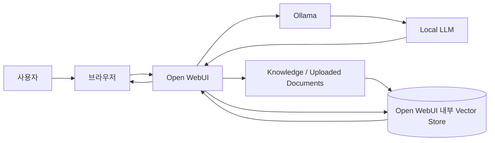

# Step2-4. Open WebUI 기반 RAG 연동 가이드

## 1. 문서 작성 목적

이 문서는 AI-Data-Platform 스터디의 Step2 RAG 과정 중 **Step2-4 Open WebUI 기반 RAG 연동**을 설명하기 위한 가이드 문서이다.

Step2-3에서는 Python 프로그램을 이용하여 다음 흐름을 직접 구현하였다.

```text
사용자 질문
 ↓
ChromaDB 검색
 ↓
검색 결과 Context 구성
 ↓
Prompt 생성
 ↓
Ollama Local LLM 호출
 ↓
최종 답변 생성
```

Step2-4에서는 이 구조를 터미널 기반 실습에서 한 단계 확장하여, **Open WebUI 화면에서 문서를 업로드하고 질문할 수 있는 RAG 사용 환경**을 구성한다.

즉, Step2-4의 목적은 Python 코드로 직접 구현한 RAG의 내부 구조를 이해한 상태에서, 사용자가 브라우저 기반 UI를 통해 RAG를 사용할 수 있도록 연결하는 것이다.

---

## 2. Step2-4의 위치

AI-Data-Platform 프로젝트의 Step2 RAG 과정은 다음 흐름으로 구성된다.

```yaml
Step2 RAG:
  - Step2-1. RAG 개요 및 아키텍처 이해
  - Step2-2. Vector DB 구축 및 문서 적재
  - Step2-3. RAG 질의응답 구현
  - Step2-4. Open WebUI 기반 RAG 연동
  - Step2-5. 실전 사내 문서 RAG 구축
```

각 단계의 의미는 다음과 같다.

```text
Step2-1: RAG가 무엇인지 이해한다.
Step2-2: 문서를 Vector DB에 적재하고 검색 가능한 구조를 만든다.
Step2-3: 검색 결과를 LLM Prompt에 연결하여 답변을 생성한다.
Step2-4: Open WebUI를 통해 RAG를 화면에서 사용할 수 있게 한다.
Step2-5: PDF, PPT, DOCX 등 실제 사내 문서를 대상으로 RAG를 확장한다.
```

Step2-4는 RAG 알고리즘을 새로 만드는 단계라기보다, **RAG 사용 환경을 Web UI로 확장하는 단계**이다.

---

## 3. Step2-3과 Step2-4의 차이

## 3.1 Step2-3의 특징

Step2-3은 Python 코드 중심의 실습이다.

```text
05_search_documents.py
06_build_prompt.py
07_ask_llm.py
08_first_rag.py
```

이 단계에서는 사용자가 터미널에서 Python 파일을 실행하고, 코드 내부에서 다음 기능을 직접 확인한다.

```text
- ChromaDB 검색
- 검색 결과 Context 구성
- Prompt 생성
- Ollama API 호출
- 최종 답변 출력
```

따라서 Step2-3은 RAG의 내부 동작 원리를 이해하는 데 목적이 있다.

---

## 3.2 Step2-4의 특징

Step2-4는 Open WebUI를 이용한 화면 기반 RAG 실습이다.

사용자는 Python 코드를 직접 실행하지 않고, 브라우저에서 다음 작업을 수행한다.

```text
- Open WebUI 접속
- Local LLM 모델 선택
- 문서 업로드
- Knowledge 또는 파일 기반 RAG 구성
- 문서 기반 질의응답 수행
```

따라서 Step2-4는 RAG를 실제 사용자 관점에서 사용하는 경험을 제공한다.

---

## 3.3 핵심 차이 요약

| 구분 | Step2-3 RAG 질의응답 구현 | Step2-4 Open WebUI 기반 RAG 연동 |
|---|---|---|
| 중심 관점 | 개발자 관점 | 사용자 및 운영 관점 |
| 실행 방식 | Python 코드 실행 | 브라우저 화면 사용 |
| 주요 도구 | Python, ChromaDB, Ollama API | Open WebUI, Ollama, Knowledge |
| 목적 | RAG 내부 원리 이해 | RAG 사용 환경 구성 |
| 문서 처리 | 코드에서 직접 처리 | Open WebUI 기능 활용 |
| 결과 확인 | 터미널 출력 | Web UI 대화 화면 |

---

## 4. Open WebUI의 역할

Open WebUI는 로컬 또는 서버 환경에서 LLM을 사용할 수 있게 해주는 Web 기반 AI 인터페이스이다.

AI-Data-Platform 프로젝트에서 Open WebUI는 다음 역할을 담당한다.

```text
1. Local LLM 사용 화면 제공
2. Ollama 모델 연결
3. 문서 업로드 및 Knowledge 구성
4. RAG 기반 질의응답 화면 제공
5. 향후 팀 단위 AI 사용 환경의 기반 제공
```

즉, Open WebUI는 단순 채팅 화면이 아니라, Local LLM과 문서 기반 RAG를 연결하는 사용자 접점이다.

---

## 5. Step2-4 목표 아키텍처

Step2-4의 목표 구조는 다음과 같다.



이 구조에서 사용자는 Open WebUI만 사용하지만, 내부적으로는 다음 작업이 수행된다.

```text
문서 업로드
 ↓
문서 텍스트 추출
 ↓
Chunking
 ↓
Embedding
 ↓
Vector Store 저장
 ↓
사용자 질문 입력
 ↓
관련 문서 검색
 ↓
검색 결과를 LLM Context로 전달
 ↓
최종 답변 생성
```

---

## 6. 사전 준비 사항

Step2-4를 진행하기 전에 아래 상태가 준비되어 있어야 한다.

## 6.1 Ollama 실행 확인

Ollama가 실행 중인지 확인한다.

```bash
ollama list
```

설치된 모델이 출력되면 정상이다.

예시:

```text
NAME        ID              SIZE
qwen3:8b    xxxxxxxxxxxx    5.2 GB
gemma3:4b   xxxxxxxxxxxx    3.3 GB
```

Ollama 서버 API가 응답하는지도 확인한다.

```bash
curl http://localhost:11434/api/tags
```

정상적으로 응답하면 Open WebUI가 Ollama와 연결할 준비가 된 상태이다.

---

## 6.2 Open WebUI 실행 확인

Docker로 Open WebUI를 실행한 경우 브라우저에서 아래 주소에 접속한다.

```text
http://localhost:3000
```

Open WebUI 로그인 화면 또는 채팅 화면이 표시되면 정상이다.

---

## 6.3 Docker 컨테이너 상태 확인

```bash
docker ps
```

예상되는 상태는 다음과 같다.

```text
CONTAINER ID   IMAGE                    PORTS                    NAMES
xxxxxxxxxxxx   ghcr.io/open-webui/open-webui:main   0.0.0.0:3000->8080/tcp   open-webui
```

컨테이너가 중지되어 있다면 다음과 같이 다시 실행한다.

```bash
docker start open-webui
```

---

## 7. Open WebUI와 Ollama 연결 이해

## 7.1 기본 연결 구조

Open WebUI는 직접 LLM 모델을 실행하는 것이 아니라, Ollama와 같은 LLM Runtime에 요청을 전달한다.

```text
Open WebUI
   ↓
Ollama API
   ↓
Local LLM
```

사용자가 Open WebUI 화면에서 질문을 입력하면 Open WebUI는 Ollama API를 호출하고, Ollama는 로컬에 설치된 모델을 이용해 답변을 생성한다.

---

## 7.2 Mac 환경에서 주의할 점

Mac에서 Ollama는 일반적으로 호스트 OS에서 실행되고, Open WebUI는 Docker 컨테이너에서 실행된다.

이때 컨테이너 내부에서 `localhost`는 Mac 자체가 아니라 컨테이너 자기 자신을 의미한다.

따라서 Docker 컨테이너에서 Mac 호스트의 Ollama에 접근할 때는 보통 다음 주소를 사용한다.

```text
http://host.docker.internal:11434
```

Open WebUI 설정에서 Ollama API 주소가 올바르게 지정되어야 한다.

---

## 8. Open WebUI 실행 예시

이미 Step1에서 Open WebUI를 구축했다면 이 절차는 참고만 한다.

Mac 또는 일반 Docker 환경에서는 다음 방식으로 실행할 수 있다.

```bash
docker run -d \
  --name open-webui \
  -p 3000:8080 \
  -v open-webui:/app/backend/data \
  -e OLLAMA_BASE_URL=http://host.docker.internal:11434 \
  ghcr.io/open-webui/open-webui:main
```

항목별 의미는 다음과 같다.

| 항목 | 설명 |
|---|---|
| `--name open-webui` | 컨테이너 이름을 open-webui로 지정한다. |
| `-p 3000:8080` | Mac의 3000 포트를 컨테이너의 8080 포트와 연결한다. |
| `-v open-webui:/app/backend/data` | Open WebUI 데이터 저장소를 Docker Volume으로 유지한다. |
| `OLLAMA_BASE_URL` | Open WebUI가 호출할 Ollama API 주소를 지정한다. |
| `ghcr.io/open-webui/open-webui:main` | Open WebUI Docker 이미지를 사용한다. |

기존 컨테이너가 이미 있다면 중복 생성하지 말고 `docker start open-webui`로 실행한다.

---

## 9. Knowledge 기반 RAG 구성

## 9.1 Knowledge의 의미

Open WebUI에서 Knowledge는 문서를 업로드하고, 모델이 해당 문서를 검색하여 답변에 활용할 수 있도록 구성하는 영역이다.

AI-Data-Platform 프로젝트 관점에서는 Knowledge를 다음과 같이 이해하면 된다.

```text
Knowledge = Open WebUI에서 관리하는 문서 기반 RAG 저장소
```

즉, Step2-2에서 우리가 직접 ChromaDB에 문서를 넣었던 것처럼, Open WebUI에서는 화면을 통해 문서를 업로드하고 Knowledge로 관리할 수 있다.

---

## 9.2 실습용 문서 준비

Step2-4에서는 Step2-2에서 사용한 실습 문서를 그대로 활용한다.

```text
labs/rag/docs/microserver_guide.md
```

해당 문서는 MicroServer Framework에 대한 간단한 설명을 담고 있으므로, Knowledge에 업로드한 뒤 다음과 같은 질문을 테스트할 수 있다.

```text
MicroServer Framework의 주요 구성요소는 뭐야?
API Gateway의 역할은 뭐야?
Eureka는 어떤 기능을 담당해?
Monitoring은 어떤 도구를 사용해?
```

---

## 9.3 Knowledge 생성 절차

Open WebUI 화면에서 다음 순서로 진행한다.

```text
1. Open WebUI 접속
2. Workspace 또는 Knowledge 메뉴 이동
3. 새 Knowledge 생성
4. 이름 입력
5. 설명 입력
6. 문서 업로드
7. 문서 처리 완료 확인
8. 채팅 화면에서 Knowledge 선택 또는 첨부
9. 문서 기반 질문 수행
```

Knowledge 이름 예시는 다음과 같다.

```text
AI Data Platform - MicroServer Guide
```

설명 예시는 다음과 같다.

```text
AI-Data-Platform RAG 실습을 위한 MicroServer Framework 샘플 문서입니다.
```

---

## 10. 파일 업로드 기반 RAG 실습

Open WebUI에서는 Knowledge를 만들지 않고, 채팅 화면에서 파일을 직접 업로드하여 질문할 수도 있다.

이 방식은 간단한 테스트에 적합하다.

```text
채팅 화면
 ↓
파일 첨부
 ↓
질문 입력
 ↓
첨부 문서를 기반으로 답변 생성
```

다만 반복적으로 사용할 문서라면 Knowledge로 등록하는 것이 좋다.

비교하면 다음과 같다.

| 방식 | 적합한 경우 |
|---|---|
| 파일 직접 첨부 | 일회성 문서 질문 |
| Knowledge 등록 | 반복적으로 사용할 문서 집합 |

---

## 11. 실습 질문 예시

## 11.1 기본 질문

```text
MicroServer Framework가 무엇인지 설명해줘.
```

예상 답변 방향:

```text
MicroServer Framework는 Spring Boot 기반의 MSA 플랫폼이며,
API Gateway, Eureka, Config Server, Business Service, Monitoring 등의 구성요소를 포함한다.
```

---

## 11.2 구성요소 질문

```text
MicroServer Framework의 주요 구성요소를 표로 정리해줘.
```

예상 답변 방향:

```text
API Gateway, Eureka Service Discovery, Config Server, Business Service, Monitoring 등을 표로 정리한다.
```

---

## 11.3 특정 기능 질문

```text
API Gateway는 어떤 역할을 담당해?
```

예상 답변 방향:

```text
API Gateway는 외부 요청의 진입점이며 Routing, 인증 처리, 로깅, Rate Limit 등의 기능을 담당한다.
```

---

## 11.4 문서 근거 확인 질문

```text
문서 내용을 기준으로만 답변해줘. Monitoring에서 사용하는 도구는 뭐야?
```

예상 답변 방향:

```text
문서에 따르면 Monitoring은 Prometheus와 Grafana를 사용한다.
```

---

## 12. Step2-4 실습 확인 기준

Step2-4는 아래 조건을 만족하면 완료로 판단한다.

```text
1. Open WebUI에 정상 접속할 수 있다.
2. Open WebUI에서 Ollama 모델을 선택할 수 있다.
3. 실습 문서를 업로드할 수 있다.
4. Knowledge 또는 파일 첨부 방식으로 문서 기반 질문을 수행할 수 있다.
5. LLM 답변이 업로드한 문서 내용을 근거로 생성된다.
6. 문서에 없는 질문을 했을 때 답변이 불확실하거나 제한적으로 생성되는 것을 확인할 수 있다.
```

가장 중요한 완료 기준은 다음이다.

```text
브라우저 화면에서 사용자가 문서를 기반으로 질문하고 답변을 받을 수 있어야 한다.
```

---

## 13. Step2-3 코드 기반 RAG와 Open WebUI RAG 비교

| 구분 | Step2-3 코드 기반 RAG | Step2-4 Open WebUI RAG |
|---|---|---|
| 문서 적재 | Python 코드로 직접 처리 | 화면에서 업로드 |
| 검색 처리 | ChromaDB 직접 호출 | Open WebUI 내부 RAG 기능 사용 |
| Prompt 생성 | Python 함수로 직접 생성 | Open WebUI 내부 설정 및 모델 지시 |
| LLM 호출 | requests로 Ollama API 호출 | Open WebUI가 Ollama 호출 |
| 사용 대상 | 개발자 | 일반 사용자, 팀원 |
| 장점 | 내부 원리 이해에 좋음 | 사용성과 확장성이 좋음 |
| 한계 | 사용자 화면이 없음 | 내부 동작을 직접 보기 어려움 |

두 방식은 경쟁 관계가 아니라 학습 목적이 다르다.

```text
Step2-3은 RAG 내부 원리 학습용이다.
Step2-4는 RAG 사용 환경 구성용이다.
```

---

## 14. 운영 관점에서 봐야 할 항목

Open WebUI 기반 RAG는 화면에서 쉽게 사용할 수 있지만, 운영 관점에서는 다음 항목을 반드시 고려해야 한다.

## 14.1 문서 권한

사내 문서를 RAG에 넣을 경우 모든 사용자가 모든 문서에 접근하면 안 된다.

따라서 향후 Step2-5 이후에는 다음 구조가 필요하다.

```text
사용자
 ↓
권한 확인
 ↓
접근 가능한 Knowledge만 검색
 ↓
답변 생성
```

---

## 14.2 문서 최신성

RAG는 저장된 문서를 기반으로 답변한다.

따라서 문서가 오래되었거나 개정되었는데 재적재하지 않으면, LLM은 오래된 내용을 기준으로 답변할 수 있다.

운영 환경에서는 다음 관리가 필요하다.

```text
- 문서 버전 관리
- 문서 변경 감지
- 재수집 및 재임베딩
- 폐기 문서 제거
```

---

## 14.3 답변 근거 확인

RAG 답변은 반드시 근거 문서를 함께 확인할 수 있어야 한다.

운영 관점에서는 다음 정보가 중요하다.

```text
- 어떤 문서를 근거로 답변했는가
- 몇 번째 페이지 또는 슬라이드에서 가져왔는가
- 검색 점수는 어느 정도인가
- 답변에 사용된 Context는 무엇인가
```

Step2-4에서는 이 개념을 이해하는 수준으로 진행하고, Step2-5에서 본격적으로 Metadata 설계와 함께 다룬다.

---

## 15. 자주 발생하는 문제와 해결 방법

## 15.1 Open WebUI에서 Ollama 모델이 보이지 않는 경우

확인 사항:

```bash
ollama list
```

Ollama 모델이 설치되어 있는지 확인한다.

```bash
curl http://localhost:11434/api/tags
```

Ollama API가 정상 응답하는지 확인한다.

Docker 컨테이너에서 Ollama에 접근하지 못하는 경우 `OLLAMA_BASE_URL` 값을 확인한다.

Mac Docker 환경에서는 일반적으로 다음 주소를 사용한다.

```text
http://host.docker.internal:11434
```

---

## 15.2 문서를 업로드했는데 답변에 반영되지 않는 경우

확인 사항:

```text
- 문서 업로드가 완료되었는가?
- Knowledge가 채팅에 연결되었는가?
- 질문이 문서 내용과 관련 있는가?
- 모델이 너무 작은 모델이라 Context를 잘 활용하지 못하는가?
- 문서 내용이 너무 짧거나 의미 단위로 잘 분리되지 않았는가?
```

테스트할 때는 먼저 문서에 명확히 포함된 내용으로 질문한다.

예:

```text
문서 기준으로 API Gateway의 주요 기능을 알려줘.
```

---

## 15.3 답변이 문서에 없는 내용을 추측하는 경우

질문할 때 다음과 같이 지시한다.

```text
업로드된 문서 내용을 기준으로만 답변해줘.
문서에 없는 내용은 모른다고 답변해줘.
```

또는 모델 지시문에 다음 원칙을 추가한다.

```text
참고 문서에 없는 내용은 추측하지 않는다.
답변에는 가능한 한 문서 근거를 함께 제시한다.
```

---

## 16. Step2-4 실습 결과 정리 예시

실습이 끝나면 다음 형태로 결과를 정리한다.

```markdown
# Step2-4 실습 결과

## 1. 실행 환경

- OS: macOS
- LLM Runtime: Ollama
- UI: Open WebUI
- 사용 모델: qwen3:8b
- 실습 문서: microserver_guide.md

## 2. 확인 결과

- Open WebUI 접속 성공
- Ollama 모델 선택 성공
- 실습 문서 업로드 성공
- 문서 기반 질의응답 성공

## 3. 테스트 질문

- MicroServer Framework가 무엇인지 설명해줘.
- API Gateway의 역할은 뭐야?
- Monitoring에서 사용하는 도구는 뭐야?

## 4. 확인 내용

Open WebUI에서 업로드한 문서를 기준으로 답변이 생성되는 것을 확인하였다.
```

---

## 17. MkDocs 반영 위치

문서 파일 위치는 다음을 추천한다.

```text
docs/study/step2/step2_4_open_webui_rag_integration_guide.md
```

`mkdocs.yml`에는 다음과 같이 반영할 수 있다.

```yaml
- Study:
    - Step2 RAG:
        - Step2-1. RAG 개요 및 아키텍처 이해: study/step2/step2_rag_overview_guide.md
        - Step2-2. Vector DB 구축 및 문서 적재: study/step2/step2_2_vector_db_build_and_document_ingestion_guide.md
        - Step2-3. RAG 질의응답 구현: study/step2/step2_3_rag_qa_implementation_guide.md
        - Step2-4. Open WebUI 기반 RAG 연동: study/step2/step2_4_open_webui_rag_integration_guide.md
```

---

## 18. 다음 단계 예고

Step2-4를 완료하면 사용자는 Open WebUI 화면에서 문서를 업로드하고 질문할 수 있게 된다.

다음 Step2-5에서는 실습용 Markdown 문서가 아니라 실제 업무 문서를 대상으로 RAG를 확장한다.

Step2-5에서는 다음 내용을 다룬다.

```text
- PDF 문서 처리
- PPTX 문서 처리
- DOCX 문서 처리
- XLSX 문서 처리
- HWP 문서 처리 전략
- OCR 및 AI OCR 적용
- Vision LLM 기반 문서 이해
- Metadata 설계
- 사내 문서 RAG 운영 구조
```

즉, Step2-4는 Open WebUI를 이용해 RAG 사용 경험을 확보하는 단계이고, Step2-5는 실제 사내 문서를 대상으로 기업형 RAG 구조를 설계하는 단계이다.

---

# 최종 정리

Step2-4의 핵심은 다음 한 문장으로 정리할 수 있다.

```text
Step2-3에서 Python 코드로 구현한 RAG 구조를 Open WebUI 화면에서 사용할 수 있도록 연결한다.
```

Step2-3에서 우리는 RAG의 내부 동작을 코드로 이해했다.

Step2-4에서는 Open WebUI를 통해 사용자가 브라우저에서 문서를 업로드하고 질문할 수 있는 환경을 구성한다.

이 단계를 완료하면 AI-Data-Platform 프로젝트는 단순 개발자 실습을 넘어, 팀원이 직접 사용할 수 있는 Local AI RAG 환경으로 발전하게 된다.
