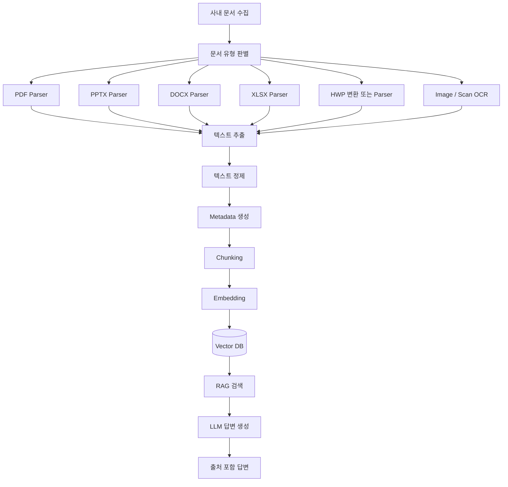

# Step2-5. 실전 사내 문서 RAG 구축 - 개요 및 아키텍처

> PDF, PPTX, DOCX, XLSX 등 실제 사내 문서를 대상으로 RAG 구조를 확장하기 위한 개요 문서

---

## 1. 문서 작성 목적

이 문서는 AI-Data-Platform 스터디의 Step2 RAG 과정 중 **Step2-5. 실전 사내 문서 RAG 구축** 단계의 전체 방향과 아키텍처를 설명한다.

앞 단계에서는 Markdown 문서를 기반으로 Vector DB 적재, 검색, Local LLM 질의응답, Open WebUI 연동을 순서대로 학습했다. 그러나 실제 기업 환경에서는 Markdown만 사용하는 경우가 거의 없다. 업무 문서는 대부분 PDF, PowerPoint, Word, Excel, HWP, 이미지, 스캔 문서 형태로 존재한다.

따라서 Step2-5의 핵심 목적은 단순한 텍스트 파일 RAG를 넘어서, **실제 사내 문서를 수집하고 문서 유형별로 내용을 추출한 뒤 Metadata와 Chunk를 설계하여 실무형 RAG 구조를 구축하는 것**이다.

---

## 2. Step2-5를 3개 문서로 분리한 이유

Step2-5는 하나의 문서로 다루기에는 범위가 넓다. 실제 사내 문서 RAG에는 개발자가 이해해야 하는 내부 파이프라인과 사용자가 경험하는 Open WebUI 기반 Knowledge 기능이 함께 포함된다.

그래서 Step2-5는 다음 3개 문서로 나누어 관리한다.

| 문서 | 목적 | 주요 대상 |
|---|---|---|
| Step2-5. 개요 및 아키텍처 | 전체 구조와 설계 방향 이해 | PM, AA, 개발자, 교육 참여자 |
| Step2-5A. 문서 전처리 파이프라인 | Python 기반 문서 추출, Chunking, Chroma 적재 실습 | 개발자, 데이터 엔지니어 |
| Step2-5B. Open WebUI Knowledge 구축 | Open WebUI 화면에서 사내 문서 Knowledge를 구성하는 실습 | 사용자, 기획자, PM, 개발자 |

이렇게 분리하면 교육 흐름이 명확해진다. Step2-5A에서는 RAG 내부 동작 원리를 코드로 이해하고, Step2-5B에서는 실제 사용자가 문서를 등록하고 질문하는 활용 관점을 이해한다.

---

## 3. 전체 학습 흐름

```text
Step2-1. RAG 개요 및 아키텍처 이해
        ↓
Step2-2. Vector DB 구축 및 문서 적재
        ↓
Step2-2-1. 임베딩 모델 이해
        ↓
Step2-3. RAG 질의응답 구현
        ↓
Step2-4. Open WebUI 연동
        ↓
Step2-5. 실전 사내 문서 RAG 구축
        ├─ Step2-5A. 문서 전처리 파이프라인
        └─ Step2-5B. Open WebUI Knowledge 구축
```

Step2-5는 Step2 RAG 과정의 마지막 실습 단계이다. 여기서 학습한 문서 처리, Metadata 설계, Chunking, 검색 구조는 이후 Step3 Agent에서 Tool Calling, 업무 API 호출, 데이터 분석 기능과 결합될 수 있다.

---

## 4. 실전 사내 문서 RAG의 기본 구조

Markdown 기반 실습에서는 문서 구조가 단순했다.

```text
Markdown 문서
   ↓
텍스트 로딩
   ↓
Chunking
   ↓
Embedding
   ↓
Vector DB 저장
   ↓
RAG 질의응답
```

하지만 실제 사내 문서 RAG에서는 다음과 같은 흐름이 필요하다.

```text
PDF / PPTX / DOCX / XLSX / HWP / 이미지 / 스캔 문서
   ↓
문서 유형 판별
   ↓
문서별 Parser 선택
   ↓
텍스트 추출 또는 OCR 처리
   ↓
텍스트 정제
   ↓
Metadata 생성
   ↓
Chunking
   ↓
Embedding
   ↓
Vector DB 저장
   ↓
검색
   ↓
LLM 답변 생성
   ↓
출처 제공
```

중요한 점은 Vector DB에 원본 파일 자체가 저장되는 것이 아니라는 점이다. Vector DB에는 보통 문서에서 추출한 **검색 가능한 텍스트 Chunk**, **Embedding Vector**, **Metadata**가 저장된다. 원본 문서는 별도의 파일 저장소, ECM, NAS, Object Storage 또는 문서관리시스템에 보관하는 구조가 일반적이다.

---

## 5. 전체 아키텍처



---

## 6. Step2-5A와 Step2-5B의 차이

Step2-5A와 Step2-5B는 모두 사내 문서 RAG를 다루지만 관점이 다르다.

### 6.1 Step2-5A. 문서 전처리 파이프라인

Step2-5A는 개발자 관점의 실습이다. Python 코드로 PDF, PPTX, DOCX, XLSX 문서를 읽고 텍스트를 추출한 뒤 Chunk를 만들고 ChromaDB에 저장한다.

```text
사내 문서
   ↓
Python Parser
   ↓
추출 텍스트 JSONL
   ↓
Chunk 생성
   ↓
Embedding
   ↓
ChromaDB
   ↓
Python RAG 검색
   ↓
Ollama 답변 생성
```

이 실습은 RAG 내부 구조를 이해하는 데 중요하다. Open WebUI가 내부적으로 어떤 일을 하는지 이해하려면 먼저 Parser, Chunking, Embedding, Vector DB 저장 흐름을 직접 코드로 실행해보는 것이 좋다.

### 6.2 Step2-5B. Open WebUI Knowledge 구축

Step2-5B는 사용자 활용 관점의 실습이다. Open WebUI의 Knowledge 기능을 사용하여 문서를 업로드하고, 모델과 연결한 뒤 Chat 화면에서 문서 기반 질의응답을 수행한다.

```text
사내 문서
   ↓
Open WebUI Knowledge 생성
   ↓
문서 업로드
   ↓
Embedding / Vector DB 저장
   ↓
Chat 화면에서 Knowledge 선택
   ↓
문서 기반 질의응답
   ↓
Citation 확인
```

Open WebUI 방식은 빠르게 실습하기 좋다. 다만 복잡한 PPT, 표 중심 Excel, HWP, 스캔 PDF, 아키텍처 다이어그램 문서는 기본 Parser만으로 충분하지 않을 수 있다. 이 경우 Step2-5A의 전처리 파이프라인을 활용해 문서를 정제한 뒤 Open WebUI에 넣는 방식이 더 적합하다.

---

## 7. 문서 유형별 처리 전략

### 7.1 PDF

PDF는 Text PDF와 Scan PDF로 구분해야 한다. Text PDF는 Parser로 텍스트 추출이 가능하지만, Scan PDF는 OCR이 필요하다. PDF는 페이지 번호가 중요하므로 `page_no`를 Metadata로 저장해야 한다.

### 7.2 PPTX

PPTX는 제안서, 보고서, 회의자료에 많이 사용된다. 슬라이드 단위로 텍스트를 추출하고 `slide_no`를 Metadata로 저장한다. 도형, 표, 이미지, 다이어그램이 많은 문서는 Vision LLM 또는 OCR을 함께 검토해야 한다.

### 7.3 DOCX

DOCX는 업무 매뉴얼, 설계서, 보고서에 적합하다. 제목 스타일과 문단을 활용해 Section 단위로 구조화하면 검색 품질이 좋아진다.

### 7.4 XLSX

XLSX는 표 형태 데이터가 많다. 단순 셀 나열보다 행 데이터를 문장형 또는 Key-Value 형태로 변환하는 것이 좋다. `sheet_name`, `row_no`를 Metadata로 저장해야 한다.

### 7.5 HWP

국내 공공·금융 프로젝트에서는 HWP가 자주 등장한다. Python에서 직접 처리하기 까다롭기 때문에 초기 실습에서는 HWP를 PDF 또는 DOCX로 변환한 뒤 처리하는 방식을 권장한다.

### 7.6 이미지와 스캔 문서

이미지, 캡처, 스캔 문서는 OCR 또는 AI OCR이 필요하다. 표, 도장, 서명, 양식 구조가 중요한 문서는 일반 OCR보다 문서 이해형 AI OCR이 더 적합할 수 있다.

---

## 8. Metadata 설계

실전 RAG에서 Metadata는 답변의 신뢰도를 결정한다. 사용자는 답변만 보는 것이 아니라, 답변이 어느 문서의 어느 위치에서 나왔는지 확인할 수 있어야 한다.

권장 Metadata는 다음과 같다.

| 항목 | 설명 |
|---|---|
| document_id | 문서 고유 ID |
| file_name | 원본 파일명 |
| document_type | pdf, pptx, docx, xlsx, hwp 등 |
| page_no | PDF 페이지 번호 |
| slide_no | PPT 슬라이드 번호 |
| sheet_name | Excel Sheet 이름 |
| row_no | Excel Row 번호 |
| section | 문서 제목 또는 장절 정보 |
| source_path | 원본 파일 경로 |
| chunk_index | Chunk 순번 |
| security_level | 문서 보안 등급 |
| project_name | 관련 프로젝트명 |
| department | 작성 부서 또는 관리 부서 |

예시는 다음과 같다.

```json
{
  "file_name": "KDB_Paperless_Proposal.pptx",
  "document_type": "pptx",
  "slide_no": 12,
  "section": "전자문서관리 아키텍처",
  "project_name": "KDB Paperless",
  "chunk_index": 3,
  "security_level": "internal"
}
```

---

## 9. Chunking 설계 원칙

문서 유형별로 Chunking 기준은 달라야 한다.

| 문서 유형 | 권장 Chunk 기준 |
|---|---|
| Markdown | 제목, 소제목 기준 |
| PDF | 페이지 기준 + 긴 페이지는 길이 기준 분할 |
| PPTX | 슬라이드 기준 |
| DOCX | Heading, 문단, 표 기준 |
| XLSX | Sheet, Row, 업무 항목 기준 |
| HWP | 변환된 PDF 또는 DOCX 기준 |
| 이미지 | OCR 결과의 블록 또는 문단 기준 |

Chunk가 너무 작으면 문맥이 부족하고, 너무 크면 검색 정확도가 떨어질 수 있다. 초기 실습에서는 500~1,000자 단위로 시작하고, 문서 성격에 따라 조정하는 것이 좋다.

---

## 10. 보안과 거버넌스 고려사항

사내 문서 RAG는 반드시 보안 관점과 함께 설계해야 한다. 특히 금융, 공공, 대기업 제안서에는 고객사명, 사업금액, 제안 전략, 내부 인력 정보, 시스템 구성, 개인정보, 비공개 요구사항이 포함될 수 있다.

실전 구축 시에는 다음 항목을 검토해야 한다.

```text
1. 문서 접근 권한 관리
2. 문서 보안 등급 관리
3. 사용자별 검색 권한 제어
4. 개인정보 마스킹
5. 원본 문서 저장 위치 관리
6. Vector DB 접근 통제
7. 질의응답 로그 감사
8. 외부 LLM 사용 가능 여부 검토
9. On-Premise LLM 적용 검토
10. 문서 폐기 및 재색인 정책
```

---

## 11. 완료 기준

Step2-5 전체 과정은 다음 조건을 만족하면 완료로 판단한다.

```text
1. 실제 업무 문서를 RAG 대상으로 준비했다.
2. PDF, PPTX, DOCX, XLSX 중 최소 1개 이상 문서 유형을 처리했다.
3. 문서에서 텍스트를 추출했다.
4. Metadata를 생성했다.
5. Chunk를 생성했다.
6. Embedding 후 Vector DB에 저장했다.
7. 질문을 통해 관련 문서를 검색했다.
8. LLM 답변 생성에 검색 결과를 활용했다.
9. 답변의 근거가 되는 문서 출처를 확인했다.
10. Open WebUI Knowledge 방식으로 사용자 관점 실습을 수행했다.
```

---

## 12. 다음 문서 안내

이 문서를 읽은 뒤에는 다음 순서로 진행한다.

```text
1. Step2-5A. 문서 전처리 파이프라인
   - Python 코드로 문서 추출, Chunking, ChromaDB 저장, RAG 검색을 수행한다.

2. Step2-5B. Open WebUI Knowledge 구축
   - Open WebUI 화면에서 Knowledge를 만들고 문서를 업로드하여 질의응답을 수행한다.
```

Step2-5A는 내부 원리 이해를 위한 개발자 실습이고, Step2-5B는 실제 사용자 활용 흐름을 이해하기 위한 실습이다. 두 과정을 모두 수행하면 실전 사내 문서 RAG의 전체 그림을 이해할 수 있다.
