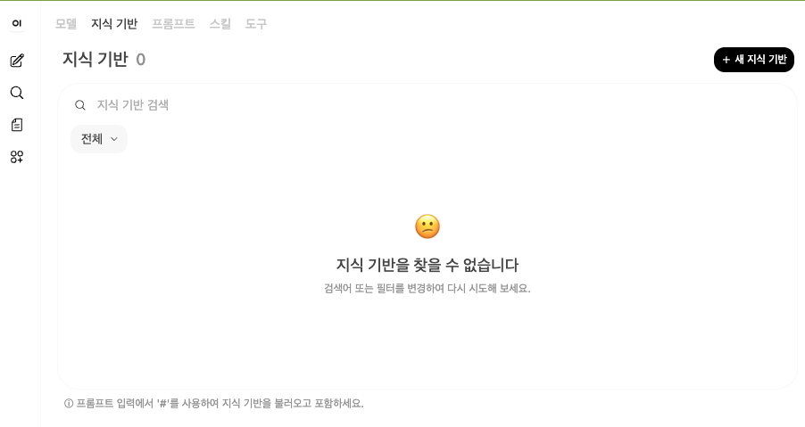
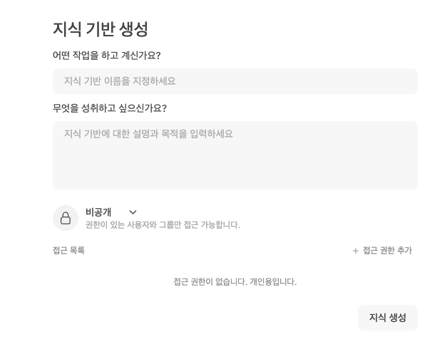
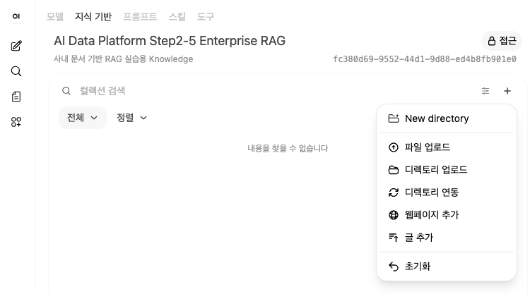
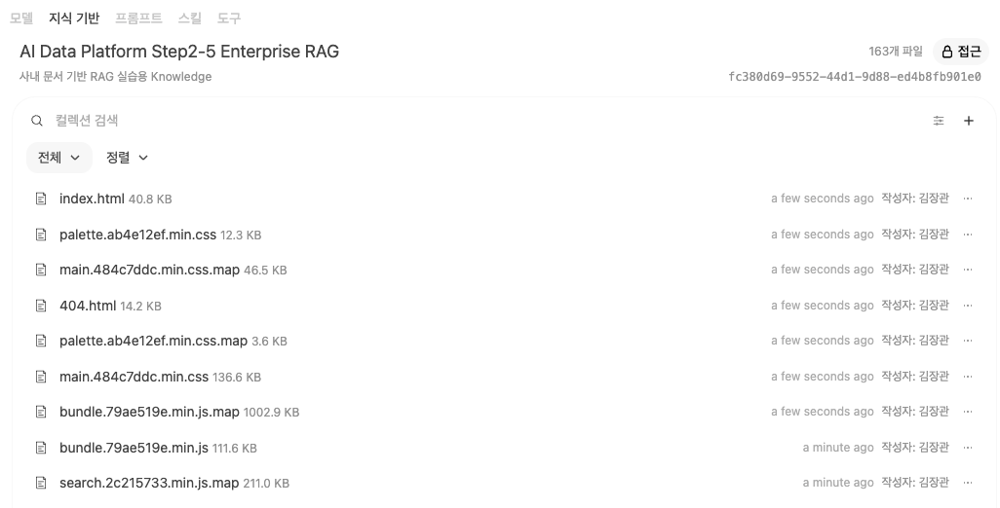
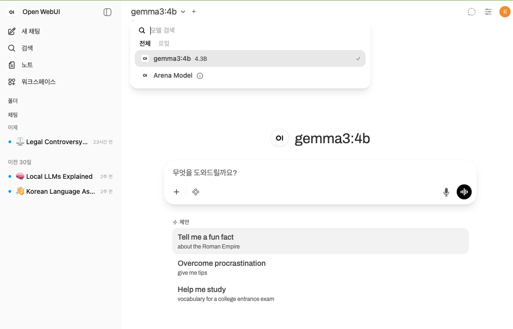
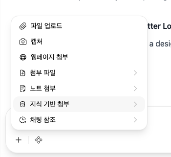

# Step2-5B. Open WebUI Knowledge 구축 가이드

> Open WebUI의 Knowledge 기능을 사용하여 사내 문서를 등록하고 문서 기반 질의응답을 수행하는 실습 문서

---

## 1. 문서 작성 목적

이 문서는 Step2-5의 하위 실습인 **Step2-5B. Open WebUI Knowledge 구축**을 설명한다.

Step2-5A에서는 Python 코드로 문서 전처리 파이프라인을 직접 구현했다. PDF, PPTX, DOCX, XLSX 문서를 읽고 텍스트를 추출한 뒤 Chunking, Embedding, ChromaDB 저장, RAG 검색까지 수행했다.

Step2-5B에서는 관점을 바꾼다. 이번에는 개발자가 내부 코드를 직접 실행하는 것이 아니라, 사용자가 Open WebUI 화면에서 Knowledge를 만들고 문서를 업로드한 뒤 Chat 화면에서 문서 기반 질문을 수행하는 흐름을 실습한다.

즉, Step2-5B의 목적은 다음과 같다.

```text
Open WebUI를 사용하여 사내 문서를 Knowledge로 등록하고,
Local LLM과 연결하여 문서 기반 질의응답을 수행하는 방법을 이해한다.
```

---

## 2. Step2-5A와 Step2-5B의 차이

| 구분 | Step2-5A | Step2-5B |
|---|---|---|
| 관점 | 개발자 내부 구조 | 사용자 활용 구조 |
| 주요 도구 | Python, ChromaDB, SentenceTransformer, Ollama | Open WebUI, Ollama, Knowledge |
| 실습 방식 | 코드 실행 | 웹 화면 조작 |
| 목적 | Parser, Chunking, Embedding 이해 | Knowledge 등록과 질의응답 경험 |
| 장점 | 내부 동작을 정확히 이해 가능 | 빠르게 사용자 경험 확인 가능 |
| 한계 | 화면 기반 사용성은 부족 | 복잡한 문서 전처리는 제한적일 수 있음 |

두 방식은 경쟁 관계가 아니라 보완 관계이다. 실무에서는 Open WebUI를 바로 사용할 수도 있지만, 문서 품질이 복잡하거나 보안·권한·Metadata 설계가 중요한 경우 별도의 전처리 파이프라인이 필요하다.

---

## 3. Open WebUI Knowledge 구조

Open WebUI Knowledge는 사용자가 문서를 업로드하고, 해당 문서를 기반으로 Chat에서 질문할 수 있게 해주는 기능이다.

기본 흐름은 다음과 같다.

```text
문서 업로드
   ↓
문서 Parser 처리
   ↓
텍스트 추출
   ↓
Chunking
   ↓
Embedding
   ↓
Vector DB 저장
   ↓
Chat에서 Knowledge 선택
   ↓
문서 기반 답변 생성
```

사용자 입장에서는 단순히 문서를 업로드하고 질문하는 것처럼 보이지만, 내부적으로는 Step2-5A에서 코드로 구현했던 것과 유사한 RAG 파이프라인이 동작한다.

---

## 4. 실습 전제 조건

이 실습을 진행하려면 다음 환경이 준비되어 있어야 한다.

```text
1. Ollama 설치 완료
2. Local LLM 모델 다운로드 완료
3. Open WebUI 실행 완료
4. 브라우저에서 Open WebUI 접속 가능
5. 테스트용 문서 준비
```

예를 들어 Ollama 모델은 다음과 같이 준비할 수 있다.

```bash
ollama pull llama3.1:8b
```

Open WebUI는 Step1-4에서 Docker 기반으로 구축한 환경을 사용한다.

---

## 5. 실습용 문서 준비

처음부터 실제 고객사 문서를 업로드하지 말고, 테스트용 샘플 문서를 사용하는 것이 좋다.

권장 테스트 문서는 다음과 같다.

```text
1. 내부 교육용 PDF
2. 샘플 업무 매뉴얼 DOCX
3. RAG 실습용 Markdown 문서
4. 개인정보가 제거된 제안서 샘플
5. 보안 정보가 제거된 아키텍처 설명 문서
```

주의할 점은 다음과 같다.

```text
1. Public GitHub에 올릴 문서는 반드시 민감정보를 제거한다.
2. 고객사명, 금액, 인력정보, 계정정보, 서버 IP는 제거한다.
3. 실제 RFP나 제안서는 비식별화 후 사용한다.
4. 개인정보가 포함된 문서는 실습에 사용하지 않는다.
```

---

## 6. Open WebUI Knowledge 생성 절차

### 6.1 Open WebUI 접속

브라우저에서 Open WebUI에 접속한다.

일반적으로 로컬 Docker 환경에서는 다음 주소를 사용한다.

```text
http://localhost:3000
```

환경에 따라 포트가 다를 수 있으므로, 본인이 Docker 실행 시 지정한 포트를 확인한다.

---

### 6.2 Knowledge 메뉴 이동

Open WebUI 화면에서 **Knowledge(지식 기반)** 메뉴로 이동한다.

Open WebUI는 버전이나 언어(Language) 설정에 따라 메뉴명이 조금씩 다를 수 있다.

- 영어 UI : **Knowledge**
- 한글 UI : **지식 기반**

또한 일부 버전에서는 **Workspace** 또는 **관리(Admin)** 메뉴 아래에 위치할 수도 있다.

일반적인 이동 경로는 다음과 같다.

```text
좌측 메뉴
    ↓
Knowledge(지식 기반)
    또는
Workspace → Knowledge
    또는
Admin → Knowledge
    ↓
새 지식 기반(Create Knowledge)
```

<figure markdown>
{width="90%" }
<figcaption>
그림 1. Open WebUI 한글 화면에서는 <strong>Knowledge</strong>가 <strong>지식 기반</strong>으로 표시된다.
</figcaption>
</figure>

> **Tip**
>
> Open WebUI의 버전에 따라 메뉴 위치와 명칭이 조금씩 달라질 수 있다.
> 본 가이드에서는 **Knowledge = 지식 기반**으로 동일한 의미이며, 이후 문서에서도 두 용어를 함께 사용한다.

---

### 6.3 Knowledge(지식 기반) 생성

우측 상단의 **새 지식 기반** 버튼을 클릭하여 새로운 Knowledge를 생성한다.

Open WebUI의 버전에 따라 입력 화면은 조금씩 다를 수 있으며, 최신 버전에서는 아래와 같이 질문 형태의 UI를 제공한다.

<figure markdown>
{ .img-border width="90%" }
<figcaption>
그림 2. Open WebUI 한글 화면의 지식 기반 생성 화면
</figcaption>
</figure>

입력 항목은 다음과 같다.

| 화면 항목 | 입력 예시 | 설명 |
|---|---|---|
| **어떤 작업을 하고 계신가요?** | `AI Data Platform Step2-5 Enterprise RAG` | 지식 기반(Knowledge)의 이름이다. 프로젝트명이나 용도를 포함하면 관리하기 쉽다. |
| **무엇을 성취하고 싶으신가요?** | `사내 문서 기반 RAG 실습용 Knowledge` | 해당 Knowledge의 목적이나 설명을 입력한다. |
| **공개 범위** | `비공개` | 개인 실습은 **비공개**를 권장한다. 팀에서 함께 사용할 경우 조직 정책에 맞게 공개 범위를 설정한다. |
| **접근 목록** | 기본값 유지 | 특정 사용자 또는 그룹과 공유해야 하는 경우에만 추가한다. |

> **Tip**
>
> Open WebUI는 버전에 따라 **Name**, **Description**, **Visibility** 형태로 표시되는 경우도 있고,
> 최신 버전처럼 **질문 형태(어떤 작업을 하고 계신가요?, 무엇을 성취하고 싶으신가요?)** 로 표시되는 경우도 있다.
>
> 항목의 이름은 다르지만 의미는 동일하다.

Knowledge 이름은 나중에 Chat 화면에서 선택하게 되므로, 다음과 같은 규칙으로 작성하는 것을 권장한다.

```text
프로젝트명 + 단계 + 문서 유형

예)
AI Data Platform Step2-5 Enterprise RAG
AI Data Platform API Guide
전자금융 업무 매뉴얼
```

모든 입력을 완료한 후 **지식 생성** 버튼을 클릭하여 Knowledge를 생성한다.

---

### 6.4 문서 업로드

Knowledge를 생성하면 아래와 같은 화면이 나타난다.

우측 상단의 **`+`(추가)** 버튼을 클릭하면 문서를 추가하는 메뉴가 열린다.

<figure markdown>
{ .img-border width="90%" }
<figcaption>
그림 3. Open WebUI 지식 기반(Knowledge)의 문서 추가 메뉴
</figcaption>
</figure>

최신 Open WebUI에서는 문서를 추가하는 방법을 여러 가지 제공한다.

| 메뉴 | 설명 | 권장 여부 |
|---|---|---|
| **파일 업로드** | 로컬 PC에 있는 문서를 업로드한다. | ⭐ 권장 |
| **디렉터리 업로드** | 폴더 전체를 업로드한다. | 대량 문서 등록 시 사용 |
| **디렉터리 연동** | 특정 디렉터리를 Knowledge와 연결한다. | 운영 환경에서 사용 |
| **웹페이지 추가** | 웹페이지(URL)를 Knowledge로 등록한다. | 필요 시 사용 |
| **글 추가** | 직접 텍스트를 입력하여 문서를 생성한다. | 간단한 테스트용 |
| **New directory** | Knowledge 내부에 폴더를 생성한다. | 문서 분류용 |

이번 실습에서는 **파일 업로드**를 사용한다.

---

#### 권장 업로드 순서

처음에는 복잡한 문서보다 단순한 문서부터 테스트하는 것이 좋다.

```text
1. TXT 또는 Markdown(.md)
        ↓
2. Word(.docx)
        ↓
3. PDF
        ↓
4. PowerPoint(.pptx)
        ↓
5. 스캔 PDF, 이미지 기반 문서
```

단순한 문서부터 테스트하면 문제가 발생했을 때 원인을 쉽게 파악할 수 있다.

예를 들어,

- TXT가 정상 검색된다.
- DOCX도 정상 검색된다.
- PDF에서만 오류가 발생한다.

이 경우 PDF Parser 또는 PDF 자체의 문제일 가능성이 높다.

반대로 처음부터 제안서 PPT나 스캔 PDF를 업로드하면 다음 중 어느 부분에서 문제가 발생했는지 판단하기 어렵다.

- 문서 Parser 문제
- OCR 문제
- Chunk 분할 문제
- Embedding 생성 문제
- Vector DB 저장 문제
- 검색(Retrieval) 문제
- Local LLM 답변 문제

따라서 **단순한 문서 → 복잡한 문서** 순서로 테스트하는 것이 가장 효율적이다.

---

> **Tip**
>
> Open WebUI는 버전에 따라 메뉴 구성은 조금씩 다를 수 있지만,
> 가장 많이 사용하는 업로드 방식은 **파일 업로드(File Upload)** 이다.
> AI Data Platform 실습에서도 먼저 파일 업로드 방식으로 RAG를 구축한 후,
> 이후 단계에서 디렉터리 연동이나 웹페이지 등록 등 다양한 Knowledge 구축 방법을 살펴볼 예정이다.

---

### 6.5 문서 처리 상태 확인

Knowledge에 문서를 업로드하면 Open WebUI는 단순히 파일을 저장하는 것이 아니라, AI가 검색할 수 있도록 여러 단계를 자동으로 수행한다.

처리 과정은 일반적으로 다음과 같다.

```text
문서 업로드
      │
      ▼
파일 저장
      │
      ▼
문서 Parser 실행
      │
      ▼
텍스트 추출
      │
      ▼
Chunk 분할
      │
      ▼
Embedding 생성
      │
      ▼
Vector DB 저장
      │
      ▼
Knowledge 등록 완료
```

즉, 업로드가 완료되었다고 해서 바로 사용할 수 있는 것은 아니며, 내부적으로 문서 파싱과 임베딩 생성이 정상적으로 완료되어야 AI가 해당 문서를 검색할 수 있다.

---

### 처리 완료 화면

아래는 프로젝트 전체 디렉터리를 업로드한 후 정상적으로 처리된 화면이다.

> 예제에서는 개별 파일을 하나씩 업로드한 것이 아니라 **프로젝트 디렉터리 전체를 업로드**하였다.
>
> Open WebUI는 디렉터리 내부의 지원 가능한 문서를 자동으로 탐색하여 Knowledge에 등록한다.

<figure markdown>
{ .img-border width="95%" }
<figcaption>
그림 12. 프로젝트 디렉터리를 업로드한 후 Knowledge에 정상 등록된 화면 (총 163개 파일)
</figcaption>
</figure>

위 화면에서 확인할 수 있는 내용은 다음과 같다.

- **① Knowledge 이름**  
  현재 선택된 Knowledge(예: *AI Data Platform Step2-5 Enterprise RAG*)를 확인할 수 있다.

- **② 등록된 전체 파일 수**  
  우측 상단에는 현재 Knowledge에 등록된 전체 문서 개수가 표시된다. 본 실습에서는 **163개의 파일**이 정상 등록된 것을 확인할 수 있다.

- **③ 문서 검색 기능**  
  검색창을 이용하여 등록된 문서를 파일명 기준으로 빠르게 검색할 수 있다.

- **④ 업로드된 파일 목록**  
  디렉터리 내부의 문서들이 목록 형태로 표시되며, 파일명과 크기를 함께 확인할 수 있다.

- **⑤ 등록 정보 확인**  
  각 문서별 등록 시간과 작성자 정보를 확인할 수 있어 관리가 편리하다.

- **⑥ 추가 업로드 기능**  
  우측 상단의 **+** 버튼을 이용하여 새로운 파일이나 디렉터리를 추가로 업로드할 수 있다.

문서가 모두 정상 처리되면 해당 Knowledge는 AI의 검색(Retrieval) 대상으로 즉시 사용할 수 있다.

> **참고**
>
> 화면에 HTML, CSS, JavaScript 파일 등이 함께 등록되어 있는 것은 프로젝트 디렉터리 전체를 업로드했기 때문이다.
> 실제 Enterprise RAG에서는 일반적으로 **PDF, DOCX, PPTX, XLSX, TXT, Markdown** 등의 업무 문서만 업로드하는 것을 권장한다.

---

### 디렉터리 업로드의 장점

기업에서는 문서가 수백~수천 개 존재하는 경우가 대부분이다.

매번 파일을 하나씩 업로드하는 것은 매우 비효율적이므로, 일반적으로는 프로젝트 폴더 또는 문서 저장소를 한 번에 업로드하여 관리한다.

디렉터리 업로드의 장점은 다음과 같다.

- 여러 문서를 한 번에 등록할 수 있다.
- 프로젝트 전체 문서를 일괄 관리할 수 있다.
- 신규 문서를 쉽게 추가할 수 있다.
- 대량의 문서에 대한 RAG 구축이 편리하다.

---

### 문서 처리 중 발생할 수 있는 문제

문서를 처리하는 과정에서는 다음과 같은 문제가 발생할 수 있다.

```text
1. 파일 업로드 실패
2. 문서 Parser 오류
3. 텍스트 추출 실패
4. Embedding 생성 실패
5. 파일 크기 제한 초과
6. 지원하지 않는 문서 형식
7. 암호화(PDF 암호 등) 문서
8. Docker Volume 또는 권한 문제
9. 디스크 공간 부족
10. 메모리 부족(OOM)
```

특히 기업 환경에서는 **스캔 PDF**, **암호화된 문서**, **손상된 파일** 때문에 Parsing이 실패하는 경우가 자주 발생한다.

---

### 정상 등록 여부 확인

문서 업로드 후에는 반드시 다음 사항을 확인한다.

- 업로드한 문서 개수가 정상적으로 등록되었는가
- 누락된 파일은 없는가
- 오류가 발생한 파일은 없는가
- 필요한 문서가 검색되는가
- 질문 시 해당 문서가 실제로 참조되는가

단순히 파일이 목록에 보인다고 해서 모든 과정이 완료된 것은 아니다.

실제 질문을 수행하여 해당 문서가 검색(Retrieval)되고 답변 생성에 활용되는지까지 확인해야 Knowledge 구성이 정상적으로 완료된 것이다.

> **실무 Tip**
>
> 대량의 문서를 업로드한 후에는 먼저 대표 문서를 하나 선택하여 검색이 정상적으로 수행되는지 확인한 뒤, 전체 문서를 테스트하는 것이 문제를 빠르게 발견하는 데 도움이 된다.

---

## 7. Chat 화면에서 Knowledge 사용

### 7.1 모델 선택

Chat 화면에서 사용할 Local LLM 모델을 선택한다.

예시는 다음과 같다.

```text
llama3.1:8b
qwen2.5:7b
mistral
gemma
```

처음 실습에서는 이미 Step1에서 정상 동작을 확인한 모델을 사용하는 것이 좋다.

---

### 7.2 Knowledge 연결

문서를 업로드했다고 해서 모든 채팅에서 자동으로 해당 문서를 사용하는 것은 아니다.

질문하기 전에 **현재 채팅에 사용할 Knowledge를 연결**해야 한다.

Open WebUI 버전에 따라 연결 방법은 조금씩 다르지만, 최신 버전에서는 **채팅 입력창의 첨부 메뉴(+)** 를 이용하는 방식이 가장 일반적이다.

일반적인 흐름은 다음과 같다.

```text
새 채팅 시작
      │
      ▼
채팅 입력창의 + 버튼 선택
      │
      ▼
Knowledge 선택
      │
      ▼
질문 입력
      │
      ▼
Knowledge 기반 RAG 검색
      │
      ▼
문서 기반 답변 생성
```

---

### Chat 화면

아래는 Open WebUI의 기본 Chat 화면이다.

<figure markdown>
{ .img-border width="95%" }
<figcaption>
그림 16. Open WebUI 기본 Chat 화면
</figcaption>
</figure>

위 화면에서 확인할 수 있는 주요 기능은 다음과 같다.

- **① 모델 선택**  
  상단에서 사용할 LLM(Gemma, Qwen, Llama 등)을 선택한다.

- **② 질문 입력 영역**  
  AI에게 질문을 입력하는 영역이다.

- **③ 첨부 메뉴(+)**  
  파일, 이미지, Knowledge 등을 현재 채팅에 연결할 수 있다.

- **④ 음성 입력**  
  음성으로 질문을 입력할 수 있다.

- **⑤ 전송 버튼**  
  질문을 AI에게 전송한다.

---

### Knowledge 연결

현재 버전(Open WebUI 0.6.x 기준)에서는 채팅 입력창 왼쪽의 **+ 버튼**을 클릭하면 다양한 첨부 기능이 나타난다.

<figure markdown>
{ .img-border width="95%" }
<figcaption>
그림 16. 지식기반 선택 화면
</figcaption>
</figure>

여기에서 **Knowledge**를 선택한 후 앞에서 생성한 Knowledge를 연결한다.

```text
+ 버튼
   │
   ├─ File
   ├─ Image
   ├─ Knowledge
   └─ ...
```

Knowledge가 연결되면 이후의 질문은 해당 Knowledge를 우선 검색(Retrieval)한 후 LLM이 답변을 생성한다.

---

### 버전에 따른 차이

Open WebUI는 버전에 따라 UI가 자주 변경된다.

대표적인 방식은 다음과 같다.

| 버전 | Knowledge 연결 방식 |
|------|---------------------|
| 초기 버전 | Chat 설정에서 Knowledge 선택 |
| 일부 버전 | `#Knowledge` 명령 사용 |
| 최신 버전(권장) | 채팅 입력창의 **+** 메뉴에서 Knowledge 선택 |

따라서 화면 구성이 조금 다르더라도 **현재 채팅에 Knowledge를 연결한 후 질문을 수행한다**는 개념은 동일하다.

> **참고**
>
> 첨부한 화면은 아직 Knowledge를 연결하기 전의 기본 Chat 화면이다. 다음 단계에서 **+ 버튼을 눌러 Knowledge를 연결**한 후 질문을 수행하면 업로드한 문서를 기반으로 RAG 검색이 이루어진다.

---

---

### 7.3 테스트 질문 입력

문서를 기반으로 질문한다.

예시는 다음과 같다.

```text
이 문서의 핵심 내용을 요약해줘.
```

```text
전자금융 장애 대응 절차를 알려줘.
```

```text
이 문서에서 아키텍처 구성요소를 정리해줘.
```

```text
문서에 나온 주요 시스템과 역할을 표로 정리해줘.
```

```text
근거 문서 기준으로만 답변하고, 문서에 없으면 없다고 말해줘.
```

마지막 질문처럼 답변 기준을 명확히 주는 것이 중요하다. RAG에서는 모델이 일반 지식으로 추측하지 않도록 지시하는 습관이 필요하다.

---

## 8. 답변 검증 방법

Open WebUI에서 문서 기반 답변이 생성되면 다음 기준으로 검증한다.

```text
1. 질문과 관련된 문서 내용이 검색되었는가?
2. 답변이 문서 내용과 일치하는가?
3. 문서에 없는 내용을 추측하지 않았는가?
4. 출처 또는 Citation을 확인할 수 있는가?
5. 같은 질문을 반복했을 때 답변 품질이 안정적인가?
6. 문서 일부만 근거로 과도하게 일반화하지 않았는가?
```

실무에서는 답변이 그럴듯한지보다 **근거가 맞는지**가 더 중요하다.

---

## 9. 권장 프롬프트

Open WebUI에서 Knowledge 기반 질의응답을 할 때는 다음과 같은 프롬프트를 사용할 수 있다.

```text
업로드된 Knowledge 문서만 근거로 답변해줘.
문서에 없는 내용은 추측하지 말고 "문서에서 확인되지 않습니다"라고 말해줘.
답변 마지막에는 참고한 문서명이나 근거 위치를 요약해줘.
```

조금 더 실무적으로 작성하면 다음과 같다.

```text
너는 사내 문서 기반 RAG 어시스턴트다.
반드시 Knowledge에 등록된 문서 내용만 근거로 답변한다.
근거가 부족하면 부족하다고 명확히 말한다.
답변은 업무 담당자가 바로 이해할 수 있도록 정리한다.
가능하면 항목별로 정리하고, 마지막에 참고 근거를 표시한다.
```

---

## 10. Open WebUI 방식의 장점

Open WebUI Knowledge 방식의 장점은 다음과 같다.

```text
1. 웹 화면에서 문서를 쉽게 업로드할 수 있다.
2. 별도 Python 코드를 작성하지 않아도 RAG를 체험할 수 있다.
3. Local LLM과 쉽게 연결할 수 있다.
4. 팀원이 같은 UI로 테스트할 수 있다.
5. Chat 기반으로 사용자 경험을 빠르게 검증할 수 있다.
```

이 방식은 교육과 PoC에 매우 적합하다. 특히 RAG 개념을 모르는 팀원에게 문서 기반 질의응답을 보여줄 때 효과적이다.

---

## 11. Open WebUI 방식의 한계

Open WebUI는 편리하지만 모든 기업 문서를 완벽하게 처리하지는 못한다.

주의해야 할 문서 유형은 다음과 같다.

```text
1. 표가 복잡한 Excel 문서
2. 도형과 이미지 중심의 PPT 제안서
3. 스캔 PDF
4. HWP 문서
5. 화면 캡처가 많은 설계서
6. 아키텍처 다이어그램 중심 문서
7. 표 병합이 많은 요구사항 정의서
```

이런 문서는 단순 Parser로 텍스트를 뽑으면 의미가 깨질 수 있다. 예를 들어 PPT 아키텍처 그림은 텍스트 박스만 추출하면 전체 구조를 이해하기 어렵고, Excel 요구사항 표는 셀 병합 때문에 Row 의미가 깨질 수 있다.

이 경우에는 Step2-5A의 전처리 파이프라인을 사용하여 문서를 미리 정제하는 것이 좋다.

---

## 12. 실무 권장 구조

실무에서는 Open WebUI만 단독으로 사용하는 것보다, 전처리 파이프라인과 함께 사용하는 구조가 더 안정적이다.

```text
원본 사내 문서
   ↓
문서 전처리 파이프라인
   - PDF Parser
   - PPTX Parser
   - DOCX Parser
   - XLSX Parser
   - OCR
   - Vision LLM 설명 생성
   - Metadata 생성
   ↓
정제된 텍스트 또는 Markdown 생성
   ↓
Open WebUI Knowledge 등록
   ↓
사용자 Chat 질의응답
```

이 구조의 장점은 다음과 같다.

```text
1. 복잡한 문서를 사전에 정제할 수 있다.
2. Metadata 품질을 통제할 수 있다.
3. 보안 필터링과 개인정보 마스킹을 적용할 수 있다.
4. Open WebUI에는 검증된 문서만 등록할 수 있다.
5. 사용자 경험은 Open WebUI로 제공하면서 내부 품질은 파이프라인으로 관리할 수 있다.
```

---

## 13. 테스트 시나리오

### 13.1 기본 요약 테스트

```text
이 Knowledge 문서의 전체 내용을 5개 항목으로 요약해줘.
```

검증 포인트는 문서 전체 주제를 제대로 파악하는지 확인하는 것이다.

### 13.2 근거 기반 질문 테스트

```text
문서에 정의된 전자금융 장애 대응 절차를 단계별로 설명해줘.
```

검증 포인트는 문서에 있는 내용을 근거로 답변하는지 확인하는 것이다.

### 13.3 문서에 없는 질문 테스트

```text
이 문서에 없는 시스템의 운영 비용을 알려줘.
```

정상적인 RAG 답변은 추측하지 않고 문서에서 확인되지 않는다고 말해야 한다.

### 13.4 출처 확인 테스트

```text
답변 근거가 된 문서명과 위치를 함께 알려줘.
```

실무에서는 출처 확인이 매우 중요하다. 답변 내용이 맞더라도 출처를 확인할 수 없으면 업무에 활용하기 어렵다.

---

## 14. 문제 해결 가이드

### 14.1 문서 업로드가 안 되는 경우

다음을 확인한다.

```text
1. 파일 크기가 너무 크지 않은가?
2. Open WebUI Docker 컨테이너가 정상 실행 중인가?
3. 브라우저 세션이 만료되지 않았는가?
4. 지원하지 않는 확장자인가?
5. Docker 볼륨 권한 문제가 있는가?
```

### 14.2 답변이 문서와 무관한 경우

다음을 확인한다.

```text
1. Knowledge가 Chat에 제대로 연결되었는가?
2. 질문이 너무 일반적이지 않은가?
3. 문서 처리가 완료되었는가?
4. 문서 텍스트 추출이 정상적으로 되었는가?
5. 모델이 Knowledge보다 일반 지식으로 답변하고 있지 않은가?
```

질문에 다음 문장을 추가하면 개선될 수 있다.

```text
Knowledge 문서에 있는 내용만 근거로 답변해줘.
```

### 14.3 PDF 내용이 검색되지 않는 경우

PDF가 스캔 문서일 수 있다. 스캔 PDF는 내부 텍스트가 없으므로 일반 Parser로 추출되지 않는다. 이 경우 OCR 처리가 필요하다.

### 14.4 PPT 내용이 부정확한 경우

PPT는 도형, 이미지, SmartArt, 차트에 정보가 들어 있는 경우가 많다. 기본 텍스트 추출만으로는 의미가 부족할 수 있다. 중요한 슬라이드는 이미지로 변환한 뒤 Vision LLM이나 OCR로 설명 텍스트를 생성하는 방식을 검토한다.

### 14.5 Excel 내용이 이상하게 검색되는 경우

Excel은 병합 셀, 다중 헤더, 숨김 행, 수식 때문에 의미가 깨질 수 있다. 요구사항 정의서나 기능 목록은 Sheet와 Row 단위로 문장형 텍스트를 생성한 뒤 Knowledge에 등록하는 것이 좋다.

---

## 15. 완료 기준

다음 조건을 만족하면 Step2-5B 실습을 완료한 것으로 판단한다.

```text
1. Open WebUI에 접속했다.
2. Knowledge를 새로 생성했다.
3. 테스트 문서를 업로드했다.
4. 문서 처리 상태를 확인했다.
5. Chat 화면에서 Knowledge를 연결했다.
6. 문서 기반 질문을 입력했다.
7. 답변 내용이 문서 근거와 일치하는지 확인했다.
8. 문서에 없는 질문에 대해 추측하지 않는지 확인했다.
9. Citation 또는 근거 문서 정보를 확인했다.
10. Open WebUI 방식의 장점과 한계를 이해했다.
```

---

## 16. 최종 정리

Step2-5B는 Open WebUI를 사용하여 사내 문서 RAG를 사용자 관점에서 실습하는 단계이다.

Step2-5A가 개발자 관점의 내부 파이프라인이라면, Step2-5B는 실제 사용자가 문서를 올리고 질문하는 활용 방식이다.

실무에서는 두 방식을 함께 이해해야 한다.

```text
Step2-5A
문서 전처리 파이프라인으로 품질을 만든다.

Step2-5B
Open WebUI Knowledge로 사용성을 검증한다.
```

이 구조를 이해하면 이후 Step3 Agent 단계에서 RAG 검색 결과를 Tool Calling, API 호출, 업무 자동화와 결합하는 구조로 자연스럽게 확장할 수 있다.
