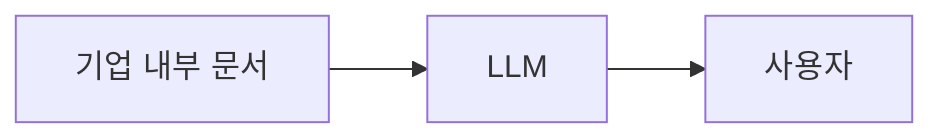
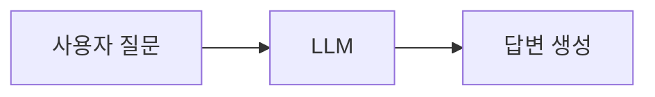
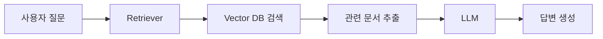
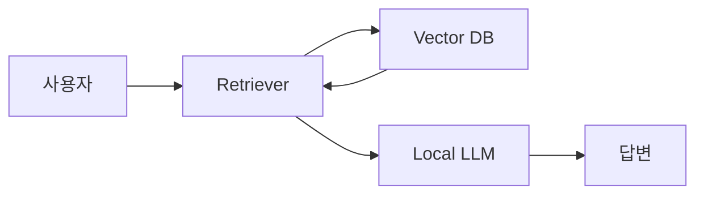
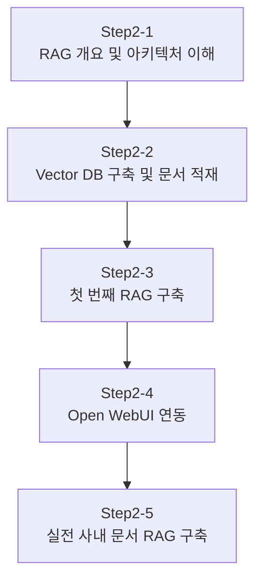
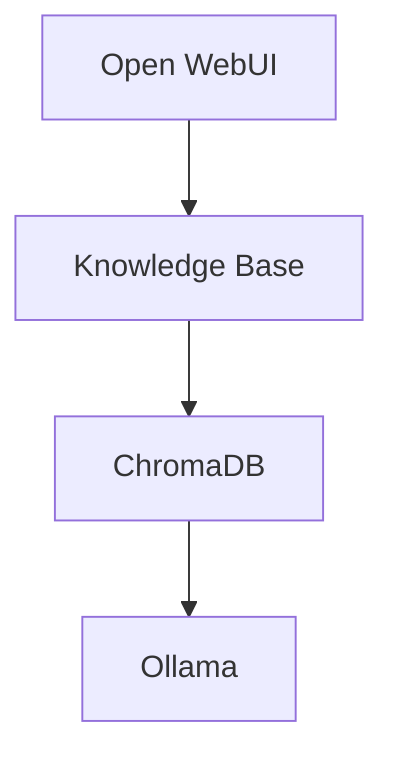
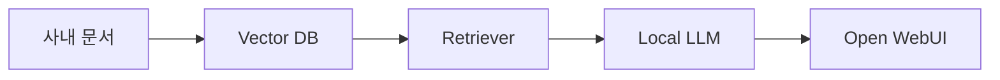
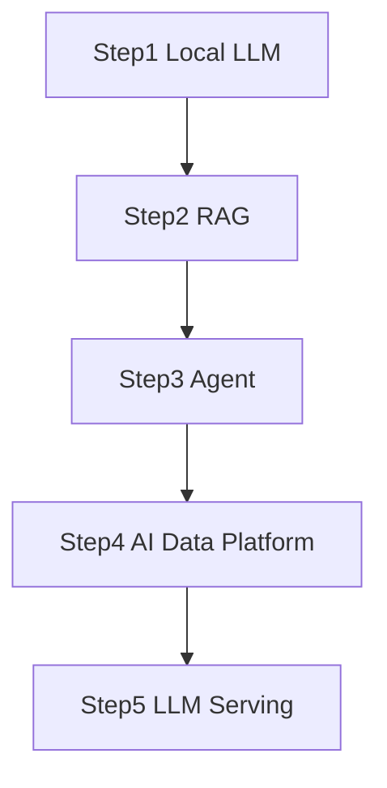

# Step2. RAG 구축 개요 가이드

## 문서 개요

본 문서는 AI Data Platform 스터디의 두 번째 단계인 **RAG(Retrieval Augmented Generation)** 구축에 대한 개요를 설명한다.

Step1에서 Local LLM 환경을 구축하였다면, 이제는 단순한 대화형 AI를 넘어 회사 문서, 업무 지식, 프로젝트 산출물, 운영 매뉴얼 등을 기반으로 답변할 수 있는 **기업형 AI 비서**를 구축하는 단계로 진입하게 된다.

RAG는 현재 기업용 AI 시스템 구축 시 가장 널리 사용되는 기술이며, ChatGPT와 같은 범용 LLM을 기업 내부 지식과 연결하는 가장 현실적인 방법이다.

---

# 1. 왜 RAG가 필요한가?

## 1.1 LLM의 한계

Local LLM을 구축했다고 해서 모든 질문에 정확하게 답변할 수 있는 것은 아니다.

예를 들어 아래와 같은 질문을 한다고 가정하자.

```text
MicroServer Framework의 Runtime 모듈 구조를 설명해줘.
```

LLM은 인터넷에 공개되지 않은 정보를 알 수 없으며, 학습 시점 이후의 최신 정보도 알지 못한다.

따라서 다음과 같은 문제가 발생한다.

- 모르는 내용을 추측함
- 존재하지 않는 내용을 생성함
- 최신 정보를 반영하지 못함
- 회사 내부 자료를 알 수 없음

이를 Hallucination(환각)이라고 한다.

## 1.2 기업 환경의 문제

실제 기업에서는 다음과 같은 문서들이 존재한다.

- 개발 가이드
- 운영 매뉴얼
- 설계서
- 제안서
- 회의록
- 정책 문서
- 표준 가이드

따라서 기업 환경에서는 다음과 같은 구조가 필요하다.



이를 해결하기 위한 대표 기술이 바로 RAG이다.

---

# 2. RAG란 무엇인가?

RAG는 Retrieval Augmented Generation의 약자이다.

우리말로는 "검색 증강 생성"이라고 한다.

즉,

> 질문과 관련된 문서를 먼저 검색한 후, 검색 결과를 기반으로 답변을 생성하는 기술

이다.

---

# 3. RAG 동작 원리

## 일반 LLM



## RAG



---

# 4. RAG 아키텍처



---

# 5. RAG 구성 요소

## Document

AI가 참고할 원본 문서

- PDF
- Word
- Excel
- Markdown
- Wiki
- Text

## Chunk

문서를 검색 가능한 단위로 분할한 데이터

## Embedding

문장을 숫자 벡터로 변환하는 과정

## Vector Database

임베딩 데이터를 저장하는 저장소

대표 솔루션

- ChromaDB
- Qdrant
- Weaviate
- Milvus
- PGVector

## Retriever

질문과 가장 유사한 문서를 검색하는 모듈

## LLM

검색된 문서를 기반으로 답변을 생성하는 모델

---

# 6. RAG 구축 로드맵

AI Data Platform 스터디에서는 RAG를 다음 5단계로 학습한다.



---

## Step2-1. RAG 개요 및 아키텍처 이해

학습 내용

- RAG 개념
- LLM 한계
- Hallucination
- RAG 구성요소
- 전체 아키텍처

---

## Step2-2. Vector DB 구축 및 문서 적재

학습 내용

- ChromaDB 설치
- Embedding 이해
- Chunking 이해
- 문서 적재

---

## Step2-3. 첫 번째 RAG 구축

학습 내용

```text
질문
 ↓
Retriever
 ↓
Vector DB
 ↓
LLM
 ↓
답변
```

Python 기반 RAG 구현

---

## Step2-4. Open WebUI 연동

학습 내용



웹 기반 RAG 서비스 구축

---

## Step2-5. 실전 사내 문서 RAG 구축

대상 문서

- AI Data Platform
- MicroServer
- 운영 가이드
- 제안서
- 회의록

고도화

- Metadata
- Hybrid Search
- 검색 품질 개선

---

# 7. 최종 목표



사용자는 Open WebUI에서 질문만 하면 된다.

```text
MicroServer 설치 절차 알려줘.
```

AI는 내부 문서를 검색한 후 정확한 답변을 제공한다.

---

# 8. AI Data Platform과의 관계

RAG는 AI Data Platform의 핵심 구성요소이다.

향후 학습하게 될

- Agent
- MCP
- Data Lakehouse
- Metadata
- Catalog
- AI Workflow

의 기반 기술이 된다.


